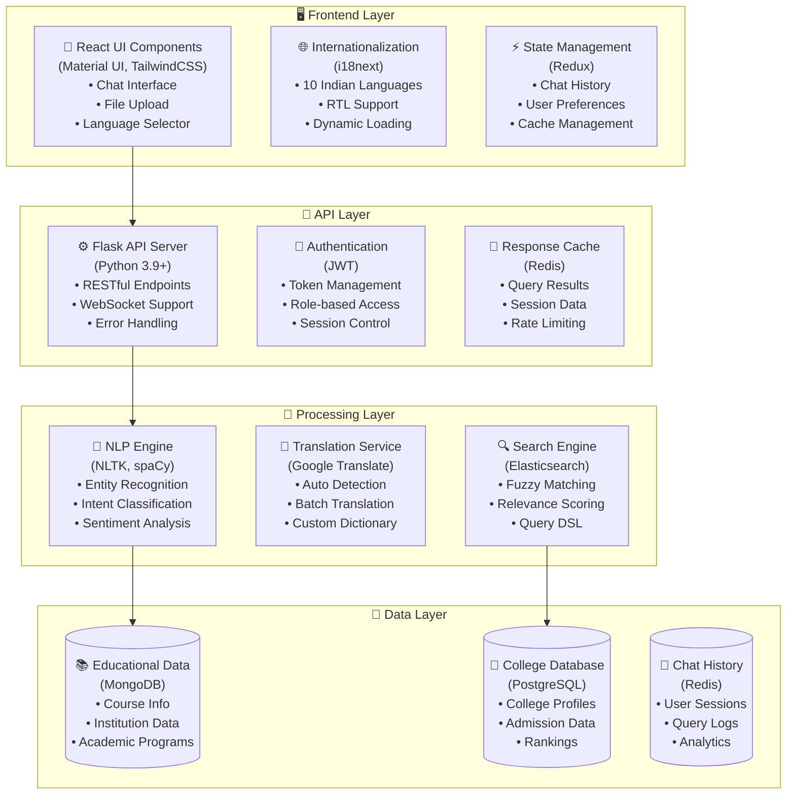
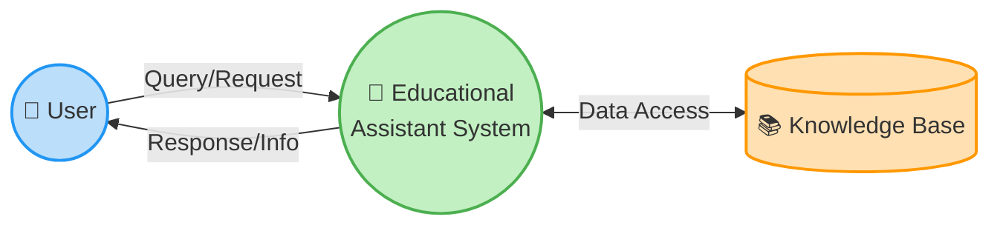
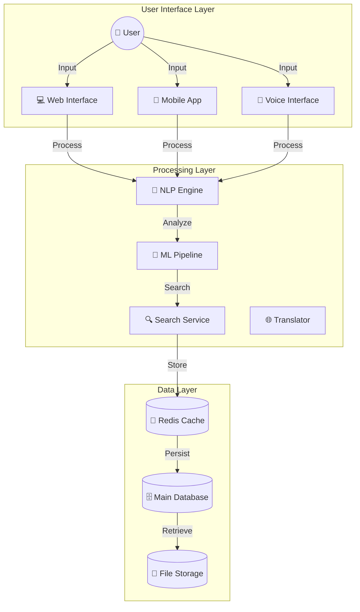
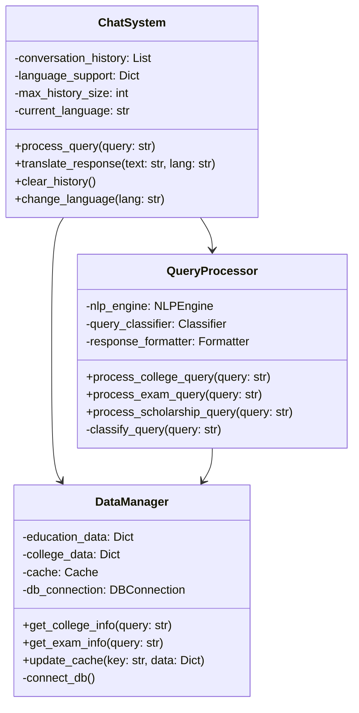
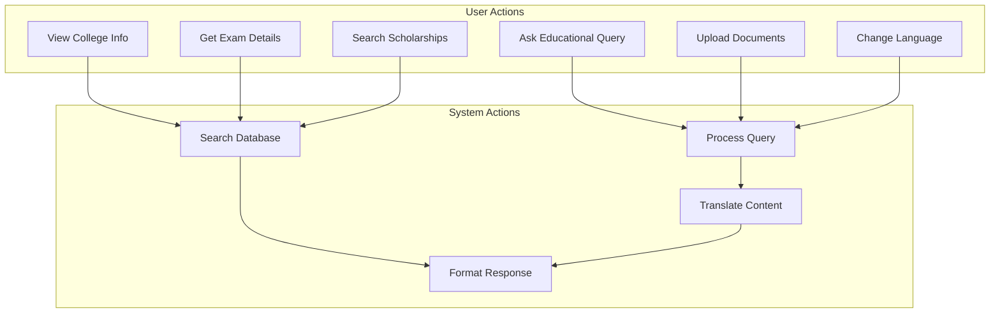

## 5. SYSTEM DESIGN

### 5.1 System Architecture

The Educational Assistant Chatbot employs a modern, scalable architecture:

### 5.2 DataFlow Diagram

#### Level 0 DFD

#### Level 1 DFD

### 5.3 UML Diagram

#### Class Diagram

### 5.4 Usecase Diagram

[Continued in next section...] 