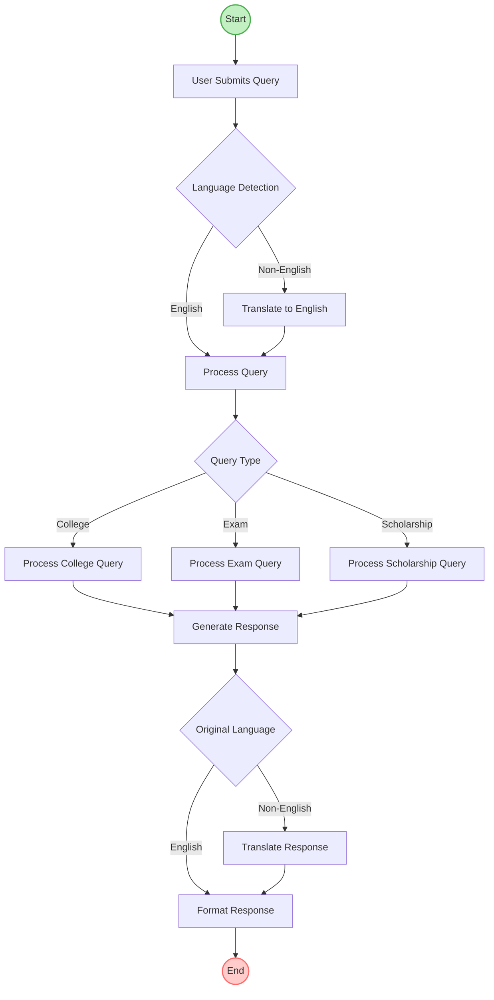
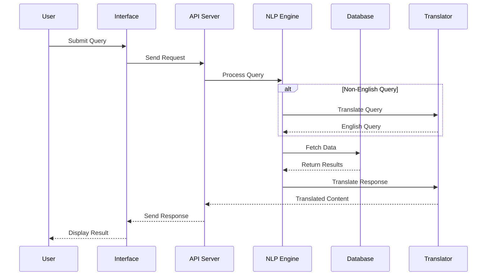
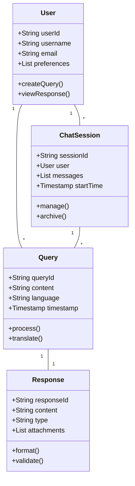
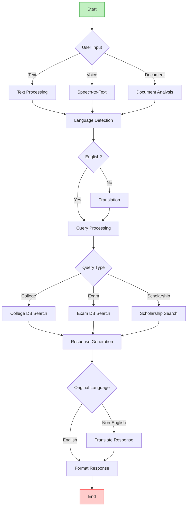

[Continued from previous section...]

### 5.5 Activity Diagram



### 5.6 Sequence Diagram



### 5.7 Class Diagram



### 5.8 Flowchart Diagram



### 5.9 Mathematical Model

#### 5.9.1 Set Theory
```
Let S be the System:
S = {I, P, O, F, Su, Fa}

Where:
I = Input Set = {q, l, t}
q = Query content
l = Language preference
t = Query type

P = Process Set = {p1, p2, p3, p4}
p1 = Language detection
p2 = Query processing
p3 = Database search
p4 = Response generation

O = Output Set = {r, c, s}
r = Response content
c = Confidence score
s = Status code

F = Functions = {f1, f2, f3}
f1 = Language detection function
f2 = Query processing function
f3 = Response generation function

Su = Success cases = {valid query, supported language}
Fa = Failure cases = {invalid query, unsupported language}
```

#### 5.9.2 Query Processing Model
```
Query Processing Function Q(x):
Q(x) = T(N(x))

Where:
T = Translation function
N = NLP processing function

N(x) = {E(x), I(x), C(x)}
E = Entity extraction
I = Intent classification
C = Context analysis

Confidence Score C(x):
C(x) = w1*E(x) + w2*I(x) + w3*M(x)

Where:
w1, w2, w3 = Weights
M = Pattern matching score
```

#### 5.9.3 Performance Model
```
Response Time R:
R = Rp + Rt + Rd

Where:
Rp = Processing time
Rt = Translation time
Rd = Database access time

System Load L:
L = (n*q)/(t*c)

Where:
n = Number of concurrent users
q = Queries per user
t = Time period
c = System capacity
```

[Continued in next section...] 