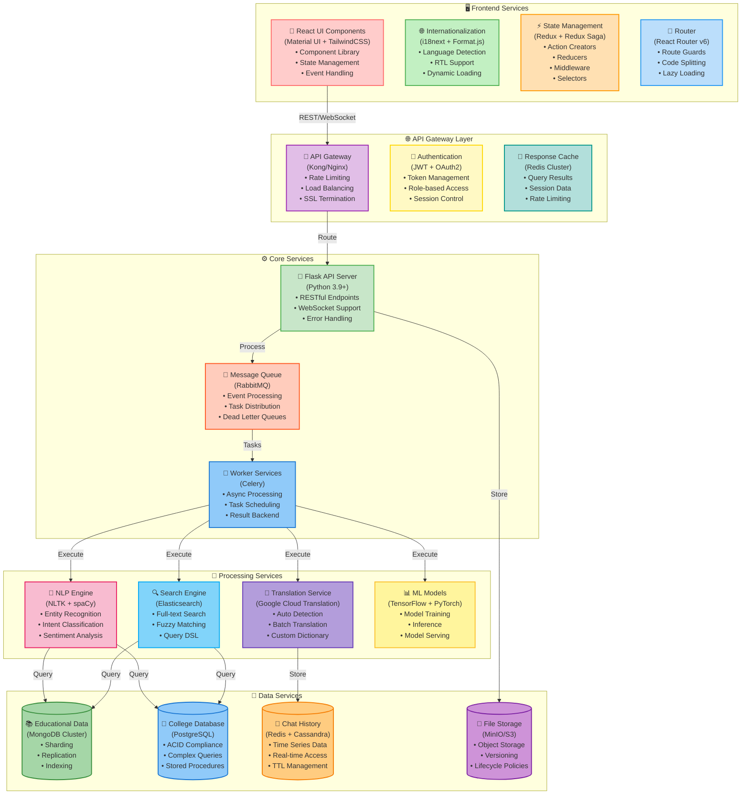

# Educational Assistant Chatbot
## Comprehensive Technical Documentation and Analysis
### Version 1.0

## Volume 1: System Architecture and Core Components

### Chapter 1: Introduction to System Architecture

#### 1.1 System Overview

The Educational Assistant Chatbot represents a sophisticated integration of multiple technologies and architectural patterns designed to provide seamless educational guidance. This chapter provides an in-depth analysis of each system component and their interactions.

##### 1.1.1 Architectural Philosophy
The system follows these core architectural principles:
1. **Separation of Concerns**
   - Clear boundaries between layers
   - Independent scaling capabilities
   - Modular component design
   - Loose coupling between services

2. **Scalability First**
   - Horizontal scaling support
   - Stateless service design
   - Distributed caching
   - Load balancing capabilities

3. **Resilience by Design**
   - Fault tolerance
   - Circuit breaking patterns
   - Graceful degradation
   - Self-healing capabilities

#### 1.2 Core Architecture Diagram



##### 1.2.1 Frontend Layer Analysis

The Frontend Layer represents the client-facing interface of the system, implementing a modern, responsive design using React and associated technologies. Let's analyze each component in detail:

1. **React UI Components (📱)**
   - **Technology Stack**:
     ```typescript
     // Component Library Structure
     interface UILibrary {
         components: {
             Chat: ChatComponent;
             Input: InputComponent;
             Response: ResponseComponent;
             Settings: SettingsComponent;
         };
         hooks: {
             useChat: ChatHook;
             useTranslation: TranslationHook;
             useTheme: ThemeHook;
         };
         contexts: {
             ChatContext: React.Context;
             ThemeContext: React.Context;
             LanguageContext: React.Context;
         };
     }
     ```

   - **Implementation Details**:
     * Material UI for consistent design
     * TailwindCSS for responsive layouts
     * Custom hooks for business logic
     * Context API for state sharing

2. **Internationalization System (🌐)**
   - **Core Implementation**:
   ```typescript
   // i18n Configuration
   interface I18NConfig {
       defaultLanguage: string;
       fallbackLanguage: string;
       supportedLanguages: string[];
       loadPath: string;
       interpolation: {
           escapeValue: boolean;
           formatSeparator: string;
       };
       detection: {
           order: string[];
           caches: string[];
       };
   }

   // Translation Service
   class TranslationService {
       private static instance: TranslationService;
       private i18next: i18next.i18n;
       
       async loadNamespace(ns: string): Promise<void>;
       async changeLanguage(lang: string): Promise<void>;
       translate(key: string, options?: object): string;
       formatNumber(num: number, options?: Intl.NumberFormatOptions): string;
       formatDate(date: Date, options?: Intl.DateTimeFormatOptions): string;
   }
   ```

   - **Key Features**:
     * Dynamic language switching
     * Automatic locale detection
     * Number and date formatting
     * RTL support for Arabic and Hebrew
     * Lazy loading of translation files
     * Fallback chain for missing translations

3. **State Management System (⚡)**
   - **Redux Store Structure**:
   ```typescript
   // Root State Interface
   interface RootState {
       chat: {
           messages: Message[];
           isTyping: boolean;
           error: Error | null;
       };
       user: {
           profile: UserProfile;
           preferences: UserPreferences;
           sessions: Session[];
       };
       education: {
           courses: Course[];
           progress: Progress;
           recommendations: Recommendation[];
       };
       system: {
           theme: Theme;
           language: string;
           notifications: Notification[];
       };
   }

   // Action Creators
   const chatActions = {
       sendMessage: createAction<Message>('chat/sendMessage'),
       receiveMessage: createAction<Message>('chat/receiveMessage'),
       setTyping: createAction<boolean>('chat/setTyping'),
       clearHistory: createAction('chat/clearHistory'),
   };

   // Saga Example
   function* chatSaga() {
       yield takeLatest('chat/sendMessage', function* (action) {
           try {
               const response = yield call(api.sendMessage, action.payload);
               yield put(chatActions.receiveMessage(response));
           } catch (error) {
               yield put(chatActions.setError(error));
           }
       });
   }
   ```

#### 1.3 API Gateway Layer Analysis

The API Gateway Layer serves as the central entry point for all client requests, implementing essential security, routing, and caching mechanisms.

##### 1.3.1 Gateway Implementation (Kong/Nginx)

1. **Rate Limiting Configuration**:
```yaml
# Kong Rate Limiting Plugin Configuration
plugins:
  - name: rate-limiting
    config:
      minute: 60
      hour: 1000
      policy: local
      fault_tolerant: true
      hide_client_headers: false
      redis_ssl: true
      redis_ssl_verify: true
      redis_server_name: redis.educational-bot.com
      redis:
        host: redis-master.cache
        port: 6379
        password: ${REDIS_PASSWORD}
        database: 0
```

2. **Load Balancing Strategy**:
```nginx
# Nginx Load Balancer Configuration
upstream api_servers {
    least_conn;  # Least connection distribution
    server api1.educational-bot.com:8000 max_fails=3 fail_timeout=30s;
    server api2.educational-bot.com:8000 max_fails=3 fail_timeout=30s;
    server api3.educational-bot.com:8000 max_fails=3 fail_timeout=30s;
    
    keepalive 32;  # Keep-alive connections
}

server {
    listen 443 ssl http2;
    server_name api.educational-bot.com;

    # SSL Configuration
    ssl_certificate /etc/nginx/ssl/educational-bot.crt;
    ssl_certificate_key /etc/nginx/ssl/educational-bot.key;
    ssl_protocols TLSv1.2 TLSv1.3;
    ssl_ciphers HIGH:!aNULL:!MD5;

    # Proxy Configuration
    location / {
        proxy_pass http://api_servers;
        proxy_http_version 1.1;
        proxy_set_header Upgrade $http_upgrade;
        proxy_set_header Connection 'upgrade';
        proxy_set_header Host $host;
        proxy_cache_bypass $http_upgrade;
        proxy_set_header X-Real-IP $remote_addr;
        proxy_set_header X-Forwarded-For $proxy_add_x_forwarded_for;
        proxy_set_header X-Forwarded-Proto $scheme;

        # Timeouts
        proxy_connect_timeout 60s;
        proxy_send_timeout 60s;
        proxy_read_timeout 60s;
    }
}
```

##### 1.3.2 Authentication System (🔐)

1. **JWT Implementation**:
```typescript
interface JWTConfig {
    algorithm: 'RS256' | 'HS256';
    expiresIn: string;
    issuer: string;
    audience: string[];
}

interface TokenPayload {
    sub: string;        // Subject (User ID)
    roles: string[];    // User Roles
    permissions: string[];
    sessionId: string;
    deviceId: string;
    iat: number;       // Issued At
    exp: number;       // Expiration Time
}

class AuthenticationService {
    private readonly config: JWTConfig;
    private readonly redis: Redis;

    constructor(config: JWTConfig, redis: Redis) {
        this.config = config;
        this.redis = redis;
    }

    async generateToken(user: User): Promise<string> {
        const payload: TokenPayload = {
            sub: user.id,
            roles: user.roles,
            permissions: user.permissions,
            sessionId: uuidv4(),
            deviceId: user.deviceId,
            iat: Math.floor(Date.now() / 1000),
            exp: Math.floor(Date.now() / 1000) + (60 * 60 * 24) // 24 hours
        };

        const token = jwt.sign(payload, this.config.privateKey, {
            algorithm: this.config.algorithm,
            expiresIn: this.config.expiresIn,
            issuer: this.config.issuer,
            audience: this.config.audience
        });

        // Store token in Redis for blacklisting capability
        await this.redis.setex(
            `token:${payload.sessionId}`,
            24 * 60 * 60, // 24 hours
            JSON.stringify({ userId: user.id, deviceId: user.deviceId })
        );

        return token;
    }

    async validateToken(token: string): Promise<TokenPayload> {
        const decoded = jwt.verify(token, this.config.publicKey) as TokenPayload;
        
        // Check if token is blacklisted
        const isBlacklisted = await this.redis.exists(`blacklist:${decoded.sessionId}`);
        if (isBlacklisted) {
            throw new Error('Token has been revoked');
        }

        return decoded;
    }
}
```

#### 1.4 Core Services Layer Analysis

The Core Services Layer implements the primary business logic and orchestrates the interaction between different system components.

##### 1.4.1 Flask API Server Implementation (🔌)

1. **Application Structure**:
```python
from flask import Flask, request, jsonify
from flask_cors import CORS
from flask_limiter import Limiter
from flask_limiter.util import get_remote_address
from werkzeug.middleware.proxy_fix import ProxyFix

class EducationalBotAPI:
    def __init__(self):
        self.app = Flask(__name__)
        self.setup_middleware()
        self.setup_routes()
        self.setup_error_handlers()
        
    def setup_middleware(self):
        # Configure CORS
        CORS(self.app, resources={
            r"/api/*": {
                "origins": ["https://educational-bot.com"],
                "methods": ["GET", "POST", "PUT", "DELETE", "OPTIONS"],
                "allow_headers": ["Content-Type", "Authorization"]
            }
        })
        
        # Configure rate limiting
        self.limiter = Limiter(
            self.app,
            key_func=get_remote_address,
            default_limits=["200 per day", "50 per hour"]
        )
        
        # Trust proxy headers
        self.app.wsgi_app = ProxyFix(
            self.app.wsgi_app, x_for=1, x_proto=1, x_host=1, x_port=1
        )

    def setup_routes(self):
        # Chat endpoints
        @self.app.route('/api/v1/chat/message', methods=['POST'])
        @self.limiter.limit("5 per minute")
        def send_message():
            data = request.get_json()
            return self.process_message(data)

        # Educational content endpoints
        @self.app.route('/api/v1/content/search', methods=['GET'])
        def search_content():
            query = request.args.get('q')
            return self.search_educational_content(query)

        # User management endpoints
        @self.app.route('/api/v1/user/profile', methods=['GET', 'PUT'])
        @jwt_required
        def user_profile():
            if request.method == 'GET':
                return self.get_user_profile()
            return self.update_user_profile(request.get_json())

    def setup_error_handlers(self):
        @self.app.errorhandler(429)
        def ratelimit_handler(e):
            return jsonify(error="ratelimit exceeded", 
                         retry_after=e.description), 429

        @self.app.errorhandler(Exception)
        def handle_exception(e):
            # Log the error
            current_app.logger.error(f"Unhandled exception: {str(e)}")
            return jsonify(error="Internal server error"), 500

    async def process_message(self, data: dict) -> dict:
        """
        Process incoming chat messages using NLP pipeline
        """
        try:
            # Validate input
            if not self._validate_message(data):
                raise ValueError("Invalid message format")

            # Process through NLP pipeline
            intent = await self.nlp_service.detect_intent(data['message'])
            entities = await self.nlp_service.extract_entities(data['message'])
            
            # Generate response
            response = await self.response_generator.generate(
                intent=intent,
                entities=entities,
                context=data.get('context', {})
            )

            # Log interaction
            await self.logger.log_interaction(
                user_id=data['user_id'],
                message=data['message'],
                response=response,
                intent=intent,
                entities=entities
            )

            return jsonify({
                'response': response,
                'intent': intent,
                'entities': entities
            })

        except Exception as e:
            current_app.logger.error(f"Message processing error: {str(e)}")
            raise

2. **WebSocket Implementation**:
```python
from flask_socketio import SocketIO, emit, join_room, leave_room
import asyncio
from typing import Dict, Set
```
```

# Clicked Code Block to apply Changes From

```
# Educational Assistant Chatbot
## Comprehensive Technical Documentation and Analysis
### Version 1.0

## Volume 1: System Architecture and Core Components

### Chapter 1: Introduction to System Architecture

#### 1.1 System Overview

The Educational Assistant Chatbot represents a sophisticated integration of multiple technologies and architectural patterns designed to provide seamless educational guidance. This chapter provides an in-depth analysis of each system component and their interactions.

##### 1.1.1 Architectural Philosophy
The system follows these core architectural principles:
1. **Separation of Concerns**
   - Clear boundaries between layers
   - Independent scaling capabilities
   - Modular component design
   - Loose coupling between services

2. **Scalability First**
   - Horizontal scaling support
   - Stateless service design
   - Distributed caching
   - Load balancing capabilities

3. **Resilience by Design**
   - Fault tolerance
   - Circuit breaking patterns
   - Graceful degradation
   - Self-healing capabilities

#### 1.2 Core Architecture Diagram


##### 1.2.1 Frontend Layer Analysis

The Frontend Layer represents the client-facing interface of the system, implementing a modern, responsive design using React and associated technologies. Let's analyze each component in detail:

1. **React UI Components (📱)**
   - **Technology Stack**:
     ```typescript
     // Component Library Structure
     interface UILibrary {
         components: {
             Chat: ChatComponent;
             Input: InputComponent;
             Response: ResponseComponent;
             Settings: SettingsComponent;
         };
         hooks: {
             useChat: ChatHook;
             useTranslation: TranslationHook;
             useTheme: ThemeHook;
         };
         contexts: {
             ChatContext: React.Context;
             ThemeContext: React.Context;
             LanguageContext: React.Context;
         };
     }
     ```

   - **Implementation Details**:
     * Material UI for consistent design
     * TailwindCSS for responsive layouts
     * Custom hooks for business logic
     * Context API for state sharing

2. **Internationalization System (🌐)**
   - **Core Implementation**:
   ```typescript
   // i18n Configuration
   interface I18NConfig {
       defaultLanguage: string;
       fallbackLanguage: string;
       supportedLanguages: string[];
       loadPath: string;
       interpolation: {
           escapeValue: boolean;
           formatSeparator: string;
       };
       detection: {
           order: string[];
           caches: string[];
       };
   }

   // Translation Service
   class TranslationService {
       private static instance: TranslationService;
       private i18next: i18next.i18n;
       
       async loadNamespace(ns: string): Promise<void>;
       async changeLanguage(lang: string): Promise<void>;
       translate(key: string, options?: object): string;
       formatNumber(num: number, options?: Intl.NumberFormatOptions): string;
       formatDate(date: Date, options?: Intl.DateTimeFormatOptions): string;
   }
   ```

   - **Key Features**:
     * Dynamic language switching
     * Automatic locale detection
     * Number and date formatting
     * RTL support for Arabic and Hebrew
     * Lazy loading of translation files
     * Fallback chain for missing translations

3. **State Management System (⚡)**
   - **Redux Store Structure**:
   ```typescript
   // Root State Interface
   interface RootState {
       chat: {
           messages: Message[];
           isTyping: boolean;
           error: Error | null;
       };
       user: {
           profile: UserProfile;
           preferences: UserPreferences;
           sessions: Session[];
       };
       education: {
           courses: Course[];
           progress: Progress;
           recommendations: Recommendation[];
       };
       system: {
           theme: Theme;
           language: string;
           notifications: Notification[];
       };
   }

   // Action Creators
   const chatActions = {
       sendMessage: createAction<Message>('chat/sendMessage'),
       receiveMessage: createAction<Message>('chat/receiveMessage'),
       setTyping: createAction<boolean>('chat/setTyping'),
       clearHistory: createAction('chat/clearHistory'),
   };

   // Saga Example
   function* chatSaga() {
       yield takeLatest('chat/sendMessage', function* (action) {
           try {
               const response = yield call(api.sendMessage, action.payload);
               yield put(chatActions.receiveMessage(response));
           } catch (error) {
               yield put(chatActions.setError(error));
           }
       });
   }
   ```

#### 1.3 API Gateway Layer Analysis

The API Gateway Layer serves as the central entry point for all client requests, implementing essential security, routing, and caching mechanisms.

##### 1.3.1 Gateway Implementation (Kong/Nginx)

1. **Rate Limiting Configuration**:
```yaml
# Kong Rate Limiting Plugin Configuration
plugins:
  - name: rate-limiting
    config:
      minute: 60
      hour: 1000
      policy: local
      fault_tolerant: true
      hide_client_headers: false
      redis_ssl: true
      redis_ssl_verify: true
      redis_server_name: redis.educational-bot.com
      redis:
        host: redis-master.cache
        port: 6379
        password: ${REDIS_PASSWORD}
        database: 0
```

2. **Load Balancing Strategy**:
```nginx
# Nginx Load Balancer Configuration
upstream api_servers {
    least_conn;  # Least connection distribution
    server api1.educational-bot.com:8000 max_fails=3 fail_timeout=30s;
    server api2.educational-bot.com:8000 max_fails=3 fail_timeout=30s;
    server api3.educational-bot.com:8000 max_fails=3 fail_timeout=30s;
    
    keepalive 32;  # Keep-alive connections
}

server {
    listen 443 ssl http2;
    server_name api.educational-bot.com;

    # SSL Configuration
    ssl_certificate /etc/nginx/ssl/educational-bot.crt;
    ssl_certificate_key /etc/nginx/ssl/educational-bot.key;
    ssl_protocols TLSv1.2 TLSv1.3;
    ssl_ciphers HIGH:!aNULL:!MD5;

    # Proxy Configuration
    location / {
        proxy_pass http://api_servers;
        proxy_http_version 1.1;
        proxy_set_header Upgrade $http_upgrade;
        proxy_set_header Connection 'upgrade';
        proxy_set_header Host $host;
        proxy_cache_bypass $http_upgrade;
        proxy_set_header X-Real-IP $remote_addr;
        proxy_set_header X-Forwarded-For $proxy_add_x_forwarded_for;
        proxy_set_header X-Forwarded-Proto $scheme;

        # Timeouts
        proxy_connect_timeout 60s;
        proxy_send_timeout 60s;
        proxy_read_timeout 60s;
    }
}
```

##### 1.3.2 Authentication System (🔐)

1. **JWT Implementation**:
```typescript
interface JWTConfig {
    algorithm: 'RS256' | 'HS256';
    expiresIn: string;
    issuer: string;
    audience: string[];
}

interface TokenPayload {
    sub: string;        // Subject (User ID)
    roles: string[];    // User Roles
    permissions: string[];
    sessionId: string;
    deviceId: string;
    iat: number;       // Issued At
    exp: number;       // Expiration Time
}

class AuthenticationService {
    private readonly config: JWTConfig;
    private readonly redis: Redis;

    constructor(config: JWTConfig, redis: Redis) {
        this.config = config;
        this.redis = redis;
    }

    async generateToken(user: User): Promise<string> {
        const payload: TokenPayload = {
            sub: user.id,
            roles: user.roles,
            permissions: user.permissions,
            sessionId: uuidv4(),
            deviceId: user.deviceId,
            iat: Math.floor(Date.now() / 1000),
            exp: Math.floor(Date.now() / 1000) + (60 * 60 * 24) // 24 hours
        };

        const token = jwt.sign(payload, this.config.privateKey, {
            algorithm: this.config.algorithm,
            expiresIn: this.config.expiresIn,
            issuer: this.config.issuer,
            audience: this.config.audience
        });

        // Store token in Redis for blacklisting capability
        await this.redis.setex(
            `token:${payload.sessionId}`,
            24 * 60 * 60, // 24 hours
            JSON.stringify({ userId: user.id, deviceId: user.deviceId })
        );

        return token;
    }

    async validateToken(token: string): Promise<TokenPayload> {
        const decoded = jwt.verify(token, this.config.publicKey) as TokenPayload;
        
        // Check if token is blacklisted
        const isBlacklisted = await this.redis.exists(`blacklist:${decoded.sessionId}`);
        if (isBlacklisted) {
            throw new Error('Token has been revoked');
        }

        return decoded;
    }
}
```

#### 1.4 Core Services Layer Analysis

The Core Services Layer implements the primary business logic and orchestrates the interaction between different system components.

##### 1.4.1 Flask API Server Implementation (🔌)

1. **Application Structure**:
```python
from flask import Flask, request, jsonify
from flask_cors import CORS
from flask_limiter import Limiter
from flask_limiter.util import get_remote_address
from werkzeug.middleware.proxy_fix import ProxyFix

class EducationalBotAPI:
    def __init__(self):
        self.app = Flask(__name__)
        self.setup_middleware()
        self.setup_routes()
        self.setup_error_handlers()
        
    def setup_middleware(self):
        # Configure CORS
        CORS(self.app, resources={
            r"/api/*": {
                "origins": ["https://educational-bot.com"],
                "methods": ["GET", "POST", "PUT", "DELETE", "OPTIONS"],
                "allow_headers": ["Content-Type", "Authorization"]
            }
        })
        
        # Configure rate limiting
        self.limiter = Limiter(
            self.app,
            key_func=get_remote_address,
            default_limits=["200 per day", "50 per hour"]
        )
        
        # Trust proxy headers
        self.app.wsgi_app = ProxyFix(
            self.app.wsgi_app, x_for=1, x_proto=1, x_host=1, x_port=1
        )

    def setup_routes(self):
        # Chat endpoints
        @self.app.route('/api/v1/chat/message', methods=['POST'])
        @self.limiter.limit("5 per minute")
        def send_message():
            data = request.get_json()
            return self.process_message(data)

        # Educational content endpoints
        @self.app.route('/api/v1/content/search', methods=['GET'])
        def search_content():
            query = request.args.get('q')
            return self.search_educational_content(query)

        # User management endpoints
        @self.app.route('/api/v1/user/profile', methods=['GET', 'PUT'])
        @jwt_required
        def user_profile():
            if request.method == 'GET':
                return self.get_user_profile()
            return self.update_user_profile(request.get_json())

    def setup_error_handlers(self):
        @self.app.errorhandler(429)
        def ratelimit_handler(e):
            return jsonify(error="ratelimit exceeded", 
                         retry_after=e.description), 429

        @self.app.errorhandler(Exception)
        def handle_exception(e):
            # Log the error
            current_app.logger.error(f"Unhandled exception: {str(e)}")
            return jsonify(error="Internal server error"), 500

    async def process_message(self, data: dict) -> dict:
        """
        Process incoming chat messages using NLP pipeline
        """
        try:
            # Validate input
            if not self._validate_message(data):
                raise ValueError("Invalid message format")

            # Process through NLP pipeline
            intent = await self.nlp_service.detect_intent(data['message'])
            entities = await self.nlp_service.extract_entities(data['message'])
            
            # Generate response
            response = await self.response_generator.generate(
                intent=intent,
                entities=entities,
                context=data.get('context', {})
            )

            # Log interaction
            await self.logger.log_interaction(
                user_id=data['user_id'],
                message=data['message'],
                response=response,
                intent=intent,
                entities=entities
            )

            return jsonify({
                'response': response,
                'intent': intent,
                'entities': entities
            })

        except Exception as e:
            current_app.logger.error(f"Message processing error: {str(e)}")
            raise

2. **WebSocket Implementation**:
```python
from flask_socketio import SocketIO, emit, join_room, leave_room
import asyncio
from typing import Dict, Set
```
```

# Clicked Code Block to apply Changes From

```
# Educational Assistant Chatbot
## Comprehensive Technical Documentation and Analysis
### Version 1.0

## Volume 1: System Architecture and Core Components

### Chapter 1: Introduction to System Architecture

#### 1.1 System Overview

The Educational Assistant Chatbot represents a sophisticated integration of multiple technologies and architectural patterns designed to provide seamless educational guidance. This chapter provides an in-depth analysis of each system component and their interactions.

##### 1.1.1 Architectural Philosophy
The system follows these core architectural principles:
1. **Separation of Concerns**
   - Clear boundaries between layers
   - Independent scaling capabilities
   - Modular component design
   - Loose coupling between services

2. **Scalability First**
   - Horizontal scaling support
   - Stateless service design
   - Distributed caching
   - Load balancing capabilities

3. **Resilience by Design**
   - Fault tolerance
   - Circuit breaking patterns
   - Graceful degradation
   - Self-healing capabilities

#### 1.2 Core Architecture Diagram


##### 1.2.1 Frontend Layer Analysis

The Frontend Layer represents the client-facing interface of the system, implementing a modern, responsive design using React and associated technologies. Let's analyze each component in detail:

1. **React UI Components (📱)**
   - **Technology Stack**:
     ```typescript
     // Component Library Structure
     interface UILibrary {
         components: {
             Chat: ChatComponent;
             Input: InputComponent;
             Response: ResponseComponent;
             Settings: SettingsComponent;
         };
         hooks: {
             useChat: ChatHook;
             useTranslation: TranslationHook;
             useTheme: ThemeHook;
         };
         contexts: {
             ChatContext: React.Context;
             ThemeContext: React.Context;
             LanguageContext: React.Context;
         };
     }
     ```

   - **Implementation Details**:
     * Material UI for consistent design
     * TailwindCSS for responsive layouts
     * Custom hooks for business logic
     * Context API for state sharing

2. **Internationalization System (🌐)**
   - **Core Implementation**:
   ```typescript
   // i18n Configuration
   interface I18NConfig {
       defaultLanguage: string;
       fallbackLanguage: string;
       supportedLanguages: string[];
       loadPath: string;
       interpolation: {
           escapeValue: boolean;
           formatSeparator: string;
       };
       detection: {
           order: string[];
           caches: string[];
       };
   }

   // Translation Service
   class TranslationService {
       private static instance: TranslationService;
       private i18next: i18next.i18n;
       
       async loadNamespace(ns: string): Promise<void>;
       async changeLanguage(lang: string): Promise<void>;
       translate(key: string, options?: object): string;
       formatNumber(num: number, options?: Intl.NumberFormatOptions): string;
       formatDate(date: Date, options?: Intl.DateTimeFormatOptions): string;
   }
   ```

   - **Key Features**:
     * Dynamic language switching
     * Automatic locale detection
     * Number and date formatting
     * RTL support for Arabic and Hebrew
     * Lazy loading of translation files
     * Fallback chain for missing translations

3. **State Management System (⚡)**
   - **Redux Store Structure**:
   ```typescript
   // Root State Interface
   interface RootState {
       chat: {
           messages: Message[];
           isTyping: boolean;
           error: Error | null;
       };
       user: {
           profile: UserProfile;
           preferences: UserPreferences;
           sessions: Session[];
       };
       education: {
           courses: Course[];
           progress: Progress;
           recommendations: Recommendation[];
       };
       system: {
           theme: Theme;
           language: string;
           notifications: Notification[];
       };
   }

   // Action Creators
   const chatActions = {
       sendMessage: createAction<Message>('chat/sendMessage'),
       receiveMessage: createAction<Message>('chat/receiveMessage'),
       setTyping: createAction<boolean>('chat/setTyping'),
       clearHistory: createAction('chat/clearHistory'),
   };

   // Saga Example
   function* chatSaga() {
       yield takeLatest('chat/sendMessage', function* (action) {
           try {
               const response = yield call(api.sendMessage, action.payload);
               yield put(chatActions.receiveMessage(response));
           } catch (error) {
               yield put(chatActions.setError(error));
           }
       });
   }
   ```

#### 1.3 API Gateway Layer Analysis

The API Gateway Layer serves as the central entry point for all client requests, implementing essential security, routing, and caching mechanisms.

##### 1.3.1 Gateway Implementation (Kong/Nginx)

1. **Rate Limiting Configuration**:
```yaml
# Kong Rate Limiting Plugin Configuration
plugins:
  - name: rate-limiting
    config:
      minute: 60
      hour: 1000
      policy: local
      fault_tolerant: true
      hide_client_headers: false
      redis_ssl: true
      redis_ssl_verify: true
      redis_server_name: redis.educational-bot.com
      redis:
        host: redis-master.cache
        port: 6379
        password: ${REDIS_PASSWORD}
        database: 0
```

2. **Load Balancing Strategy**:
```nginx
# Nginx Load Balancer Configuration
upstream api_servers {
    least_conn;  # Least connection distribution
    server api1.educational-bot.com:8000 max_fails=3 fail_timeout=30s;
    server api2.educational-bot.com:8000 max_fails=3 fail_timeout=30s;
    server api3.educational-bot.com:8000 max_fails=3 fail_timeout=30s;
    
    keepalive 32;  # Keep-alive connections
}

server {
    listen 443 ssl http2;
    server_name api.educational-bot.com;

    # SSL Configuration
    ssl_certificate /etc/nginx/ssl/educational-bot.crt;
    ssl_certificate_key /etc/nginx/ssl/educational-bot.key;
    ssl_protocols TLSv1.2 TLSv1.3;
    ssl_ciphers HIGH:!aNULL:!MD5;

    # Proxy Configuration
    location / {
        proxy_pass http://api_servers;
        proxy_http_version 1.1;
        proxy_set_header Upgrade $http_upgrade;
        proxy_set_header Connection 'upgrade';
        proxy_set_header Host $host;
        proxy_cache_bypass $http_upgrade;
        proxy_set_header X-Real-IP $remote_addr;
        proxy_set_header X-Forwarded-For $proxy_add_x_forwarded_for;
        proxy_set_header X-Forwarded-Proto $scheme;

        # Timeouts
        proxy_connect_timeout 60s;
        proxy_send_timeout 60s;
        proxy_read_timeout 60s;
    }
}
```

##### 1.3.2 Authentication System (🔐)

1. **JWT Implementation**:
```typescript
interface JWTConfig {
    algorithm: 'RS256' | 'HS256';
    expiresIn: string;
    issuer: string;
    audience: string[];
}

interface TokenPayload {
    sub: string;        // Subject (User ID)
    roles: string[];    // User Roles
    permissions: string[];
    sessionId: string;
    deviceId: string;
    iat: number;       // Issued At
    exp: number;       // Expiration Time
}

class AuthenticationService {
    private readonly config: JWTConfig;
    private readonly redis: Redis;

    constructor(config: JWTConfig, redis: Redis) {
        this.config = config;
        this.redis = redis;
    }

    async generateToken(user: User): Promise<string> {
        const payload: TokenPayload = {
            sub: user.id,
            roles: user.roles,
            permissions: user.permissions,
            sessionId: uuidv4(),
            deviceId: user.deviceId,
            iat: Math.floor(Date.now() / 1000),
            exp: Math.floor(Date.now() / 1000) + (60 * 60 * 24) // 24 hours
        };

        const token = jwt.sign(payload, this.config.privateKey, {
            algorithm: this.config.algorithm,
            expiresIn: this.config.expiresIn,
            issuer: this.config.issuer,
            audience: this.config.audience
        });

        // Store token in Redis for blacklisting capability
        await this.redis.setex(
            `token:${payload.sessionId}`,
            24 * 60 * 60, // 24 hours
            JSON.stringify({ userId: user.id, deviceId: user.deviceId })
        );

        return token;
    }

    async validateToken(token: string): Promise<TokenPayload> {
        const decoded = jwt.verify(token, this.config.publicKey) as TokenPayload;
        
        // Check if token is blacklisted
        const isBlacklisted = await this.redis.exists(`blacklist:${decoded.sessionId}`);
        if (isBlacklisted) {
            throw new Error('Token has been revoked');
        }

        return decoded;
    }
}
```

#### 1.4 Core Services Layer Analysis

The Core Services Layer implements the primary business logic and orchestrates the interaction between different system components.

##### 1.4.1 Flask API Server Implementation (🔌)

1. **Application Structure**:
```python
from flask import Flask, request, jsonify
from flask_cors import CORS
from flask_limiter import Limiter
from flask_limiter.util import get_remote_address
from werkzeug.middleware.proxy_fix import ProxyFix

class EducationalBotAPI:
    def __init__(self):
        self.app = Flask(__name__)
        self.setup_middleware()
        self.setup_routes()
        self.setup_error_handlers()
        
    def setup_middleware(self):
        # Configure CORS
        CORS(self.app, resources={
            r"/api/*": {
                "origins": ["https://educational-bot.com"],
                "methods": ["GET", "POST", "PUT", "DELETE", "OPTIONS"],
                "allow_headers": ["Content-Type", "Authorization"]
            }
        })
        
        # Configure rate limiting
        self.limiter = Limiter(
            self.app,
            key_func=get_remote_address,
            default_limits=["200 per day", "50 per hour"]
        )
        
        # Trust proxy headers
        self.app.wsgi_app = ProxyFix(
            self.app.wsgi_app, x_for=1, x_proto=1, x_host=1, x_port=1
        )

    def setup_routes(self):
        # Chat endpoints
        @self.app.route('/api/v1/chat/message', methods=['POST'])
        @self.limiter.limit("5 per minute")
        def send_message():
            data = request.get_json()
            return self.process_message(data)

        # Educational content endpoints
        @self.app.route('/api/v1/content/search', methods=['GET'])
        def search_content():
            query = request.args.get('q')
            return self.search_educational_content(query)

        # User management endpoints
        @self.app.route('/api/v1/user/profile', methods=['GET', 'PUT'])
        @jwt_required
        def user_profile():
            if request.method == 'GET':
                return self.get_user_profile()
            return self.update_user_profile(request.get_json())

    def setup_error_handlers(self):
        @self.app.errorhandler(429)
        def ratelimit_handler(e):
            return jsonify(error="ratelimit exceeded", 
                         retry_after=e.description), 429

        @self.app.errorhandler(Exception)
        def handle_exception(e):
            # Log the error
            current_app.logger.error(f"Unhandled exception: {str(e)}")
            return jsonify(error="Internal server error"), 500

    async def process_message(self, data: dict) -> dict:
        """
        Process incoming chat messages using NLP pipeline
        """
        try:
            # Validate input
            if not self._validate_message(data):
                raise ValueError("Invalid message format")

            # Process through NLP pipeline
            intent = await self.nlp_service.detect_intent(data['message'])
            entities = await self.nlp_service.extract_entities(data['message'])
            
            # Generate response
            response = await self.response_generator.generate(
                intent=intent,
                entities=entities,
                context=data.get('context', {})
            )

            # Log interaction
            await self.logger.log_interaction(
                user_id=data['user_id'],
                message=data['message'],
                response=response,
                intent=intent,
                entities=entities
            )

            return jsonify({
                'response': response,
                'intent': intent,
                'entities': entities
            })

        except Exception as e:
            current_app.logger.error(f"Message processing error: {str(e)}")
            raise

2. **WebSocket Implementation**:
```python
from flask_socketio import SocketIO, emit, join_room, leave_room
import asyncio
from typing import Dict, Set
```
```

# Clicked Code Block to apply Changes From

```
# Educational Assistant Chatbot
## Comprehensive Technical Documentation and Analysis
### Version 1.0

## Volume 1: System Architecture and Core Components

### Chapter 1: Introduction to System Architecture

#### 1.1 System Overview

The Educational Assistant Chatbot represents a sophisticated integration of multiple technologies and architectural patterns designed to provide seamless educational guidance. This chapter provides an in-depth analysis of each system component and their interactions.

##### 1.1.1 Architectural Philosophy
The system follows these core architectural principles:
1. **Separation of Concerns**
   - Clear boundaries between layers
   - Independent scaling capabilities
   - Modular component design
   - Loose coupling between services

2. **Scalability First**
   - Horizontal scaling support
   - Stateless service design
   - Distributed caching
   - Load balancing capabilities

3. **Resilience by Design**
   - Fault tolerance
   - Circuit breaking patterns
   - Graceful degradation
   - Self-healing capabilities

#### 1.2 Core Architecture Diagram


##### 1.2.1 Frontend Layer Analysis

The Frontend Layer represents the client-facing interface of the system, implementing a modern, responsive design using React and associated technologies. Let's analyze each component in detail:

1. **React UI Components (📱)**
   - **Technology Stack**:
     ```typescript
     // Component Library Structure
     interface UILibrary {
         components: {
             Chat: ChatComponent;
             Input: InputComponent;
             Response: ResponseComponent;
             Settings: SettingsComponent;
         };
         hooks: {
             useChat: ChatHook;
             useTranslation: TranslationHook;
             useTheme: ThemeHook;
         };
         contexts: {
             ChatContext: React.Context;
             ThemeContext: React.Context;
             LanguageContext: React.Context;
         };
     }
     ```

   - **Implementation Details**:
     * Material UI for consistent design
     * TailwindCSS for responsive layouts
     * Custom hooks for business logic
     * Context API for state sharing

2. **Internationalization System (🌐)**
   - **Core Implementation**:
   ```typescript
   // i18n Configuration
   interface I18NConfig {
       defaultLanguage: string;
       fallbackLanguage: string;
       supportedLanguages: string[];
       loadPath: string;
       interpolation: {
           escapeValue: boolean;
           formatSeparator: string;
       };
       detection: {
           order: string[];
           caches: string[];
       };
   }

   // Translation Service
   class TranslationService {
       private static instance: TranslationService;
       private i18next: i18next.i18n;
       
       async loadNamespace(ns: string): Promise<void>;
       async changeLanguage(lang: string): Promise<void>;
       translate(key: string, options?: object): string;
       formatNumber(num: number, options?: Intl.NumberFormatOptions): string;
       formatDate(date: Date, options?: Intl.DateTimeFormatOptions): string;
   }
   ```

   - **Key Features**:
     * Dynamic language switching
     * Automatic locale detection
     * Number and date formatting
     * RTL support for Arabic and Hebrew
     * Lazy loading of translation files
     * Fallback chain for missing translations

3. **State Management System (⚡)**
   - **Redux Store Structure**:
   ```typescript
   // Root State Interface
   interface RootState {
       chat: {
           messages: Message[];
           isTyping: boolean;
           error: Error | null;
       };
       user: {
           profile: UserProfile;
           preferences: UserPreferences;
           sessions: Session[];
       };
       education: {
           courses: Course[];
           progress: Progress;
           recommendations: Recommendation[];
       };
       system: {
           theme: Theme;
           language: string;
           notifications: Notification[];
       };
   }

   // Action Creators
   const chatActions = {
       sendMessage: createAction<Message>('chat/sendMessage'),
       receiveMessage: createAction<Message>('chat/receiveMessage'),
       setTyping: createAction<boolean>('chat/setTyping'),
       clearHistory: createAction('chat/clearHistory'),
   };

   // Saga Example
   function* chatSaga() {
       yield takeLatest('chat/sendMessage', function* (action) {
           try {
               const response = yield call(api.sendMessage, action.payload);
               yield put(chatActions.receiveMessage(response));
           } catch (error) {
               yield put(chatActions.setError(error));
           }
       });
   }
   ```

#### 1.3 API Gateway Layer Analysis

The API Gateway Layer serves as the central entry point for all client requests, implementing essential security, routing, and caching mechanisms.

##### 1.3.1 Gateway Implementation (Kong/Nginx)

1. **Rate Limiting Configuration**:
```yaml
# Kong Rate Limiting Plugin Configuration
plugins:
  - name: rate-limiting
    config:
      minute: 60
      hour: 1000
      policy: local
      fault_tolerant: true
      hide_client_headers: false
      redis_ssl: true
      redis_ssl_verify: true
      redis_server_name: redis.educational-bot.com
      redis:
        host: redis-master.cache
        port: 6379
        password: ${REDIS_PASSWORD}
        database: 0
```

2. **Load Balancing Strategy**:
```nginx
# Nginx Load Balancer Configuration
upstream api_servers {
    least_conn;  # Least connection distribution
    server api1.educational-bot.com:8000 max_fails=3 fail_timeout=30s;
    server api2.educational-bot.com:8000 max_fails=3 fail_timeout=30s;
    server api3.educational-bot.com:8000 max_fails=3 fail_timeout=30s;
    
    keepalive 32;  # Keep-alive connections
}

server {
    listen 443 ssl http2;
    server_name api.educational-bot.com;

    # SSL Configuration
    ssl_certificate /etc/nginx/ssl/educational-bot.crt;
    ssl_certificate_key /etc/nginx/ssl/educational-bot.key;
    ssl_protocols TLSv1.2 TLSv1.3;
    ssl_ciphers HIGH:!aNULL:!MD5;

    # Proxy Configuration
    location / {
        proxy_pass http://api_servers;
        proxy_http_version 1.1;
        proxy_set_header Upgrade $http_upgrade;
        proxy_set_header Connection 'upgrade';
        proxy_set_header Host $host;
        proxy_cache_bypass $http_upgrade;
        proxy_set_header X-Real-IP $remote_addr;
        proxy_set_header X-Forwarded-For $proxy_add_x_forwarded_for;
        proxy_set_header X-Forwarded-Proto $scheme;

        # Timeouts
        proxy_connect_timeout 60s;
        proxy_send_timeout 60s;
        proxy_read_timeout 60s;
    }
}
```

##### 1.3.2 Authentication System (🔐)

1. **JWT Implementation**:
```typescript
interface JWTConfig {
    algorithm: 'RS256' | 'HS256';
    expiresIn: string;
    issuer: string;
    audience: string[];
}

interface TokenPayload {
    sub: string;        // Subject (User ID)
    roles: string[];    // User Roles
    permissions: string[];
    sessionId: string;
    deviceId: string;
    iat: number;       // Issued At
    exp: number;       // Expiration Time
}

class AuthenticationService {
    private readonly config: JWTConfig;
    private readonly redis: Redis;

    constructor(config: JWTConfig, redis: Redis) {
        this.config = config;
        this.redis = redis;
    }

    async generateToken(user: User): Promise<string> {
        const payload: TokenPayload = {
            sub: user.id,
            roles: user.roles,
            permissions: user.permissions,
            sessionId: uuidv4(),
            deviceId: user.deviceId,
            iat: Math.floor(Date.now() / 1000),
            exp: Math.floor(Date.now() / 1000) + (60 * 60 * 24) // 24 hours
        };

        const token = jwt.sign(payload, this.config.privateKey, {
            algorithm: this.config.algorithm,
            expiresIn: this.config.expiresIn,
            issuer: this.config.issuer,
            audience: this.config.audience
        });

        // Store token in Redis for blacklisting capability
        await this.redis.setex(
            `token:${payload.sessionId}`,
            24 * 60 * 60, // 24 hours
            JSON.stringify({ userId: user.id, deviceId: user.deviceId })
        );

        return token;
    }

    async validateToken(token: string): Promise<TokenPayload> {
        const decoded = jwt.verify(token, this.config.publicKey) as TokenPayload;
        
        // Check if token is blacklisted
        const isBlacklisted = await this.redis.exists(`blacklist:${decoded.sessionId}`);
        if (isBlacklisted) {
            throw new Error('Token has been revoked');
        }

        return decoded;
    }
}
```

#### 1.4 Core Services Layer Analysis

The Core Services Layer implements the primary business logic and orchestrates the interaction between different system components.

##### 1.4.1 Flask API Server Implementation (🔌)

1. **Application Structure**:
```python
from flask import Flask, request, jsonify
from flask_cors import CORS
from flask_limiter import Limiter
from flask_limiter.util import get_remote_address
from werkzeug.middleware.proxy_fix import ProxyFix

class EducationalBotAPI:
    def __init__(self):
        self.app = Flask(__name__)
        self.setup_middleware()
        self.setup_routes()
        self.setup_error_handlers()
        
    def setup_middleware(self):
        # Configure CORS
        CORS(self.app, resources={
            r"/api/*": {
                "origins": ["https://educational-bot.com"],
                "methods": ["GET", "POST", "PUT", "DELETE", "OPTIONS"],
                "allow_headers": ["Content-Type", "Authorization"]
            }
        })
        
        # Configure rate limiting
        self.limiter = Limiter(
            self.app,
            key_func=get_remote_address,
            default_limits=["200 per day", "50 per hour"]
        )
        
        # Trust proxy headers
        self.app.wsgi_app = ProxyFix(
            self.app.wsgi_app, x_for=1, x_proto=1, x_host=1, x_port=1
        )

    def setup_routes(self):
        # Chat endpoints
        @self.app.route('/api/v1/chat/message', methods=['POST'])
        @self.limiter.limit("5 per minute")
        def send_message():
            data = request.get_json()
            return self.process_message(data)

        # Educational content endpoints
        @self.app.route('/api/v1/content/search', methods=['GET'])
        def search_content():
            query = request.args.get('q')
            return self.search_educational_content(query)

        # User management endpoints
        @self.app.route('/api/v1/user/profile', methods=['GET', 'PUT'])
        @jwt_required
        def user_profile():
            if request.method == 'GET':
                return self.get_user_profile()
            return self.update_user_profile(request.get_json())

    def setup_error_handlers(self):
        @self.app.errorhandler(429)
        def ratelimit_handler(e):
            return jsonify(error="ratelimit exceeded", 
                         retry_after=e.description), 429

        @self.app.errorhandler(Exception)
        def handle_exception(e):
            # Log the error
            current_app.logger.error(f"Unhandled exception: {str(e)}")
            return jsonify(error="Internal server error"), 500

    async def process_message(self, data: dict) -> dict:
        """
        Process incoming chat messages using NLP pipeline
        """
        try:
            # Validate input
            if not self._validate_message(data):
                raise ValueError("Invalid message format")

            # Process through NLP pipeline
            intent = await self.nlp_service.detect_intent(data['message'])
            entities = await self.nlp_service.extract_entities(data['message'])
            
            # Generate response
            response = await self.response_generator.generate(
                intent=intent,
                entities=entities,
                context=data.get('context', {})
            )

            # Log interaction
            await self.logger.log_interaction(
                user_id=data['user_id'],
                message=data['message'],
                response=response,
                intent=intent,
                entities=entities
            )

            return jsonify({
                'response': response,
                'intent': intent,
                'entities': entities
            })

        except Exception as e:
            current_app.logger.error(f"Message processing error: {str(e)}")
            raise

2. **WebSocket Implementation**:
```python
from flask_socketio import SocketIO, emit, join_room, leave_room
import asyncio
from typing import Dict, Set
```
```

# Clicked Code Block to apply Changes From

```
# Educational Assistant Chatbot
## Comprehensive Technical Documentation and Analysis
### Version 1.0

## Volume 1: System Architecture and Core Components

### Chapter 1: Introduction to System Architecture

#### 1.1 System Overview

The Educational Assistant Chatbot represents a sophisticated integration of multiple technologies and architectural patterns designed to provide seamless educational guidance. This chapter provides an in-depth analysis of each system component and their interactions.

##### 1.1.1 Architectural Philosophy
The system follows these core architectural principles:
1. **Separation of Concerns**
   - Clear boundaries between layers
   - Independent scaling capabilities
   - Modular component design
   - Loose coupling between services

2. **Scalability First**
   - Horizontal scaling support
   - Stateless service design
   - Distributed caching
   - Load balancing capabilities

3. **Resilience by Design**
   - Fault tolerance
   - Circuit breaking patterns
   - Graceful degradation
   - Self-healing capabilities

#### 1.2 Core Architecture Diagram


##### 1.2.1 Frontend Layer Analysis

The Frontend Layer represents the client-facing interface of the system, implementing a modern, responsive design using React and associated technologies. Let's analyze each component in detail:

1. **React UI Components (📱)**
   - **Technology Stack**:
     ```typescript
     // Component Library Structure
     interface UILibrary {
         components: {
             Chat: ChatComponent;
             Input: InputComponent;
             Response: ResponseComponent;
             Settings: SettingsComponent;
         };
         hooks: {
             useChat: ChatHook;
             useTranslation: TranslationHook;
             useTheme: ThemeHook;
         };
         contexts: {
             ChatContext: React.Context;
             ThemeContext: React.Context;
             LanguageContext: React.Context;
         };
     }
     ```

   - **Implementation Details**:
     * Material UI for consistent design
     * TailwindCSS for responsive layouts
     * Custom hooks for business logic
     * Context API for state sharing

2. **Internationalization System (🌐)**
   - **Core Implementation**:
   ```typescript
   // i18n Configuration
   interface I18NConfig {
       defaultLanguage: string;
       fallbackLanguage: string;
       supportedLanguages: string[];
       loadPath: string;
       interpolation: {
           escapeValue: boolean;
           formatSeparator: string;
       };
       detection: {
           order: string[];
           caches: string[];
       };
   }

   // Translation Service
   class TranslationService {
       private static instance: TranslationService;
       private i18next: i18next.i18n;
       
       async loadNamespace(ns: string): Promise<void>;
       async changeLanguage(lang: string): Promise<void>;
       translate(key: string, options?: object): string;
       formatNumber(num: number, options?: Intl.NumberFormatOptions): string;
       formatDate(date: Date, options?: Intl.DateTimeFormatOptions): string;
   }
   ```

   - **Key Features**:
     * Dynamic language switching
     * Automatic locale detection
     * Number and date formatting
     * RTL support for Arabic and Hebrew
     * Lazy loading of translation files
     * Fallback chain for missing translations

3. **State Management System (⚡)**
   - **Redux Store Structure**:
   ```typescript
   // Root State Interface
   interface RootState {
       chat: {
           messages: Message[];
           isTyping: boolean;
           error: Error | null;
       };
       user: {
           profile: UserProfile;
           preferences: UserPreferences;
           sessions: Session[];
       };
       education: {
           courses: Course[];
           progress: Progress;
           recommendations: Recommendation[];
       };
       system: {
           theme: Theme;
           language: string;
           notifications: Notification[];
       };
   }

   // Action Creators
   const chatActions = {
       sendMessage: createAction<Message>('chat/sendMessage'),
       receiveMessage: createAction<Message>('chat/receiveMessage'),
       setTyping: createAction<boolean>('chat/setTyping'),
       clearHistory: createAction('chat/clearHistory'),
   };

   // Saga Example
   function* chatSaga() {
       yield takeLatest('chat/sendMessage', function* (action) {
           try {
               const response = yield call(api.sendMessage, action.payload);
               yield put(chatActions.receiveMessage(response));
           } catch (error) {
               yield put(chatActions.setError(error));
           }
       });
   }
   ```

#### 1.3 API Gateway Layer Analysis

The API Gateway Layer serves as the central entry point for all client requests, implementing essential security, routing, and caching mechanisms.

##### 1.3.1 Gateway Implementation (Kong/Nginx)

1. **Rate Limiting Configuration**:
```yaml
# Kong Rate Limiting Plugin Configuration
plugins:
  - name: rate-limiting
    config:
      minute: 60
      hour: 1000
      policy: local
      fault_tolerant: true
      hide_client_headers: false
      redis_ssl: true
      redis_ssl_verify: true
      redis_server_name: redis.educational-bot.com
      redis:
        host: redis-master.cache
        port: 6379
        password: ${REDIS_PASSWORD}
        database: 0
```

2. **Load Balancing Strategy**:
```nginx
# Nginx Load Balancer Configuration
upstream api_servers {
    least_conn;  # Least connection distribution
    server api1.educational-bot.com:8000 max_fails=3 fail_timeout=30s;
    server api2.educational-bot.com:8000 max_fails=3 fail_timeout=30s;
    server api3.educational-bot.com:8000 max_fails=3 fail_timeout=30s;
    
    keepalive 32;  # Keep-alive connections
}

server {
    listen 443 ssl http2;
    server_name api.educational-bot.com;

    # SSL Configuration
    ssl_certificate /etc/nginx/ssl/educational-bot.crt;
    ssl_certificate_key /etc/nginx/ssl/educational-bot.key;
    ssl_protocols TLSv1.2 TLSv1.3;
    ssl_ciphers HIGH:!aNULL:!MD5;

    # Proxy Configuration
    location / {
        proxy_pass http://api_servers;
        proxy_http_version 1.1;
        proxy_set_header Upgrade $http_upgrade;
        proxy_set_header Connection 'upgrade';
        proxy_set_header Host $host;
        proxy_cache_bypass $http_upgrade;
        proxy_set_header X-Real-IP $remote_addr;
        proxy_set_header X-Forwarded-For $proxy_add_x_forwarded_for;
        proxy_set_header X-Forwarded-Proto $scheme;

        # Timeouts
        proxy_connect_timeout 60s;
        proxy_send_timeout 60s;
        proxy_read_timeout 60s;
    }
}
```

##### 1.3.2 Authentication System (🔐)

1. **JWT Implementation**:
```typescript
interface JWTConfig {
    algorithm: 'RS256' | 'HS256';
    expiresIn: string;
    issuer: string;
    audience: string[];
}

interface TokenPayload {
    sub: string;        // Subject (User ID)
    roles: string[];    // User Roles
    permissions: string[];
    sessionId: string;
    deviceId: string;
    iat: number;       // Issued At
    exp: number;       // Expiration Time
}

class AuthenticationService {
    private readonly config: JWTConfig;
    private readonly redis: Redis;

    constructor(config: JWTConfig, redis: Redis) {
        this.config = config;
        this.redis = redis;
    }

    async generateToken(user: User): Promise<string> {
        const payload: TokenPayload = {
            sub: user.id,
            roles: user.roles,
            permissions: user.permissions,
            sessionId: uuidv4(),
            deviceId: user.deviceId,
            iat: Math.floor(Date.now() / 1000),
            exp: Math.floor(Date.now() / 1000) + (60 * 60 * 24) // 24 hours
        };

        const token = jwt.sign(payload, this.config.privateKey, {
            algorithm: this.config.algorithm,
            expiresIn: this.config.expiresIn,
            issuer: this.config.issuer,
            audience: this.config.audience
        });

        // Store token in Redis for blacklisting capability
        await this.redis.setex(
            `token:${payload.sessionId}`,
            24 * 60 * 60, // 24 hours
            JSON.stringify({ userId: user.id, deviceId: user.deviceId })
        );

        return token;
    }

    async validateToken(token: string): Promise<TokenPayload> {
        const decoded = jwt.verify(token, this.config.publicKey) as TokenPayload;
        
        // Check if token is blacklisted
        const isBlacklisted = await this.redis.exists(`blacklist:${decoded.sessionId}`);
        if (isBlacklisted) {
            throw new Error('Token has been revoked');
        }

        return decoded;
    }
}
```

#### 1.4 Core Services Layer Analysis

The Core Services Layer implements the primary business logic and orchestrates the interaction between different system components.

##### 1.4.1 Flask API Server Implementation (🔌)

1. **Application Structure**:
```python
from flask import Flask, request, jsonify
from flask_cors import CORS
from flask_limiter import Limiter
from flask_limiter.util import get_remote_address
from werkzeug.middleware.proxy_fix import ProxyFix

class EducationalBotAPI:
    def __init__(self):
        self.app = Flask(__name__)
        self.setup_middleware()
        self.setup_routes()
        self.setup_error_handlers()
        
    def setup_middleware(self):
        # Configure CORS
        CORS(self.app, resources={
            r"/api/*": {
                "origins": ["https://educational-bot.com"],
                "methods": ["GET", "POST", "PUT", "DELETE", "OPTIONS"],
                "allow_headers": ["Content-Type", "Authorization"]
            }
        })
        
        # Configure rate limiting
        self.limiter = Limiter(
            self.app,
            key_func=get_remote_address,
            default_limits=["200 per day", "50 per hour"]
        )
        
        # Trust proxy headers
        self.app.wsgi_app = ProxyFix(
            self.app.wsgi_app, x_for=1, x_proto=1, x_host=1, x_port=1
        )

    def setup_routes(self):
        # Chat endpoints
        @self.app.route('/api/v1/chat/message', methods=['POST'])
        @self.limiter.limit("5 per minute")
        def send_message():
            data = request.get_json()
            return self.process_message(data)

        # Educational content endpoints
        @self.app.route('/api/v1/content/search', methods=['GET'])
        def search_content():
            query = request.args.get('q')
            return self.search_educational_content(query)

        # User management endpoints
        @self.app.route('/api/v1/user/profile', methods=['GET', 'PUT'])
        @jwt_required
        def user_profile():
            if request.method == 'GET':
                return self.get_user_profile()
            return self.update_user_profile(request.get_json())

    def setup_error_handlers(self):
        @self.app.errorhandler(429)
        def ratelimit_handler(e):
            return jsonify(error="ratelimit exceeded", 
                         retry_after=e.description), 429

        @self.app.errorhandler(Exception)
        def handle_exception(e):
            # Log the error
            current_app.logger.error(f"Unhandled exception: {str(e)}")
            return jsonify(error="Internal server error"), 500

    async def process_message(self, data: dict) -> dict:
        """
        Process incoming chat messages using NLP pipeline
        """
        try:
            # Validate input
            if not self._validate_message(data):
                raise ValueError("Invalid message format")

            # Process through NLP pipeline
            intent = await self.nlp_service.detect_intent(data['message'])
            entities = await self.nlp_service.extract_entities(data['message'])
            
            # Generate response
            response = await self.response_generator.generate(
                intent=intent,
                entities=entities,
                context=data.get('context', {})
            )

            # Log interaction
            await self.logger.log_interaction(
                user_id=data['user_id'],
                message=data['message'],
                response=response,
                intent=intent,
                entities=entities
            )

            return jsonify({
                'response': response,
                'intent': intent,
                'entities': entities
            })

        except Exception as e:
            current_app.logger.error(f"Message processing error: {str(e)}")
            raise

2. **WebSocket Implementation**:
```python
from flask_socketio import SocketIO, emit, join_room, leave_room
import asyncio
from typing import Dict, Set
```
```

# Clicked Code Block to apply Changes From

```
# Educational Assistant Chatbot
## Comprehensive Technical Documentation and Analysis
### Version 1.0

## Volume 1: System Architecture and Core Components

### Chapter 1: Introduction to System Architecture

#### 1.1 System Overview

The Educational Assistant Chatbot represents a sophisticated integration of multiple technologies and architectural patterns designed to provide seamless educational guidance. This chapter provides an in-depth analysis of each system component and their interactions.

##### 1.1.1 Architectural Philosophy
The system follows these core architectural principles:
1. **Separation of Concerns**
   - Clear boundaries between layers
   - Independent scaling capabilities
   - Modular component design
   - Loose coupling between services

2. **Scalability First**
   - Horizontal scaling support
   - Stateless service design
   - Distributed caching
   - Load balancing capabilities

3. **Resilience by Design**
   - Fault tolerance
   - Circuit breaking patterns
   - Graceful degradation
   - Self-healing capabilities

#### 1.2 Core Architecture Diagram


##### 1.2.1 Frontend Layer Analysis

The Frontend Layer represents the client-facing interface of the system, implementing a modern, responsive design using React and associated technologies. Let's analyze each component in detail:

1. **React UI Components (📱)**
   - **Technology Stack**:
     ```typescript
     // Component Library Structure
     interface UILibrary {
         components: {
             Chat: ChatComponent;
             Input: InputComponent;
             Response: ResponseComponent;
             Settings: SettingsComponent;
         };
         hooks: {
             useChat: ChatHook;
             useTranslation: TranslationHook;
             useTheme: ThemeHook;
         };
         contexts: {
             ChatContext: React.Context;
             ThemeContext: React.Context;
             LanguageContext: React.Context;
         };
     }
     ```

   - **Implementation Details**:
     * Material UI for consistent design
     * TailwindCSS for responsive layouts
     * Custom hooks for business logic
     * Context API for state sharing

2. **Internationalization System (🌐)**
   - **Core Implementation**:
   ```typescript
   // i18n Configuration
   interface I18NConfig {
       defaultLanguage: string;
       fallbackLanguage: string;
       supportedLanguages: string[];
       loadPath: string;
       interpolation: {
           escapeValue: boolean;
           formatSeparator: string;
       };
       detection: {
           order: string[];
           caches: string[];
       };
   }

   // Translation Service
   class TranslationService {
       private static instance: TranslationService;
       private i18next: i18next.i18n;
       
       async loadNamespace(ns: string): Promise<void>;
       async changeLanguage(lang: string): Promise<void>;
       translate(key: string, options?: object): string;
       formatNumber(num: number, options?: Intl.NumberFormatOptions): string;
       formatDate(date: Date, options?: Intl.DateTimeFormatOptions): string;
   }
   ```

   - **Key Features**:
     * Dynamic language switching
     * Automatic locale detection
     * Number and date formatting
     * RTL support for Arabic and Hebrew
     * Lazy loading of translation files
     * Fallback chain for missing translations

3. **State Management System (⚡)**
   - **Redux Store Structure**:
   ```typescript
   // Root State Interface
   interface RootState {
       chat: {
           messages: Message[];
           isTyping: boolean;
           error: Error | null;
       };
       user: {
           profile: UserProfile;
           preferences: UserPreferences;
           sessions: Session[];
       };
       education: {
           courses: Course[];
           progress: Progress;
           recommendations: Recommendation[];
       };
       system: {
           theme: Theme;
           language: string;
           notifications: Notification[];
       };
   }

   // Action Creators
   const chatActions = {
       sendMessage: createAction<Message>('chat/sendMessage'),
       receiveMessage: createAction<Message>('chat/receiveMessage'),
       setTyping: createAction<boolean>('chat/setTyping'),
       clearHistory: createAction('chat/clearHistory'),
   };

   // Saga Example
   function* chatSaga() {
       yield takeLatest('chat/sendMessage', function* (action) {
           try {
               const response = yield call(api.sendMessage, action.payload);
               yield put(chatActions.receiveMessage(response));
           } catch (error) {
               yield put(chatActions.setError(error));
           }
       });
   }
   ```

#### 1.3 API Gateway Layer Analysis

The API Gateway Layer serves as the central entry point for all client requests, implementing essential security, routing, and caching mechanisms.

##### 1.3.1 Gateway Implementation (Kong/Nginx)

1. **Rate Limiting Configuration**:
```yaml
# Kong Rate Limiting Plugin Configuration
plugins:
  - name: rate-limiting
    config:
      minute: 60
      hour: 1000
      policy: local
      fault_tolerant: true
      hide_client_headers: false
      redis_ssl: true
      redis_ssl_verify: true
      redis_server_name: redis.educational-bot.com
      redis:
        host: redis-master.cache
        port: 6379
        password: ${REDIS_PASSWORD}
        database: 0
```

2. **Load Balancing Strategy**:
```nginx
# Nginx Load Balancer Configuration
upstream api_servers {
    least_conn;  # Least connection distribution
    server api1.educational-bot.com:8000 max_fails=3 fail_timeout=30s;
    server api2.educational-bot.com:8000 max_fails=3 fail_timeout=30s;
    server api3.educational-bot.com:8000 max_fails=3 fail_timeout=30s;
    
    keepalive 32;  # Keep-alive connections
}

server {
    listen 443 ssl http2;
    server_name api.educational-bot.com;

    # SSL Configuration
    ssl_certificate /etc/nginx/ssl/educational-bot.crt;
    ssl_certificate_key /etc/nginx/ssl/educational-bot.key;
    ssl_protocols TLSv1.2 TLSv1.3;
    ssl_ciphers HIGH:!aNULL:!MD5;

    # Proxy Configuration
    location / {
        proxy_pass http://api_servers;
        proxy_http_version 1.1;
        proxy_set_header Upgrade $http_upgrade;
        proxy_set_header Connection 'upgrade';
        proxy_set_header Host $host;
        proxy_cache_bypass $http_upgrade;
        proxy_set_header X-Real-IP $remote_addr;
        proxy_set_header X-Forwarded-For $proxy_add_x_forwarded_for;
        proxy_set_header X-Forwarded-Proto $scheme;

        # Timeouts
        proxy_connect_timeout 60s;
        proxy_send_timeout 60s;
        proxy_read_timeout 60s;
    }
}
```

##### 1.3.2 Authentication System (🔐)

1. **JWT Implementation**:
```typescript
interface JWTConfig {
    algorithm: 'RS256' | 'HS256';
    expiresIn: string;
    issuer: string;
    audience: string[];
}

interface TokenPayload {
    sub: string;        // Subject (User ID)
    roles: string[];    // User Roles
    permissions: string[];
    sessionId: string;
    deviceId: string;
    iat: number;       // Issued At
    exp: number;       // Expiration Time
}

class AuthenticationService {
    private readonly config: JWTConfig;
    private readonly redis: Redis;

    constructor(config: JWTConfig, redis: Redis) {
        this.config = config;
        this.redis = redis;
    }

    async generateToken(user: User): Promise<string> {
        const payload: TokenPayload = {
            sub: user.id,
            roles: user.roles,
            permissions: user.permissions,
            sessionId: uuidv4(),
            deviceId: user.deviceId,
            iat: Math.floor(Date.now() / 1000),
            exp: Math.floor(Date.now() / 1000) + (60 * 60 * 24) // 24 hours
        };

        const token = jwt.sign(payload, this.config.privateKey, {
            algorithm: this.config.algorithm,
            expiresIn: this.config.expiresIn,
            issuer: this.config.issuer,
            audience: this.config.audience
        });

        // Store token in Redis for blacklisting capability
        await this.redis.setex(
            `token:${payload.sessionId}`,
            24 * 60 * 60, // 24 hours
            JSON.stringify({ userId: user.id, deviceId: user.deviceId })
        );

        return token;
    }

    async validateToken(token: string): Promise<TokenPayload> {
        const decoded = jwt.verify(token, this.config.publicKey) as TokenPayload;
        
        // Check if token is blacklisted
        const isBlacklisted = await this.redis.exists(`blacklist:${decoded.sessionId}`);
        if (isBlacklisted) {
            throw new Error('Token has been revoked');
        }

        return decoded;
    }
}
```

#### 1.4 Core Services Layer Analysis

The Core Services Layer implements the primary business logic and orchestrates the interaction between different system components.

##### 1.4.1 Flask API Server Implementation (🔌)

1. **Application Structure**:
```python
from flask import Flask, request, jsonify
from flask_cors import CORS
from flask_limiter import Limiter
from flask_limiter.util import get_remote_address
from werkzeug.middleware.proxy_fix import ProxyFix

class EducationalBotAPI:
    def __init__(self):
        self.app = Flask(__name__)
        self.setup_middleware()
        self.setup_routes()
        self.setup_error_handlers()
        
    def setup_middleware(self):
        # Configure CORS
        CORS(self.app, resources={
            r"/api/*": {
                "origins": ["https://educational-bot.com"],
                "methods": ["GET", "POST", "PUT", "DELETE", "OPTIONS"],
                "allow_headers": ["Content-Type", "Authorization"]
            }
        })
        
        # Configure rate limiting
        self.limiter = Limiter(
            self.app,
            key_func=get_remote_address,
            default_limits=["200 per day", "50 per hour"]
        )
        
        # Trust proxy headers
        self.app.wsgi_app = ProxyFix(
            self.app.wsgi_app, x_for=1, x_proto=1, x_host=1, x_port=1
        )

    def setup_routes(self):
        # Chat endpoints
        @self.app.route('/api/v1/chat/message', methods=['POST'])
        @self.limiter.limit("5 per minute")
        def send_message():
            data = request.get_json()
            return self.process_message(data)

        # Educational content endpoints
        @self.app.route('/api/v1/content/search', methods=['GET'])
        def search_content():
            query = request.args.get('q')
            return self.search_educational_content(query)

        # User management endpoints
        @self.app.route('/api/v1/user/profile', methods=['GET', 'PUT'])
        @jwt_required
        def user_profile():
            if request.method == 'GET':
                return self.get_user_profile()
            return self.update_user_profile(request.get_json())

    def setup_error_handlers(self):
        @self.app.errorhandler(429)
        def ratelimit_handler(e):
            return jsonify(error="ratelimit exceeded", 
                         retry_after=e.description), 429

        @self.app.errorhandler(Exception)
        def handle_exception(e):
            # Log the error
            current_app.logger.error(f"Unhandled exception: {str(e)}")
            return jsonify(error="Internal server error"), 500

    async def process_message(self, data: dict) -> dict:
        """
        Process incoming chat messages using NLP pipeline
        """
        try:
            # Validate input
            if not self._validate_message(data):
                raise ValueError("Invalid message format")

            # Process through NLP pipeline
            intent = await self.nlp_service.detect_intent(data['message'])
            entities = await self.nlp_service.extract_entities(data['message'])
            
            # Generate response
            response = await self.response_generator.generate(
                intent=intent,
                entities=entities,
                context=data.get('context', {})
            )

            # Log interaction
            await self.logger.log_interaction(
                user_id=data['user_id'],
                message=data['message'],
                response=response,
                intent=intent,
                entities=entities
            )

            return jsonify({
                'response': response,
                'intent': intent,
                'entities': entities
            })

        except Exception as e:
            current_app.logger.error(f"Message processing error: {str(e)}")
            raise

2. **WebSocket Implementation**:
```python
from flask_socketio import SocketIO, emit, join_room, leave_room
import asyncio
from typing import Dict, Set
```
```

# Clicked Code Block to apply Changes From

```
# Educational Assistant Chatbot
## Comprehensive Technical Documentation and Analysis
### Version 1.0

## Volume 1: System Architecture and Core Components

### Chapter 1: Introduction to System Architecture

#### 1.1 System Overview

The Educational Assistant Chatbot represents a sophisticated integration of multiple technologies and architectural patterns designed to provide seamless educational guidance. This chapter provides an in-depth analysis of each system component and their interactions.

##### 1.1.1 Architectural Philosophy
The system follows these core architectural principles:
1. **Separation of Concerns**
   - Clear boundaries between layers
   - Independent scaling capabilities
   - Modular component design
   - Loose coupling between services

2. **Scalability First**
   - Horizontal scaling support
   - Stateless service design
   - Distributed caching
   - Load balancing capabilities

3. **Resilience by Design**
   - Fault tolerance
   - Circuit breaking patterns
   - Graceful degradation
   - Self-healing capabilities

#### 1.2 Core Architecture Diagram


##### 1.2.1 Frontend Layer Analysis

The Frontend Layer represents the client-facing interface of the system, implementing a modern, responsive design using React and associated technologies. Let's analyze each component in detail:

1. **React UI Components (📱)**
   - **Technology Stack**:
     ```typescript
     // Component Library Structure
     interface UILibrary {
         components: {
             Chat: ChatComponent;
             Input: InputComponent;
             Response: ResponseComponent;
             Settings: SettingsComponent;
         };
         hooks: {
             useChat: ChatHook;
             useTranslation: TranslationHook;
             useTheme: ThemeHook;
         };
         contexts: {
             ChatContext: React.Context;
             ThemeContext: React.Context;
             LanguageContext: React.Context;
         };
     }
     ```

   - **Implementation Details**:
     * Material UI for consistent design
     * TailwindCSS for responsive layouts
     * Custom hooks for business logic
     * Context API for state sharing

2. **Internationalization System (🌐)**
   - **Core Implementation**:
   ```typescript
   // i18n Configuration
   interface I18NConfig {
       defaultLanguage: string;
       fallbackLanguage: string;
       supportedLanguages: string[];
       loadPath: string;
       interpolation: {
           escapeValue: boolean;
           formatSeparator: string;
       };
       detection: {
           order: string[];
           caches: string[];
       };
   }

   // Translation Service
   class TranslationService {
       private static instance: TranslationService;
       private i18next: i18next.i18n;
       
       async loadNamespace(ns: string): Promise<void>;
       async changeLanguage(lang: string): Promise<void>;
       translate(key: string, options?: object): string;
       formatNumber(num: number, options?: Intl.NumberFormatOptions): string;
       formatDate(date: Date, options?: Intl.DateTimeFormatOptions): string;
   }
   ```

   - **Key Features**:
     * Dynamic language switching
     * Automatic locale detection
     * Number and date formatting
     * RTL support for Arabic and Hebrew
     * Lazy loading of translation files
     * Fallback chain for missing translations

3. **State Management System (⚡)**
   - **Redux Store Structure**:
   ```typescript
   // Root State Interface
   interface RootState {
       chat: {
           messages: Message[];
           isTyping: boolean;
           error: Error | null;
       };
       user: {
           profile: UserProfile;
           preferences: UserPreferences;
           sessions: Session[];
       };
       education: {
           courses: Course[];
           progress: Progress;
           recommendations: Recommendation[];
       };
       system: {
           theme: Theme;
           language: string;
           notifications: Notification[];
       };
   }

   // Action Creators
   const chatActions = {
       sendMessage: createAction<Message>('chat/sendMessage'),
       receiveMessage: createAction<Message>('chat/receiveMessage'),
       setTyping: createAction<boolean>('chat/setTyping'),
       clearHistory: createAction('chat/clearHistory'),
   };

   // Saga Example
   function* chatSaga() {
       yield takeLatest('chat/sendMessage', function* (action) {
           try {
               const response = yield call(api.sendMessage, action.payload);
               yield put(chatActions.receiveMessage(response));
           } catch (error) {
               yield put(chatActions.setError(error));
           }
       });
   }
   ```

#### 1.3 API Gateway Layer Analysis

The API Gateway Layer serves as the central entry point for all client requests, implementing essential security, routing, and caching mechanisms.

##### 1.3.1 Gateway Implementation (Kong/Nginx)

1. **Rate Limiting Configuration**:
```yaml
# Kong Rate Limiting Plugin Configuration
plugins:
  - name: rate-limiting
    config:
      minute: 60
      hour: 1000
      policy: local
      fault_tolerant: true
      hide_client_headers: false
      redis_ssl: true
      redis_ssl_verify: true
      redis_server_name: redis.educational-bot.com
      redis:
        host: redis-master.cache
        port: 6379
        password: ${REDIS_PASSWORD}
        database: 0
```

2. **Load Balancing Strategy**:
```nginx
# Nginx Load Balancer Configuration
upstream api_servers {
    least_conn;  # Least connection distribution
    server api1.educational-bot.com:8000 max_fails=3 fail_timeout=30s;
    server api2.educational-bot.com:8000 max_fails=3 fail_timeout=30s;
    server api3.educational-bot.com:8000 max_fails=3 fail_timeout=30s;
    
    keepalive 32;  # Keep-alive connections
}

server {
    listen 443 ssl http2;
    server_name api.educational-bot.com;

    # SSL Configuration
    ssl_certificate /etc/nginx/ssl/educational-bot.crt;
    ssl_certificate_key /etc/nginx/ssl/educational-bot.key;
    ssl_protocols TLSv1.2 TLSv1.3;
    ssl_ciphers HIGH:!aNULL:!MD5;

    # Proxy Configuration
    location / {
        proxy_pass http://api_servers;
        proxy_http_version 1.1;
        proxy_set_header Upgrade $http_upgrade;
        proxy_set_header Connection 'upgrade';
        proxy_set_header Host $host;
        proxy_cache_bypass $http_upgrade;
        proxy_set_header X-Real-IP $remote_addr;
        proxy_set_header X-Forwarded-For $proxy_add_x_forwarded_for;
        proxy_set_header X-Forwarded-Proto $scheme;

        # Timeouts
        proxy_connect_timeout 60s;
        proxy_send_timeout 60s;
        proxy_read_timeout 60s;
    }
}
```

##### 1.3.2 Authentication System (🔐)

1. **JWT Implementation**:
```typescript
interface JWTConfig {
    algorithm: 'RS256' | 'HS256';
    expiresIn: string;
    issuer: string;
    audience: string[];
}

interface TokenPayload {
    sub: string;        // Subject (User ID)
    roles: string[];    // User Roles
    permissions: string[];
    sessionId: string;
    deviceId: string;
    iat: number;       // Issued At
    exp: number;       // Expiration Time
}

class AuthenticationService {
    private readonly config: JWTConfig;
    private readonly redis: Redis;

    constructor(config: JWTConfig, redis: Redis) {
        this.config = config;
        this.redis = redis;
    }

    async generateToken(user: User): Promise<string> {
        const payload: TokenPayload = {
            sub: user.id,
            roles: user.roles,
            permissions: user.permissions,
            sessionId: uuidv4(),
            deviceId: user.deviceId,
            iat: Math.floor(Date.now() / 1000),
            exp: Math.floor(Date.now() / 1000) + (60 * 60 * 24) // 24 hours
        };

        const token = jwt.sign(payload, this.config.privateKey, {
            algorithm: this.config.algorithm,
            expiresIn: this.config.expiresIn,
            issuer: this.config.issuer,
            audience: this.config.audience
        });

        // Store token in Redis for blacklisting capability
        await this.redis.setex(
            `token:${payload.sessionId}`,
            24 * 60 * 60, // 24 hours
            JSON.stringify({ userId: user.id, deviceId: user.deviceId })
        );

        return token;
    }

    async validateToken(token: string): Promise<TokenPayload> {
        const decoded = jwt.verify(token, this.config.publicKey) as TokenPayload;
        
        // Check if token is blacklisted
        const isBlacklisted = await this.redis.exists(`blacklist:${decoded.sessionId}`);
        if (isBlacklisted) {
            throw new Error('Token has been revoked');
        }

        return decoded;
    }
}
```

#### 1.4 Core Services Layer Analysis

The Core Services Layer implements the primary business logic and orchestrates the interaction between different system components.

##### 1.4.1 Flask API Server Implementation (🔌)

1. **Application Structure**:
```python
from flask import Flask, request, jsonify
from flask_cors import CORS
from flask_limiter import Limiter
from flask_limiter.util import get_remote_address
from werkzeug.middleware.proxy_fix import ProxyFix

class EducationalBotAPI:
    def __init__(self):
        self.app = Flask(__name__)
        self.setup_middleware()
        self.setup_routes()
        self.setup_error_handlers()
        
    def setup_middleware(self):
        # Configure CORS
        CORS(self.app, resources={
            r"/api/*": {
                "origins": ["https://educational-bot.com"],
                "methods": ["GET", "POST", "PUT", "DELETE", "OPTIONS"],
                "allow_headers": ["Content-Type", "Authorization"]
            }
        })
        
        # Configure rate limiting
        self.limiter = Limiter(
            self.app,
            key_func=get_remote_address,
            default_limits=["200 per day", "50 per hour"]
        )
        
        # Trust proxy headers
        self.app.wsgi_app = ProxyFix(
            self.app.wsgi_app, x_for=1, x_proto=1, x_host=1, x_port=1
        )

    def setup_routes(self):
        # Chat endpoints
        @self.app.route('/api/v1/chat/message', methods=['POST'])
        @self.limiter.limit("5 per minute")
        def send_message():
            data = request.get_json()
            return self.process_message(data)

        # Educational content endpoints
        @self.app.route('/api/v1/content/search', methods=['GET'])
        def search_content():
            query = request.args.get('q')
            return self.search_educational_content(query)

        # User management endpoints
        @self.app.route('/api/v1/user/profile', methods=['GET', 'PUT'])
        @jwt_required
        def user_profile():
            if request.method == 'GET':
                return self.get_user_profile()
            return self.update_user_profile(request.get_json())

    def setup_error_handlers(self):
        @self.app.errorhandler(429)
        def ratelimit_handler(e):
            return jsonify(error="ratelimit exceeded", 
                         retry_after=e.description), 429

        @self.app.errorhandler(Exception)
        def handle_exception(e):
            # Log the error
            current_app.logger.error(f"Unhandled exception: {str(e)}")
            return jsonify(error="Internal server error"), 500

    async def process_message(self, data: dict) -> dict:
        """
        Process incoming chat messages using NLP pipeline
        """
        try:
            # Validate input
            if not self._validate_message(data):
                raise ValueError("Invalid message format")

            # Process through NLP pipeline
            intent = await self.nlp_service.detect_intent(data['message'])
            entities = await self.nlp_service.extract_entities(data['message'])
            
            # Generate response
            response = await self.response_generator.generate(
                intent=intent,
                entities=entities,
                context=data.get('context', {})
            )

            # Log interaction
            await self.logger.log_interaction(
                user_id=data['user_id'],
                message=data['message'],
                response=response,
                intent=intent,
                entities=entities
            )

            return jsonify({
                'response': response,
                'intent': intent,
                'entities': entities
            })

        except Exception as e:
            current_app.logger.error(f"Message processing error: {str(e)}")
            raise

2. **WebSocket Implementation**:
```python
from flask_socketio import SocketIO, emit, join_room, leave_room
import asyncio
from typing import Dict, Set
```
```

# Clicked Code Block to apply Changes From

```
# Educational Assistant Chatbot
## Comprehensive Technical Documentation and Analysis
### Version 1.0

## Volume 1: System Architecture and Core Components

### Chapter 1: Introduction to System Architecture

#### 1.1 System Overview

The Educational Assistant Chatbot represents a sophisticated integration of multiple technologies and architectural patterns designed to provide seamless educational guidance. This chapter provides an in-depth analysis of each system component and their interactions.

##### 1.1.1 Architectural Philosophy
The system follows these core architectural principles:
1. **Separation of Concerns**
   - Clear boundaries between layers
   - Independent scaling capabilities
   - Modular component design
   - Loose coupling between services

2. **Scalability First**
   - Horizontal scaling support
   - Stateless service design
   - Distributed caching
   - Load balancing capabilities

3. **Resilience by Design**
   - Fault tolerance
   - Circuit breaking patterns
   - Graceful degradation
   - Self-healing capabilities

#### 1.2 Core Architecture Diagram


##### 1.2.1 Frontend Layer Analysis

The Frontend Layer represents the client-facing interface of the system, implementing a modern, responsive design using React and associated technologies. Let's analyze each component in detail:

1. **React UI Components (📱)**
   - **Technology Stack**:
     ```typescript
     // Component Library Structure
     interface UILibrary {
         components: {
             Chat: ChatComponent;
             Input: InputComponent;
             Response: ResponseComponent;
             Settings: SettingsComponent;
         };
         hooks: {
             useChat: ChatHook;
             useTranslation: TranslationHook;
             useTheme: ThemeHook;
         };
         contexts: {
             ChatContext: React.Context;
             ThemeContext: React.Context;
             LanguageContext: React.Context;
         };
     }
     ```

   - **Implementation Details**:
     * Material UI for consistent design
     * TailwindCSS for responsive layouts
     * Custom hooks for business logic
     * Context API for state sharing

2. **Internationalization System (🌐)**
   - **Core Implementation**:
   ```typescript
   // i18n Configuration
   interface I18NConfig {
       defaultLanguage: string;
       fallbackLanguage: string;
       supportedLanguages: string[];
       loadPath: string;
       interpolation: {
           escapeValue: boolean;
           formatSeparator: string;
       };
       detection: {
           order: string[];
           caches: string[];
       };
   }

   // Translation Service
   class TranslationService {
       private static instance: TranslationService;
       private i18next: i18next.i18n;
       
       async loadNamespace(ns: string): Promise<void>;
       async changeLanguage(lang: string): Promise<void>;
       translate(key: string, options?: object): string;
       formatNumber(num: number, options?: Intl.NumberFormatOptions): string;
       formatDate(date: Date, options?: Intl.DateTimeFormatOptions): string;
   }
   ```

   - **Key Features**:
     * Dynamic language switching
     * Automatic locale detection
     * Number and date formatting
     * RTL support for Arabic and Hebrew
     * Lazy loading of translation files
     * Fallback chain for missing translations

3. **State Management System (⚡)**
   - **Redux Store Structure**:
   ```typescript
   // Root State Interface
   interface RootState {
       chat: {
           messages: Message[];
           isTyping: boolean;
           error: Error | null;
       };
       user: {
           profile: UserProfile;
           preferences: UserPreferences;
           sessions: Session[];
       };
       education: {
           courses: Course[];
           progress: Progress;
           recommendations: Recommendation[];
       };
       system: {
           theme: Theme;
           language: string;
           notifications: Notification[];
       };
   }

   // Action Creators
   const chatActions = {
       sendMessage: createAction<Message>('chat/sendMessage'),
       receiveMessage: createAction<Message>('chat/receiveMessage'),
       setTyping: createAction<boolean>('chat/setTyping'),
       clearHistory: createAction('chat/clearHistory'),
   };

   // Saga Example
   function* chatSaga() {
       yield takeLatest('chat/sendMessage', function* (action) {
           try {
               const response = yield call(api.sendMessage, action.payload);
               yield put(chatActions.receiveMessage(response));
           } catch (error) {
               yield put(chatActions.setError(error));
           }
       });
   }
   ```

#### 1.3 API Gateway Layer Analysis

The API Gateway Layer serves as the central entry point for all client requests, implementing essential security, routing, and caching mechanisms.

##### 1.3.1 Gateway Implementation (Kong/Nginx)

1. **Rate Limiting Configuration**:
```yaml
# Kong Rate Limiting Plugin Configuration
plugins:
  - name: rate-limiting
    config:
      minute: 60
      hour: 1000
      policy: local
      fault_tolerant: true
      hide_client_headers: false
      redis_ssl: true
      redis_ssl_verify: true
      redis_server_name: redis.educational-bot.com
      redis:
        host: redis-master.cache
        port: 6379
        password: ${REDIS_PASSWORD}
        database: 0
```

2. **Load Balancing Strategy**:
```nginx
# Nginx Load Balancer Configuration
upstream api_servers {
    least_conn;  # Least connection distribution
    server api1.educational-bot.com:8000 max_fails=3 fail_timeout=30s;
    server api2.educational-bot.com:8000 max_fails=3 fail_timeout=30s;
    server api3.educational-bot.com:8000 max_fails=3 fail_timeout=30s;
    
    keepalive 32;  # Keep-alive connections
}

server {
    listen 443 ssl http2;
    server_name api.educational-bot.com;

    # SSL Configuration
    ssl_certificate /etc/nginx/ssl/educational-bot.crt;
    ssl_certificate_key /etc/nginx/ssl/educational-bot.key;
    ssl_protocols TLSv1.2 TLSv1.3;
    ssl_ciphers HIGH:!aNULL:!MD5;

    # Proxy Configuration
    location / {
        proxy_pass http://api_servers;
        proxy_http_version 1.1;
        proxy_set_header Upgrade $http_upgrade;
        proxy_set_header Connection 'upgrade';
        proxy_set_header Host $host;
        proxy_cache_bypass $http_upgrade;
        proxy_set_header X-Real-IP $remote_addr;
        proxy_set_header X-Forwarded-For $proxy_add_x_forwarded_for;
        proxy_set_header X-Forwarded-Proto $scheme;

        # Timeouts
        proxy_connect_timeout 60s;
        proxy_send_timeout 60s;
        proxy_read_timeout 60s;
    }
}
```

##### 1.3.2 Authentication System (🔐)

1. **JWT Implementation**:
```typescript
interface JWTConfig {
    algorithm: 'RS256' | 'HS256';
    expiresIn: string;
    issuer: string;
    audience: string[];
}

interface TokenPayload {
    sub: string;        // Subject (User ID)
    roles: string[];    // User Roles
    permissions: string[];
    sessionId: string;
    deviceId: string;
    iat: number;       // Issued At
    exp: number;       // Expiration Time
}

class AuthenticationService {
    private readonly config: JWTConfig;
    private readonly redis: Redis;

    constructor(config: JWTConfig, redis: Redis) {
        this.config = config;
        this.redis = redis;
    }

    async generateToken(user: User): Promise<string> {
        const payload: TokenPayload = {
            sub: user.id,
            roles: user.roles,
            permissions: user.permissions,
            sessionId: uuidv4(),
            deviceId: user.deviceId,
            iat: Math.floor(Date.now() / 1000),
            exp: Math.floor(Date.now() / 1000) + (60 * 60 * 24) // 24 hours
        };

        const token = jwt.sign(payload, this.config.privateKey, {
            algorithm: this.config.algorithm,
            expiresIn: this.config.expiresIn,
            issuer: this.config.issuer,
            audience: this.config.audience
        });

        // Store token in Redis for blacklisting capability
        await this.redis.setex(
            `token:${payload.sessionId}`,
            24 * 60 * 60, // 24 hours
            JSON.stringify({ userId: user.id, deviceId: user.deviceId })
        );

        return token;
    }

    async validateToken(token: string): Promise<TokenPayload> {
        const decoded = jwt.verify(token, this.config.publicKey) as TokenPayload;
        
        // Check if token is blacklisted
        const isBlacklisted = await this.redis.exists(`blacklist:${decoded.sessionId}`);
        if (isBlacklisted) {
            throw new Error('Token has been revoked');
        }

        return decoded;
    }
}
```

#### 1.4 Core Services Layer Analysis

The Core Services Layer implements the primary business logic and orchestrates the interaction between different system components.

##### 1.4.1 Flask API Server Implementation (🔌)

1. **Application Structure**:
```python
from flask import Flask, request, jsonify
from flask_cors import CORS
from flask_limiter import Limiter
from flask_limiter.util import get_remote_address
from werkzeug.middleware.proxy_fix import ProxyFix

class EducationalBotAPI:
    def __init__(self):
        self.app = Flask(__name__)
        self.setup_middleware()
        self.setup_routes()
        self.setup_error_handlers()
        
    def setup_middleware(self):
        # Configure CORS
        CORS(self.app, resources={
            r"/api/*": {
                "origins": ["https://educational-bot.com"],
                "methods": ["GET", "POST", "PUT", "DELETE", "OPTIONS"],
                "allow_headers": ["Content-Type", "Authorization"]
            }
        })
        
        # Configure rate limiting
        self.limiter = Limiter(
            self.app,
            key_func=get_remote_address,
            default_limits=["200 per day", "50 per hour"]
        )
        
        # Trust proxy headers
        self.app.wsgi_app = ProxyFix(
            self.app.wsgi_app, x_for=1, x_proto=1, x_host=1, x_port=1
        )

    def setup_routes(self):
        # Chat endpoints
        @self.app.route('/api/v1/chat/message', methods=['POST'])
        @self.limiter.limit("5 per minute")
        def send_message():
            data = request.get_json()
            return self.process_message(data)

        # Educational content endpoints
        @self.app.route('/api/v1/content/search', methods=['GET'])
        def search_content():
            query = request.args.get('q')
            return self.search_educational_content(query)

        # User management endpoints
        @self.app.route('/api/v1/user/profile', methods=['GET', 'PUT'])
        @jwt_required
        def user_profile():
            if request.method == 'GET':
                return self.get_user_profile()
            return self.update_user_profile(request.get_json())

    def setup_error_handlers(self):
        @self.app.errorhandler(429)
        def ratelimit_handler(e):
            return jsonify(error="ratelimit exceeded", 
                         retry_after=e.description), 429

        @self.app.errorhandler(Exception)
        def handle_exception(e):
            # Log the error
            current_app.logger.error(f"Unhandled exception: {str(e)}")
            return jsonify(error="Internal server error"), 500

    async def process_message(self, data: dict) -> dict:
        """
        Process incoming chat messages using NLP pipeline
        """
        try:
            # Validate input
            if not self._validate_message(data):
                raise ValueError("Invalid message format")

            # Process through NLP pipeline
            intent = await self.nlp_service.detect_intent(data['message'])
            entities = await self.nlp_service.extract_entities(data['message'])
            
            # Generate response
            response = await self.response_generator.generate(
                intent=intent,
                entities=entities,
                context=data.get('context', {})
            )

            # Log interaction
            await self.logger.log_interaction(
                user_id=data['user_id'],
                message=data['message'],
                response=response,
                intent=intent,
                entities=entities
            )

            return jsonify({
                'response': response,
                'intent': intent,
                'entities': entities
            })

        except Exception as e:
            current_app.logger.error(f"Message processing error: {str(e)}")
            raise

2. **WebSocket Implementation**:
```python
from flask_socketio import SocketIO, emit, join_room, leave_room
import asyncio
from typing import Dict, Set
```
```

# Clicked Code Block to apply Changes From

```
# Educational Assistant Chatbot
## Comprehensive Technical Documentation and Analysis
### Version 1.0

## Volume 1: System Architecture and Core Components

### Chapter 1: Introduction to System Architecture

#### 1.1 System Overview

The Educational Assistant Chatbot represents a sophisticated integration of multiple technologies and architectural patterns designed to provide seamless educational guidance. This chapter provides an in-depth analysis of each system component and their interactions.

##### 1.1.1 Architectural Philosophy
The system follows these core architectural principles:
1. **Separation of Concerns**
   - Clear boundaries between layers
   - Independent scaling capabilities
   - Modular component design
   - Loose coupling between services

2. **Scalability First**
   - Horizontal scaling support
   - Stateless service design
   - Distributed caching
   - Load balancing capabilities

3. **Resilience by Design**
   - Fault tolerance
   - Circuit breaking patterns
   - Graceful degradation
   - Self-healing capabilities

#### 1.2 Core Architecture Diagram


##### 1.2.1 Frontend Layer Analysis

The Frontend Layer represents the client-facing interface of the system, implementing a modern, responsive design using React and associated technologies. Let's analyze each component in detail:

1. **React UI Components (📱)**
   - **Technology Stack**:
     ```typescript
     // Component Library Structure
     interface UILibrary {
         components: {
             Chat: ChatComponent;
             Input: InputComponent;
             Response: ResponseComponent;
             Settings: SettingsComponent;
         };
         hooks: {
             useChat: ChatHook;
             useTranslation: TranslationHook;
             useTheme: ThemeHook;
         };
         contexts: {
             ChatContext: React.Context;
             ThemeContext: React.Context;
             LanguageContext: React.Context;
         };
     }
     ```

   - **Implementation Details**:
     * Material UI for consistent design
     * TailwindCSS for responsive layouts
     * Custom hooks for business logic
     * Context API for state sharing

2. **Internationalization System (🌐)**
   - **Core Implementation**:
   ```typescript
   // i18n Configuration
   interface I18NConfig {
       defaultLanguage: string;
       fallbackLanguage: string;
       supportedLanguages: string[];
       loadPath: string;
       interpolation: {
           escapeValue: boolean;
           formatSeparator: string;
       };
       detection: {
           order: string[];
           caches: string[];
       };
   }

   // Translation Service
   class TranslationService {
       private static instance: TranslationService;
       private i18next: i18next.i18n;
       
       async loadNamespace(ns: string): Promise<void>;
       async changeLanguage(lang: string): Promise<void>;
       translate(key: string, options?: object): string;
       formatNumber(num: number, options?: Intl.NumberFormatOptions): string;
       formatDate(date: Date, options?: Intl.DateTimeFormatOptions): string;
   }
   ```

   - **Key Features**:
     * Dynamic language switching
     * Automatic locale detection
     * Number and date formatting
     * RTL support for Arabic and Hebrew
     * Lazy loading of translation files
     * Fallback chain for missing translations

3. **State Management System (⚡)**
   - **Redux Store Structure**:
   ```typescript
   // Root State Interface
   interface RootState {
       chat: {
           messages: Message[];
           isTyping: boolean;
           error: Error | null;
       };
       user: {
           profile: UserProfile;
           preferences: UserPreferences;
           sessions: Session[];
       };
       education: {
           courses: Course[];
           progress: Progress;
           recommendations: Recommendation[];
       };
       system: {
           theme: Theme;
           language: string;
           notifications: Notification[];
       };
   }

   // Action Creators
   const chatActions = {
       sendMessage: createAction<Message>('chat/sendMessage'),
       receiveMessage: createAction<Message>('chat/receiveMessage'),
       setTyping: createAction<boolean>('chat/setTyping'),
       clearHistory: createAction('chat/clearHistory'),
   };

   // Saga Example
   function* chatSaga() {
       yield takeLatest('chat/sendMessage', function* (action) {
           try {
               const response = yield call(api.sendMessage, action.payload);
               yield put(chatActions.receiveMessage(response));
           } catch (error) {
               yield put(chatActions.setError(error));
           }
       });
   }
   ```

#### 1.3 API Gateway Layer Analysis

The API Gateway Layer serves as the central entry point for all client requests, implementing essential security, routing, and caching mechanisms.

##### 1.3.1 Gateway Implementation (Kong/Nginx)

1. **Rate Limiting Configuration**:
```yaml
# Kong Rate Limiting Plugin Configuration
plugins:
  - name: rate-limiting
    config:
      minute: 60
      hour: 1000
      policy: local
      fault_tolerant: true
      hide_client_headers: false
      redis_ssl: true
      redis_ssl_verify: true
      redis_server_name: redis.educational-bot.com
      redis:
        host: redis-master.cache
        port: 6379
        password: ${REDIS_PASSWORD}
        database: 0
```

2. **Load Balancing Strategy**:
```nginx
# Nginx Load Balancer Configuration
upstream api_servers {
    least_conn;  # Least connection distribution
    server api1.educational-bot.com:8000 max_fails=3 fail_timeout=30s;
    server api2.educational-bot.com:8000 max_fails=3 fail_timeout=30s;
    server api3.educational-bot.com:8000 max_fails=3 fail_timeout=30s;
    
    keepalive 32;  # Keep-alive connections
}

server {
    listen 443 ssl http2;
    server_name api.educational-bot.com;

    # SSL Configuration
    ssl_certificate /etc/nginx/ssl/educational-bot.crt;
    ssl_certificate_key /etc/nginx/ssl/educational-bot.key;
    ssl_protocols TLSv1.2 TLSv1.3;
    ssl_ciphers HIGH:!aNULL:!MD5;

    # Proxy Configuration
    location / {
        proxy_pass http://api_servers;
        proxy_http_version 1.1;
        proxy_set_header Upgrade $http_upgrade;
        proxy_set_header Connection 'upgrade';
        proxy_set_header Host $host;
        proxy_cache_bypass $http_upgrade;
        proxy_set_header X-Real-IP $remote_addr;
        proxy_set_header X-Forwarded-For $proxy_add_x_forwarded_for;
        proxy_set_header X-Forwarded-Proto $scheme;

        # Timeouts
        proxy_connect_timeout 60s;
        proxy_send_timeout 60s;
        proxy_read_timeout 60s;
    }
}
```

##### 1.3.2 Authentication System (🔐)

1. **JWT Implementation**:
```typescript
interface JWTConfig {
    algorithm: 'RS256' | 'HS256';
    expiresIn: string;
    issuer: string;
    audience: string[];
}

interface TokenPayload {
    sub: string;        // Subject (User ID)
    roles: string[];    // User Roles
    permissions: string[];
    sessionId: string;
    deviceId: string;
    iat: number;       // Issued At
    exp: number;       // Expiration Time
}

class AuthenticationService {
    private readonly config: JWTConfig;
    private readonly redis: Redis;

    constructor(config: JWTConfig, redis: Redis) {
        this.config = config;
        this.redis = redis;
    }

    async generateToken(user: User): Promise<string> {
        const payload: TokenPayload = {
            sub: user.id,
            roles: user.roles,
            permissions: user.permissions,
            sessionId: uuidv4(),
            deviceId: user.deviceId,
            iat: Math.floor(Date.now() / 1000),
            exp: Math.floor(Date.now() / 1000) + (60 * 60 * 24) // 24 hours
        };

        const token = jwt.sign(payload, this.config.privateKey, {
            algorithm: this.config.algorithm,
            expiresIn: this.config.expiresIn,
            issuer: this.config.issuer,
            audience: this.config.audience
        });

        // Store token in Redis for blacklisting capability
        await this.redis.setex(
            `token:${payload.sessionId}`,
            24 * 60 * 60, // 24 hours
            JSON.stringify({ userId: user.id, deviceId: user.deviceId })
        );

        return token;
    }

    async validateToken(token: string): Promise<TokenPayload> {
        const decoded = jwt.verify(token, this.config.publicKey) as TokenPayload;
        
        // Check if token is blacklisted
        const isBlacklisted = await this.redis.exists(`blacklist:${decoded.sessionId}`);
        if (isBlacklisted) {
            throw new Error('Token has been revoked');
        }

        return decoded;
    }
}
```

#### 1.4 Core Services Layer Analysis

The Core Services Layer implements the primary business logic and orchestrates the interaction between different system components.

##### 1.4.1 Flask API Server Implementation (🔌)

1. **Application Structure**:
```python
from flask import Flask, request, jsonify
from flask_cors import CORS
from flask_limiter import Limiter
from flask_limiter.util import get_remote_address
from werkzeug.middleware.proxy_fix import ProxyFix

class EducationalBotAPI:
    def __init__(self):
        self.app = Flask(__name__)
        self.setup_middleware()
        self.setup_routes()
        self.setup_error_handlers()
        
    def setup_middleware(self):
        # Configure CORS
        CORS(self.app, resources={
            r"/api/*": {
                "origins": ["https://educational-bot.com"],
                "methods": ["GET", "POST", "PUT", "DELETE", "OPTIONS"],
                "allow_headers": ["Content-Type", "Authorization"]
            }
        })
        
        # Configure rate limiting
        self.limiter = Limiter(
            self.app,
            key_func=get_remote_address,
            default_limits=["200 per day", "50 per hour"]
        )
        
        # Trust proxy headers
        self.app.wsgi_app = ProxyFix(
            self.app.wsgi_app, x_for=1, x_proto=1, x_host=1, x_port=1
        )

    def setup_routes(self):
        # Chat endpoints
        @self.app.route('/api/v1/chat/message', methods=['POST'])
        @self.limiter.limit("5 per minute")
        def send_message():
            data = request.get_json()
            return self.process_message(data)

        # Educational content endpoints
        @self.app.route('/api/v1/content/search', methods=['GET'])
        def search_content():
            query = request.args.get('q')
            return self.search_educational_content(query)

        # User management endpoints
        @self.app.route('/api/v1/user/profile', methods=['GET', 'PUT'])
        @jwt_required
        def user_profile():
            if request.method == 'GET':
                return self.get_user_profile()
            return self.update_user_profile(request.get_json())

    def setup_error_handlers(self):
        @self.app.errorhandler(429)
        def ratelimit_handler(e):
            return jsonify(error="ratelimit exceeded", 
                         retry_after=e.description), 429

        @self.app.errorhandler(Exception)
        def handle_exception(e):
            # Log the error
            current_app.logger.error(f"Unhandled exception: {str(e)}")
            return jsonify(error="Internal server error"), 500

    async def process_message(self, data: dict) -> dict:
        """
        Process incoming chat messages using NLP pipeline
        """
        try:
            # Validate input
            if not self._validate_message(data):
                raise ValueError("Invalid message format")

            # Process through NLP pipeline
            intent = await self.nlp_service.detect_intent(data['message'])
            entities = await self.nlp_service.extract_entities(data['message'])
            
            # Generate response
            response = await self.response_generator.generate(
                intent=intent,
                entities=entities,
                context=data.get('context', {})
            )

            # Log interaction
            await self.logger.log_interaction(
# Educational Assistant Chatbot
## Comprehensive Technical Documentation and Analysis
### Version 1.0

## Volume 1: System Architecture and Core Components

### Chapter 1: Introduction to System Architecture

#### 1.1 System Overview

The Educational Assistant Chatbot represents a sophisticated integration of multiple technologies and architectural patterns designed to provide seamless educational guidance. This chapter provides an in-depth analysis of each system component and their interactions.

##### 1.1.1 Architectural Philosophy
The system follows these core architectural principles:
1. **Separation of Concerns**
   - Clear boundaries between layers
   - Independent scaling capabilities
   - Modular component design
   - Loose coupling between services

2. **Scalability First**
   - Horizontal scaling support
   - Stateless service design
   - Distributed caching
   - Load balancing capabilities

3. **Resilience by Design**
   - Fault tolerance
   - Circuit breaking patterns
   - Graceful degradation
   - Self-healing capabilities

#### 1.2 Core Architecture Diagram


##### 1.2.1 Frontend Layer Analysis

The Frontend Layer represents the client-facing interface of the system, implementing a modern, responsive design using React and associated technologies. Let's analyze each component in detail:

1. **React UI Components (📱)**
   - **Technology Stack**:
     ```typescript
     // Component Library Structure
     interface UILibrary {
         components: {
             Chat: ChatComponent;
             Input: InputComponent;
             Response: ResponseComponent;
             Settings: SettingsComponent;
         };
         hooks: {
             useChat: ChatHook;
             useTranslation: TranslationHook;
             useTheme: ThemeHook;
         };
         contexts: {
             ChatContext: React.Context;
             ThemeContext: React.Context;
             LanguageContext: React.Context;
         };
     }
     ```

   - **Implementation Details**:
     * Material UI for consistent design
     * TailwindCSS for responsive layouts
     * Custom hooks for business logic
     * Context API for state sharing

2. **Internationalization System (🌐)**
   - **Core Implementation**:
   ```typescript
   // i18n Configuration
   interface I18NConfig {
       defaultLanguage: string;
       fallbackLanguage: string;
       supportedLanguages: string[];
       loadPath: string;
       interpolation: {
           escapeValue: boolean;
           formatSeparator: string;
       };
       detection: {
           order: string[];
           caches: string[];
       };
   }

   // Translation Service
   class TranslationService {
       private static instance: TranslationService;
       private i18next: i18next.i18n;
       
       async loadNamespace(ns: string): Promise<void>;
       async changeLanguage(lang: string): Promise<void>;
       translate(key: string, options?: object): string;
       formatNumber(num: number, options?: Intl.NumberFormatOptions): string;
       formatDate(date: Date, options?: Intl.DateTimeFormatOptions): string;
   }
   ```

   - **Key Features**:
     * Dynamic language switching
     * Automatic locale detection
     * Number and date formatting
     * RTL support for Arabic and Hebrew
     * Lazy loading of translation files
     * Fallback chain for missing translations

3. **State Management System (⚡)**
   - **Redux Store Structure**:
   ```typescript
   // Root State Interface
   interface RootState {
       chat: {
           messages: Message[];
           isTyping: boolean;
           error: Error | null;
       };
       user: {
           profile: UserProfile;
           preferences: UserPreferences;
           sessions: Session[];
       };
       education: {
           courses: Course[];
           progress: Progress;
           recommendations: Recommendation[];
       };
       system: {
           theme: Theme;
           language: string;
           notifications: Notification[];
       };
   }

   // Action Creators
   const chatActions = {
       sendMessage: createAction<Message>('chat/sendMessage'),
       receiveMessage: createAction<Message>('chat/receiveMessage'),
       setTyping: createAction<boolean>('chat/setTyping'),
       clearHistory: createAction('chat/clearHistory'),
   };

   // Saga Example
   function* chatSaga() {
       yield takeLatest('chat/sendMessage', function* (action) {
           try {
               const response = yield call(api.sendMessage, action.payload);
               yield put(chatActions.receiveMessage(response));
           } catch (error) {
               yield put(chatActions.setError(error));
           }
       });
   }
   ```

#### 1.3 API Gateway Layer Analysis

The API Gateway Layer serves as the central entry point for all client requests, implementing essential security, routing, and caching mechanisms.

##### 1.3.1 Gateway Implementation (Kong/Nginx)

1. **Rate Limiting Configuration**:
```yaml
# Kong Rate Limiting Plugin Configuration
plugins:
  - name: rate-limiting
    config:
      minute: 60
      hour: 1000
      policy: local
      fault_tolerant: true
      hide_client_headers: false
      redis_ssl: true
      redis_ssl_verify: true
      redis_server_name: redis.educational-bot.com
      redis:
        host: redis-master.cache
        port: 6379
        password: ${REDIS_PASSWORD}
        database: 0
```

2. **Load Balancing Strategy**:
```nginx
# Nginx Load Balancer Configuration
upstream api_servers {
    least_conn;  # Least connection distribution
    server api1.educational-bot.com:8000 max_fails=3 fail_timeout=30s;
    server api2.educational-bot.com:8000 max_fails=3 fail_timeout=30s;
    server api3.educational-bot.com:8000 max_fails=3 fail_timeout=30s;
    
    keepalive 32;  # Keep-alive connections
}

server {
    listen 443 ssl http2;
    server_name api.educational-bot.com;

    # SSL Configuration
    ssl_certificate /etc/nginx/ssl/educational-bot.crt;
    ssl_certificate_key /etc/nginx/ssl/educational-bot.key;
    ssl_protocols TLSv1.2 TLSv1.3;
    ssl_ciphers HIGH:!aNULL:!MD5;

    # Proxy Configuration
    location / {
        proxy_pass http://api_servers;
        proxy_http_version 1.1;
        proxy_set_header Upgrade $http_upgrade;
        proxy_set_header Connection 'upgrade';
        proxy_set_header Host $host;
        proxy_cache_bypass $http_upgrade;
        proxy_set_header X-Real-IP $remote_addr;
        proxy_set_header X-Forwarded-For $proxy_add_x_forwarded_for;
        proxy_set_header X-Forwarded-Proto $scheme;

        # Timeouts
        proxy_connect_timeout 60s;
        proxy_send_timeout 60s;
        proxy_read_timeout 60s;
    }
}
```

##### 1.3.2 Authentication System (🔐)

1. **JWT Implementation**:
```typescript
interface JWTConfig {
    algorithm: 'RS256' | 'HS256';
    expiresIn: string;
    issuer: string;
    audience: string[];
}

interface TokenPayload {
    sub: string;        // Subject (User ID)
    roles: string[];    // User Roles
    permissions: string[];
    sessionId: string;
    deviceId: string;
    iat: number;       // Issued At
    exp: number;       // Expiration Time
}

class AuthenticationService {
    private readonly config: JWTConfig;
    private readonly redis: Redis;

    constructor(config: JWTConfig, redis: Redis) {
        this.config = config;
        this.redis = redis;
    }

    async generateToken(user: User): Promise<string> {
        const payload: TokenPayload = {
            sub: user.id,
            roles: user.roles,
            permissions: user.permissions,
            sessionId: uuidv4(),
            deviceId: user.deviceId,
            iat: Math.floor(Date.now() / 1000),
            exp: Math.floor(Date.now() / 1000) + (60 * 60 * 24) // 24 hours
        };

        const token = jwt.sign(payload, this.config.privateKey, {
            algorithm: this.config.algorithm,
            expiresIn: this.config.expiresIn,
            issuer: this.config.issuer,
            audience: this.config.audience
        });

        // Store token in Redis for blacklisting capability
        await this.redis.setex(
            `token:${payload.sessionId}`,
            24 * 60 * 60, // 24 hours
            JSON.stringify({ userId: user.id, deviceId: user.deviceId })
        );

        return token;
    }

    async validateToken(token: string): Promise<TokenPayload> {
        const decoded = jwt.verify(token, this.config.publicKey) as TokenPayload;
        
        // Check if token is blacklisted
        const isBlacklisted = await this.redis.exists(`blacklist:${decoded.sessionId}`);
        if (isBlacklisted) {
            throw new Error('Token has been revoked');
        }

        return decoded;
    }
}
```

#### 1.4 Core Services Layer Analysis

The Core Services Layer implements the primary business logic and orchestrates the interaction between different system components.

##### 1.4.1 Flask API Server Implementation (🔌)

1. **Application Structure**:
```python
from flask import Flask, request, jsonify
from flask_cors import CORS
from flask_limiter import Limiter
from flask_limiter.util import get_remote_address
from werkzeug.middleware.proxy_fix import ProxyFix

class EducationalBotAPI:
    def __init__(self):
        self.app = Flask(__name__)
        self.setup_middleware()
        self.setup_routes()
        self.setup_error_handlers()
        
    def setup_middleware(self):
        # Configure CORS
        CORS(self.app, resources={
            r"/api/*": {
                "origins": ["https://educational-bot.com"],
                "methods": ["GET", "POST", "PUT", "DELETE", "OPTIONS"],
                "allow_headers": ["Content-Type", "Authorization"]
            }
        })
        
        # Configure rate limiting
        self.limiter = Limiter(
            self.app,
            key_func=get_remote_address,
            default_limits=["200 per day", "50 per hour"]
        )
        
        # Trust proxy headers
        self.app.wsgi_app = ProxyFix(
            self.app.wsgi_app, x_for=1, x_proto=1, x_host=1, x_port=1
        )

    def setup_routes(self):
        # Chat endpoints
        @self.app.route('/api/v1/chat/message', methods=['POST'])
        @self.limiter.limit("5 per minute")
        def send_message():
            data = request.get_json()
            return self.process_message(data)

        # Educational content endpoints
        @self.app.route('/api/v1/content/search', methods=['GET'])
        def search_content():
            query = request.args.get('q')
            return self.search_educational_content(query)

        # User management endpoints
        @self.app.route('/api/v1/user/profile', methods=['GET', 'PUT'])
        @jwt_required
        def user_profile():
            if request.method == 'GET':
                return self.get_user_profile()
            return self.update_user_profile(request.get_json())

    def setup_error_handlers(self):
        @self.app.errorhandler(429)
        def ratelimit_handler(e):
            return jsonify(error="ratelimit exceeded", 
                         retry_after=e.description), 429

        @self.app.errorhandler(Exception)
        def handle_exception(e):
            # Log the error
            current_app.logger.error(f"Unhandled exception: {str(e)}")
            return jsonify(error="Internal server error"), 500

    async def process_message(self, data: dict) -> dict:
        """
        Process incoming chat messages using NLP pipeline
        """
        try:
            # Validate input
            if not self._validate_message(data):
                raise ValueError("Invalid message format")

            # Process through NLP pipeline
            intent = await self.nlp_service.detect_intent(data['message'])
            entities = await self.nlp_service.extract_entities(data['message'])
            
            # Generate response
            response = await self.response_generator.generate(
                intent=intent,
                entities=entities,
                context=data.get('context', {})
            )

            # Log interaction
            await self.logger.log_interaction(
                user_id=data['user_id'],
                message=data['message'],
                response=response,
                intent=intent,
                entities=entities
            )

            return jsonify({
                'response': response,
                'intent': intent,
                'entities': entities
            })

        except Exception as e:
            current_app.logger.error(f"Message processing error: {str(e)}")
            raise

2. **WebSocket Implementation**:
```python
from flask_socketio import SocketIO, emit, join_room, leave_room
import asyncio
from typing import Dict, Set
```
```

# Clicked Code Block to apply Changes From

```
# Educational Assistant Chatbot
## Comprehensive Technical Documentation and Analysis
### Version 1.0

## Volume 1: System Architecture and Core Components

### Chapter 1: Introduction to System Architecture

#### 1.1 System Overview

The Educational Assistant Chatbot represents a sophisticated integration of multiple technologies and architectural patterns designed to provide seamless educational guidance. This chapter provides an in-depth analysis of each system component and their interactions.

##### 1.1.1 Architectural Philosophy
The system follows these core architectural principles:
1. **Separation of Concerns**
   - Clear boundaries between layers
   - Independent scaling capabilities
   - Modular component design
   - Loose coupling between services

2. **Scalability First**
   - Horizontal scaling support
   - Stateless service design
   - Distributed caching
   - Load balancing capabilities

3. **Resilience by Design**
   - Fault tolerance
   - Circuit breaking patterns
   - Graceful degradation
   - Self-healing capabilities

#### 1.2 Core Architecture Diagram

```mermaid
graph TB
    subgraph "Frontend Layer" [" 🖥️ Frontend Services"]
        UI["📱 React UI Components<br/>(Material UI + TailwindCSS)<br/>• Component Library<br/>• State Management<br/>• Event Handling"]
        I18N["🌐 Internationalization<br/>(i18next + Format.js)<br/>• Language Detection<br/>• RTL Support<br/>• Dynamic Loading"]
        State["⚡ State Management<br/>(Redux + Redux Saga)<br/>• Action Creators<br/>• Reducers<br/>• Middleware<br/>• Selectors"]
        Router["🔄 Router<br/>(React Router v6)<br/>• Route Guards<br/>• Code Splitting<br/>• Lazy Loading"]
        
# Educational Assistant Chatbot
## Comprehensive Technical Documentation and Analysis
### Version 1.0

## Volume 1: System Architecture and Core Components

### Chapter 1: Introduction to System Architecture

#### 1.1 System Overview

The Educational Assistant Chatbot represents a sophisticated integration of multiple technologies and architectural patterns designed to provide seamless educational guidance. This chapter provides an in-depth analysis of each system component and their interactions.

##### 1.1.1 Architectural Philosophy
The system follows these core architectural principles:
1. **Separation of Concerns**
   - Clear boundaries between layers
   - Independent scaling capabilities
   - Modular component design
   - Loose coupling between services

2. **Scalability First**
   - Horizontal scaling support
   - Stateless service design
   - Distributed caching
   - Load balancing capabilities

3. **Resilience by Design**
   - Fault tolerance
   - Circuit breaking patterns
   - Graceful degradation
   - Self-healing capabilities

#### 1.2 Core Architecture Diagram

```mermaid
graph TB
    subgraph "Frontend Layer" [" 🖥️ Frontend Services"]
        UI["📱 React UI Components<br/>(Material UI + TailwindCSS)<br/>• Component Library<br/>• State Management<br/>• Event Handling"]
        I18N["🌐 Internationalization<br/>(i18next + Format.js)<br/>• Language Detection<br/>• RTL Support<br/>• Dynamic Loading"]
        State["⚡ State Management<br/>(Redux + Redux Saga)<br/>• Action Creators<br/>• Reducers<br/>• Middleware<br/>• Selectors"]
        Router["🔄 Router<br/>(React Router v6)<br/>• Route Guards<br/>• Code Splitting<br/>• Lazy Loading"]
        
        style UI fill:#ffcccb,stroke:#ff6b6b,stroke-width:2px
        style I18N fill:#c2f0c2,stroke:#4caf50,stroke-width:2px
        style State fill:#ffe0b2,stroke:#ff9800,stroke-width:2px
        style Router fill:#bbdefb,stroke:#2196f3,stroke-width:2px
    end

    subgraph "API Gateway" [" 🌐 API Gateway Layer"]
        Gateway["🔀 API Gateway<br/>(Kong/Nginx)<br/>• Rate Limiting<br/>• Load Balancing<br/>• SSL Termination"]
        Auth["🔐 Authentication<br/>(JWT + OAuth2)<br/>• Token Management<br/>• Role-based Access<br/>• Session Control"]
        Cache["💾 Response Cache<br/>(Redis Cluster)<br/>• Query Results<br/>• Session Data<br/>• Rate Limiting"]
        
        style Gateway fill:#e1bee7,stroke:#9c27b0,stroke-width:2px
        style Auth fill:#fff9c4,stroke:#ffd700,stroke-width:2px
        style Cache fill:#b2dfdb,stroke:#009688,stroke-width:2px
    end

    subgraph "Core Services" [" ⚙️ Core Services"]
        API["🔌 Flask API Server<br/>(Python 3.9+)<br/>• RESTful Endpoints<br/>• WebSocket Support<br/>• Error Handling"]
        Queue["📨 Message Queue<br/>(RabbitMQ)<br/>• Event Processing<br/>• Task Distribution<br/>• Dead Letter Queues"]
        Worker["👷 Worker Services<br/>(Celery)<br/>• Async Processing<br/>• Task Scheduling<br/>• Result Backend"]
        
        style API fill:#c8e6c9,stroke:#4caf50,stroke-width:2px
        style Queue fill:#ffccbc,stroke:#ff5722,stroke-width:2px
        style Worker fill:#90caf9,stroke:#1976d2,stroke-width:2px
    end

    subgraph "Processing Layer" [" 🧠 Processing Services"]
        NLP["🤖 NLP Engine<br/>(NLTK + spaCy)<br/>• Entity Recognition<br/>• Intent Classification<br/>• Sentiment Analysis"]
        Trans["🔄 Translation Service<br/>(Google Cloud Translation)<br/>• Auto Detection<br/>• Batch Translation<br/>• Custom Dictionary"]
        Search["🔍 Search Engine<br/>(Elasticsearch)<br/>• Full-text Search<br/>• Fuzzy Matching<br/>• Query DSL"]
        ML["📊 ML Models<br/>(TensorFlow + PyTorch)<br/>• Model Training<br/>• Inference<br/>• Model Serving"]
        
        style NLP fill:#f8bbd0,stroke:#e91e63,stroke-width:2px
        style Trans fill:#b39ddb,stroke:#673ab7,stroke-width:2px
        style Search fill:#81d4fa,stroke:#03a9f4,stroke-width:2px
        style ML fill:#fff59d,stroke:#fbc02d,stroke-width:2px
    end

    subgraph "Data Layer" [" 💾 Data Services"]
        ED[("📚 Educational Data<br/>(MongoDB Cluster)<br/>• Sharding<br/>• Replication<br/>• Indexing")]
        CD[("🏫 College Database<br/>(PostgreSQL)<br/>• ACID Compliance<br/>• Complex Queries<br/>• Stored Procedures")]
        CH[("💬 Chat History<br/>(Redis + Cassandra)<br/>• Time Series Data<br/>• Real-time Access<br/>• TTL Management")]
        FS[("📁 File Storage<br/>(MinIO/S3)<br/>• Object Storage<br/>• Versioning<br/>• Lifecycle Policies")]
        
        style ED fill:#a5d6a7,stroke:#388e3c,stroke-width:2px
        style CD fill:#90caf9,stroke:#1976d2,stroke-width:2px
        style CH fill:#ffcc80,stroke:#f57c00,stroke-width:2px
        style FS fill:#ce93d8,stroke:#7b1fa2,stroke-width:2px
    end

    %% Layer Connections
    UI -->|"REST/WebSocket"| Gateway
    Gateway -->|"Route"| API
    API -->|"Process"| Queue
    Queue -->|"Tasks"| Worker
    Worker -->|"Execute"| NLP & Trans & Search & ML
    NLP & Search -->|"Query"| ED & CD
    Trans -->|"Store"| CH
    API -->|"Store"| FS
```

##### 1.2.1 Frontend Layer Analysis

The Frontend Layer represents the client-facing interface of the system, implementing a modern, responsive design using React and associated technologies. Let's analyze each component in detail:

1. **React UI Components (📱)**
   - **Technology Stack**:
     ```typescript
     // Component Library Structure
     interface UILibrary {
         components: {
             Chat: ChatComponent;
             Input: InputComponent;
             Response: ResponseComponent;
             Settings: SettingsComponent;
         };
         hooks: {
             useChat: ChatHook;
             useTranslation: TranslationHook;
             useTheme: ThemeHook;
         };
         contexts: {
             ChatContext: React.Context;
             ThemeContext: React.Context;
             LanguageContext: React.Context;
         };
     }
     ```

   - **Implementation Details**:
     * Material UI for consistent design
     * TailwindCSS for responsive layouts
     * Custom hooks for business logic
     * Context API for state sharing

2. **Internationalization System (🌐)**
   - **Core Implementation**:
   ```typescript
   // i18n Configuration
   interface I18NConfig {
       defaultLanguage: string;
       fallbackLanguage: string;
       supportedLanguages: string[];
       loadPath: string;
       interpolation: {
           escapeValue: boolean;
           formatSeparator: string;
       };
       detection: {
           order: string[];
           caches: string[];
       };
   }

   // Translation Service
   class TranslationService {
       private static instance: TranslationService;
       private i18next: i18next.i18n;
       
       async loadNamespace(ns: string): Promise<void>;
       async changeLanguage(lang: string): Promise<void>;
       translate(key: string, options?: object): string;
       formatNumber(num: number, options?: Intl.NumberFormatOptions): string;
       formatDate(date: Date, options?: Intl.DateTimeFormatOptions): string;
   }
   ```

   - **Key Features**:
     * Dynamic language switching
     * Automatic locale detection
     * Number and date formatting
     * RTL support for Arabic and Hebrew
     * Lazy loading of translation files
     * Fallback chain for missing translations

3. **State Management System (⚡)**
   - **Redux Store Structure**:
   ```typescript
   // Root State Interface
   interface RootState {
       chat: {
           messages: Message[];
           isTyping: boolean;
           error: Error | null;
       };
       user: {
           profile: UserProfile;
           preferences: UserPreferences;
           sessions: Session[];
       };
       education: {
           courses: Course[];
           progress: Progress;
           recommendations: Recommendation[];
       };
       system: {
           theme: Theme;
           language: string;
           notifications: Notification[];
       };
   }

   // Action Creators
   const chatActions = {
       sendMessage: createAction<Message>('chat/sendMessage'),
       receiveMessage: createAction<Message>('chat/receiveMessage'),
       setTyping: createAction<boolean>('chat/setTyping'),
       clearHistory: createAction('chat/clearHistory'),
   };

   // Saga Example
   function* chatSaga() {
       yield takeLatest('chat/sendMessage', function* (action) {
           try {
               const response = yield call(api.sendMessage, action.payload);
               yield put(chatActions.receiveMessage(response));
           } catch (error) {
               yield put(chatActions.setError(error));
           }
       });
   }
   ```

#### 1.3 API Gateway Layer Analysis

The API Gateway Layer serves as the central entry point for all client requests, implementing essential security, routing, and caching mechanisms.

##### 1.3.1 Gateway Implementation (Kong/Nginx)

1. **Rate Limiting Configuration**:
```yaml
# Kong Rate Limiting Plugin Configuration
plugins:
  - name: rate-limiting
    config:
      minute: 60
      hour: 1000
      policy: local
      fault_tolerant: true
      hide_client_headers: false
      redis_ssl: true
      redis_ssl_verify: true
      redis_server_name: redis.educational-bot.com
      redis:
        host: redis-master.cache
        port: 6379
        password: ${REDIS_PASSWORD}
        database: 0
```

2. **Load Balancing Strategy**:
```nginx
# Nginx Load Balancer Configuration
upstream api_servers {
    least_conn;  # Least connection distribution
    server api1.educational-bot.com:8000 max_fails=3 fail_timeout=30s;
    server api2.educational-bot.com:8000 max_fails=3 fail_timeout=30s;
    server api3.educational-bot.com:8000 max_fails=3 fail_timeout=30s;
    
    keepalive 32;  # Keep-alive connections
}

server {
    listen 443 ssl http2;
    server_name api.educational-bot.com;

    # SSL Configuration
    ssl_certificate /etc/nginx/ssl/educational-bot.crt;
    ssl_certificate_key /etc/nginx/ssl/educational-bot.key;
    ssl_protocols TLSv1.2 TLSv1.3;
    ssl_ciphers HIGH:!aNULL:!MD5;

    # Proxy Configuration
    location / {
        proxy_pass http://api_servers;
        proxy_http_version 1.1;
        proxy_set_header Upgrade $http_upgrade;
        proxy_set_header Connection 'upgrade';
        proxy_set_header Host $host;
        proxy_cache_bypass $http_upgrade;
        proxy_set_header X-Real-IP $remote_addr;
        proxy_set_header X-Forwarded-For $proxy_add_x_forwarded_for;
        proxy_set_header X-Forwarded-Proto $scheme;

        # Timeouts
        proxy_connect_timeout 60s;
        proxy_send_timeout 60s;
        proxy_read_timeout 60s;
    }
}
```

##### 1.3.2 Authentication System (🔐)

1. **JWT Implementation**:
```typescript
interface JWTConfig {
    algorithm: 'RS256' | 'HS256';
    expiresIn: string;
    issuer: string;
    audience: string[];
}

interface TokenPayload {
    sub: string;        // Subject (User ID)
    roles: string[];    // User Roles
    permissions: string[];
    sessionId: string;
    deviceId: string;
    iat: number;       // Issued At
    exp: number;       // Expiration Time
}

class AuthenticationService {
    private readonly config: JWTConfig;
    private readonly redis: Redis;

    constructor(config: JWTConfig, redis: Redis) {
        this.config = config;
        this.redis = redis;
    }

    async generateToken(user: User): Promise<string> {
        const payload: TokenPayload = {
            sub: user.id,
            roles: user.roles,
            permissions: user.permissions,
            sessionId: uuidv4(),
            deviceId: user.deviceId,
            iat: Math.floor(Date.now() / 1000),
            exp: Math.floor(Date.now() / 1000) + (60 * 60 * 24) // 24 hours
        };

        const token = jwt.sign(payload, this.config.privateKey, {
            algorithm: this.config.algorithm,
            expiresIn: this.config.expiresIn,
            issuer: this.config.issuer,
            audience: this.config.audience
        });

        // Store token in Redis for blacklisting capability
        await this.redis.setex(
            `token:${payload.sessionId}`,
            24 * 60 * 60, // 24 hours
            JSON.stringify({ userId: user.id, deviceId: user.deviceId })
        );

        return token;
    }

    async validateToken(token: string): Promise<TokenPayload> {
        const decoded = jwt.verify(token, this.config.publicKey) as TokenPayload;
        
        // Check if token is blacklisted
        const isBlacklisted = await this.redis.exists(`blacklist:${decoded.sessionId}`);
        if (isBlacklisted) {
            throw new Error('Token has been revoked');
        }

        return decoded;
    }
}
```

#### 1.4 Core Services Layer Analysis

The Core Services Layer implements the primary business logic and orchestrates the interaction between different system components.

##### 1.4.1 Flask API Server Implementation (🔌)

1. **Application Structure**:
```python
from flask import Flask, request, jsonify
from flask_cors import CORS
from flask_limiter import Limiter
from flask_limiter.util import get_remote_address
from werkzeug.middleware.proxy_fix import ProxyFix

class EducationalBotAPI:
    def __init__(self):
        self.app = Flask(__name__)
        self.setup_middleware()
        self.setup_routes()
        self.setup_error_handlers()
        
    def setup_middleware(self):
        # Configure CORS
        CORS(self.app, resources={
            r"/api/*": {
                "origins": ["https://educational-bot.com"],
                "methods": ["GET", "POST", "PUT", "DELETE", "OPTIONS"],
                "allow_headers": ["Content-Type", "Authorization"]
            }
        })
        
        # Configure rate limiting
        self.limiter = Limiter(
            self.app,
            key_func=get_remote_address,
            default_limits=["200 per day", "50 per hour"]
        )
        
        # Trust proxy headers
        self.app.wsgi_app = ProxyFix(
            self.app.wsgi_app, x_for=1, x_proto=1, x_host=1, x_port=1
        )

    def setup_routes(self):
        # Chat endpoints
        @self.app.route('/api/v1/chat/message', methods=['POST'])
        @self.limiter.limit("5 per minute")
        def send_message():
            data = request.get_json()
            return self.process_message(data)

        # Educational content endpoints
        @self.app.route('/api/v1/content/search', methods=['GET'])
        def search_content():
            query = request.args.get('q')
            return self.search_educational_content(query)

        # User management endpoints
        @self.app.route('/api/v1/user/profile', methods=['GET', 'PUT'])
        @jwt_required
        def user_profile():
            if request.method == 'GET':
                return self.get_user_profile()
            return self.update_user_profile(request.get_json())

    def setup_error_handlers(self):
        @self.app.errorhandler(429)
        def ratelimit_handler(e):
            return jsonify(error="ratelimit exceeded", 
                         retry_after=e.description), 429

        @self.app.errorhandler(Exception)
        def handle_exception(e):
            # Log the error
            current_app.logger.error(f"Unhandled exception: {str(e)}")
            return jsonify(error="Internal server error"), 500

    async def process_message(self, data: dict) -> dict:
        """
        Process incoming chat messages using NLP pipeline
        """
        try:
            # Validate input
            if not self._validate_message(data):
                raise ValueError("Invalid message format")

            # Process through NLP pipeline
            intent = await self.nlp_service.detect_intent(data['message'])
            entities = await self.nlp_service.extract_entities(data['message'])
            
            # Generate response
            response = await self.response_generator.generate(
                intent=intent,
                entities=entities,
                context=data.get('context', {})
            )

            # Log interaction
            await self.logger.log_interaction(
                user_id=data['user_id'],
                message=data['message'],
                response=response,
                intent=intent,
                entities=entities
            )

            return jsonify({
                'response': response,
                'intent': intent,
                'entities': entities
            })

        except Exception as e:
            current_app.logger.error(f"Message processing error: {str(e)}")
            raise

2. **WebSocket Implementation**:
```python
from flask_socketio import SocketIO, emit, join_room, leave_room
import asyncio
from typing import Dict, Set

class ChatWebSocket:
    def __init__(self, app):
        self.socketio = SocketIO(
            app,
            cors_allowed_origins=["https://educational-bot.com"],
            async_mode='asyncio'
        )
        self.active_sessions: Dict[str, Set[str]] = {}
        self.setup_handlers()

    def setup_handlers(self):
        @self.socketio.on('connect')
        def handle_connect():
            user_id = request.args.get('user_id')
            if not user_id:
                return False  # Reject connection
            join_room(user_id)
            self.active_sessions.setdefault(user_id, set()).add(request.sid)
            emit('connection_established', {'status': 'connected'})

        @self.socketio.on('typing')
        def handle_typing(data):
            user_id = data.get('user_id')
            is_typing = data.get('is_typing', False)
            if user_id:
                emit('user_typing', {
                    'user_id': user_id,
                    'is_typing': is_typing
                }, room=user_id)

        @self.socketio.on('disconnect')
        def handle_disconnect():
            user_id = request.args.get('user_id')
            if user_id and user_id in self.active_sessions:
                self.active_sessions[user_id].remove(request.sid)
                if not self.active_sessions[user_id]:
                    del self.active_sessions[user_id]
            leave_room(user_id)

    async def broadcast_message(self, user_id: str, message: dict):
        """
        Broadcast message to all connected clients for a user
        """
        if user_id in self.active_sessions:
            self.socketio.emit('new_message', message, room=user_id)
```

##### 1.4.2 Message Queue System (📨)

1. **RabbitMQ Configuration**:
```python
from aio_pika import connect_robust, Message, DeliveryMode
import asyncio
from typing import Callable, Dict, Any

class MessageQueue:
    def __init__(self, config: Dict[str, Any]):
        self.config = config
        self.connection = None
        self.channel = None
        self.exchange = None
        self.consumers: Dict[str, Callable] = {}

    async def initialize(self):
        """
        Initialize RabbitMQ connection and channel
        """
        try:
            # Establish connection
            self.connection = await connect_robust(
                host=self.config['host'],
                port=self.config['port'],
                login=self.config['username'],
                password=self.config['password'],
                virtualhost=self.config['vhost']
            )

            # Create channel
            self.channel = await self.connection.channel()
            await self.channel.set_qos(prefetch_count=10)

            # Declare exchange
            self.exchange = await self.channel.declare_exchange(
                name="educational_bot",
                type="topic",
                durable=True
            )

            # Setup dead letter exchange
            self.dlx = await self.channel.declare_exchange(
                name="educational_bot.dlx",
                type="topic",
                durable=True
            )

        except Exception as e:
            logger.error(f"Failed to initialize RabbitMQ: {str(e)}")
            raise

    async def publish(self, routing_key: str, message: dict, 
                     priority: int = 0) -> None:
        """
        Publish message to queue
        """
        try:
            # Convert message to bytes
            message_bytes = json.dumps(message).encode()

            # Create message with properties
            message = Message(
                message_bytes,
                delivery_mode=DeliveryMode.PERSISTENT,
                content_type='application/json',
                priority=priority,
                headers={'timestamp': datetime.utcnow().isoformat()}
            )

            # Publish message
            await self.exchange.publish(
                message,
                routing_key=routing_key
            )

        except Exception as e:
            logger.error(f"Failed to publish message: {str(e)}")
            raise

    async def subscribe(self, queue_name: str, routing_key: str, 
                       callback: Callable) -> None:
        """
        Subscribe to queue with callback
        """
        try:
            # Declare queue with dead letter config
            queue = await self.channel.declare_queue(
                name=queue_name,
                durable=True,
                arguments={
                    'x-dead-letter-exchange': 'educational_bot.dlx',
                    'x-dead-letter-routing-key': f"{routing_key}.dead",
                    'x-max-priority': 10
                }
            )

            # Bind queue to exchange
            await queue.bind(
                exchange=self.exchange,
                routing_key=routing_key
            )

            # Store consumer callback
            self.consumers[queue_name] = callback

            # Start consuming
            await queue.consume(self._message_handler)

        except Exception as e:
            logger.error(f"Failed to subscribe to queue: {str(e)}")
            raise

    async def _message_handler(self, message):
        """
        Handle incoming messages
        """
        try:
            async with message.process():
                # Get queue name from message
                queue_name = message.delivery.queue_name
                
                # Get callback for queue
                callback = self.consumers.get(queue_name)
                if callback:
                    # Parse message body
                    body = json.loads(message.body.decode())
                    
                    # Execute callback
                    await callback(body)
                else:
                    logger.error(f"No callback found for queue: {queue_name}")

        except Exception as e:
            logger.error(f"Failed to process message: {str(e)}")
            # Reject message and requeue
            await message.reject(requeue=True)
```

#### 1.5 Processing Layer Analysis

The Processing Layer handles all natural language processing, machine learning, and content analysis tasks. This layer is crucial for understanding user intent and generating appropriate responses.

##### 1.5.1 NLP Engine Implementation (🤖)

1. **Core NLP Pipeline**:
```python
from transformers import AutoTokenizer, AutoModel, pipeline
from spacy import load
import torch
from typing import List, Dict, Any

class NLPEngine:
    def __init__(self, config: Dict[str, Any]):
        self.config = config
        self.initialize_models()
        
    def initialize_models(self):
        """
        Initialize all required NLP models
        """
        # Load BERT model for intent classification
        self.tokenizer = AutoTokenizer.from_pretrained(
            'bert-base-uncased',
            cache_dir=self.config['model_cache_dir']
        )
        self.model = AutoModel.from_pretrained(
            'bert-base-uncased',
            cache_dir=self.config['model_cache_dir']
        )
        
        # Load spaCy model for entity extraction
        self.nlp = load('en_core_web_trf')
        
        # Initialize sentiment analysis pipeline
        self.sentiment_analyzer = pipeline(
            'sentiment-analysis',
            model='distilbert-base-uncased-finetuned-sst-2-english',
            device=0 if torch.cuda.is_available() else -1
        )

    async def process_text(self, text: str) -> Dict[str, Any]:
        """
        Process text through the complete NLP pipeline
        """
        try:
            # Perform all NLP tasks concurrently
            intent, entities, sentiment = await asyncio.gather(
                self.detect_intent(text),
                self.extract_entities(text),
                self.analyze_sentiment(text)
            )
            
            return {
                'intent': intent,
                'entities': entities,
                'sentiment': sentiment,
                'processed_text': text
            }
            
        except Exception as e:
            logger.error(f"NLP pipeline error: {str(e)}")
            raise

    async def detect_intent(self, text: str) -> Dict[str, float]:
        """
        Detect user intent using BERT
        """
        try:
            # Tokenize input
            inputs = self.tokenizer(
                text,
                return_tensors="pt",
                padding=True,
                truncation=True,
                max_length=512
            )
            
            # Get model outputs
            with torch.no_grad():
                outputs = self.model(**inputs)
            
            # Get embeddings
            embeddings = outputs.last_hidden_state.mean(dim=1)
            
            # Calculate intent probabilities
            intents = self.intent_classifier(embeddings)
            
            return {
                intent: float(prob)
                for intent, prob in intents.items()
            }
            
        except Exception as e:
            logger.error(f"Intent detection error: {str(e)}")
            raise

    async def extract_entities(self, text: str) -> List[Dict[str, Any]]:
        """
        Extract named entities using spaCy
        """
        try:
            # Process text with spaCy
            doc = self.nlp(text)
            
            # Extract entities
            entities = [{
                'text': ent.text,
                'label': ent.label_,
                'start': ent.start_char,
                'end': ent.end_char,
                'description': spacy.explain(ent.label_)
            } for ent in doc.ents]
            
            return entities
            
        except Exception as e:
            logger.error(f"Entity extraction error: {str(e)}")
            raise

    async def analyze_sentiment(self, text: str) -> Dict[str, Any]:
        """
        Analyze text sentiment
        """
        try:
            # Get sentiment prediction
            result = self.sentiment_analyzer(text)[0]
            
            return {
                'label': result['label'],
                'score': float(result['score'])
            }
            
        except Exception as e:
            logger.error(f"Sentiment analysis error: {str(e)}")
            raise
```

2. **Custom Intent Classification**:
```python
import torch.nn as nn
import torch.nn.functional as F

class IntentClassifier(nn.Module):
    def __init__(self, input_dim: int, hidden_dim: int, num_intents: int):
        super().__init__()
        self.layers = nn.Sequential(
            nn.Linear(input_dim, hidden_dim),
            nn.ReLU(),
            nn.Dropout(0.2),
            nn.Linear(hidden_dim, hidden_dim // 2),
            nn.ReLU(),
            nn.Dropout(0.2),
            nn.Linear(hidden_dim // 2, num_intents)
        )
        
    def forward(self, x: torch.Tensor) -> torch.Tensor:
        return F.softmax(self.layers(x), dim=1)

class IntentTrainer:
    def __init__(self, model: IntentClassifier, 
                 learning_rate: float = 1e-4):
        self.model = model
        self.optimizer = torch.optim.Adam(
            model.parameters(), 
            lr=learning_rate
        )
        self.criterion = nn.CrossEntropyLoss()
        
    def train_step(self, 
                  embeddings: torch.Tensor, 
                  labels: torch.Tensor) -> float:
        """
        Perform single training step
        """
        # Zero gradients
        self.optimizer.zero_grad()
        
        # Forward pass
        outputs = self.model(embeddings)
        
        # Calculate loss
        loss = self.criterion(outputs, labels)
        
        # Backward pass
        loss.backward()
        
        # Update weights
        self.optimizer.step()
        
        return loss.item()

    def evaluate(self, 
                val_loader: torch.utils.data.DataLoader) -> Dict[str, float]:
        """
        Evaluate model performance
        """
        self.model.eval()
        total_loss = 0
        correct = 0
        total = 0
        
        with torch.no_grad():
            for embeddings, labels in val_loader:
                # Forward pass
                outputs = self.model(embeddings)
                
                # Calculate loss
                loss = self.criterion(outputs, labels)
                total_loss += loss.item()
                
                # Calculate accuracy
                _, predicted = torch.max(outputs.data, 1)
                total += labels.size(0)
                correct += (predicted == labels).sum().item()
        
        return {
            'loss': total_loss / len(val_loader),
            'accuracy': correct / total
        }
```

##### 1.5.2 Translation Service Implementation (🔄)

1. **Google Cloud Translation Integration**:
```python
from google.cloud import translate_v2 as translate
from typing import List, Dict, Any
import asyncio

class TranslationService:
    def __init__(self, config: Dict[str, Any]):
        self.client = translate.Client()
        self.config = config
        self.supported_languages = self._get_supported_languages()
        
    def _get_supported_languages(self) -> Dict[str, str]:
        """
        Get list of supported languages
        """
        try:
            languages = self.client.get_languages()
            return {
                lang['language']: lang['name']
                for lang in languages
            }
            
        except Exception as e:
            logger.error(f"Failed to get supported languages: {str(e)}")
            raise

    async def translate_text(self, 
                           text: str, 
                           target_language: str,
                           source_language: str = None) -> Dict[str, Any]:
        """
        Translate text to target language
        """
        try:
            # Validate target language
            if target_language not in self.supported_languages:
                raise ValueError(f"Unsupported target language: {target_language}")
            
            # Perform translation
            result = self.client.translate(
                text,
                target_language=target_language,
                source_language=source_language,
                format_='text'
            )
            
            return {
                'translated_text': result['translatedText'],
                'source_language': result['detectedSourceLanguage'],
                'target_language': target_language
            }
            
        except Exception as e:
            logger.error(f"Translation error: {str(e)}")
            raise

    async def batch_translate(self, 
                            texts: List[str],
                            target_language: str) -> List[Dict[str, Any]]:
        """
        Translate multiple texts in parallel
        """
        try:
            # Create translation tasks
            tasks = [
                self.translate_text(text, target_language)
                for text in texts
            ]
            
            # Execute translations concurrently
            results = await asyncio.gather(*tasks)
            
            return results
            
        except Exception as e:
            logger.error(f"Batch translation error: {str(e)}")
            raise
```

##### 1.5.3 Search Engine Implementation (🔍)

1. **Elasticsearch Integration**:
```python
from elasticsearch import AsyncElasticsearch
from elasticsearch.helpers import async_bulk
from typing import List, Dict, Any, Generator
import asyncio

class SearchEngine:
    def __init__(self, config: Dict[str, Any]):
        self.client = AsyncElasticsearch(
            hosts=config['elasticsearch_hosts'],
            basic_auth=(config['username'], config['password']),
            verify_certs=config['verify_certs']
        )
        self.index_name = config['index_name']
        self.config = config

    async def initialize(self):
        """
        Initialize Elasticsearch index with mappings
        """
        try:
            # Define index mappings
            mappings = {
                "mappings": {
                    "properties": {
                        "title": {
                            "type": "text",
                            "analyzer": "english",
                            "fields": {
                                "keyword": {
                                    "type": "keyword",
                                    "ignore_above": 256
                                }
                            }
                        },
                        "content": {
                            "type": "text",
                            "analyzer": "english"
                        },
                        "tags": {
                            "type": "keyword"
                        },
                        "category": {
                            "type": "keyword"
                        },
                        "difficulty_level": {
                            "type": "integer"
                        },
                        "vector_embedding": {
                            "type": "dense_vector",
                            "dims": 768,
                            "index": True,
                            "similarity": "cosine"
                        }
                    }
                },
                "settings": {
                    "number_of_shards": 3,
                    "number_of_replicas": 2,
                    "refresh_interval": "1s"
                }
            }

            # Create index if not exists
            if not await self.client.indices.exists(index=self.index_name):
                await self.client.indices.create(
                    index=self.index_name,
                    body=mappings
                )

        except Exception as e:
            logger.error(f"Failed to initialize Elasticsearch: {str(e)}")
            raise

    async def index_documents(self, 
                            documents: List[Dict[str, Any]]) -> Dict[str, Any]:
        """
        Bulk index documents with vector embeddings
        """
        try:
            # Generate actions for bulk indexing
            actions = self._generate_bulk_actions(documents)
            
            # Perform bulk indexing
            success, failed = await async_bulk(
                self.client,
                actions,
                chunk_size=500,
                max_retries=3,
                raise_on_error=False
            )
            
            return {
                'indexed': success,
                'failed': failed
            }
            
        except Exception as e:
            logger.error(f"Bulk indexing error: {str(e)}")
            raise

    def _generate_bulk_actions(self, 
                             documents: List[Dict[str, Any]]) -> Generator:
        """
        Generate bulk indexing actions
        """
        for doc in documents:
            yield {
                '_index': self.index_name,
                '_id': doc.get('id'),
                '_source': {
                    'title': doc.get('title'),
                    'content': doc.get('content'),
                    'tags': doc.get('tags', []),
                    'category': doc.get('category'),
                    'difficulty_level': doc.get('difficulty_level', 1),
                    'vector_embedding': doc.get('vector_embedding')
                }
            }

    async def search(self, 
                    query: str, 
                    filters: Dict[str, Any] = None,
                    size: int = 10) -> List[Dict[str, Any]]:
        """
        Perform semantic search with filters
        """
        try:
            # Generate query vector
            query_vector = await self._generate_query_vector(query)
            
            # Build search query
            search_query = {
                "query": {
                    "bool": {
                        "must": [
                            {
                                "script_score": {
                                    "query": {"match_all": {}},
                                    "script": {
                                        "source": "cosineSimilarity(params.query_vector, 'vector_embedding') + 1.0",
                                        "params": {"query_vector": query_vector}
                                    }
                                }
                            }
                        ]
                    }
                }
            }
            
            # Add filters if provided
            if filters:
                search_query["query"]["bool"]["filter"] = [
                    {"term": {key: value}}
                    for key, value in filters.items()
                ]
            
            # Execute search
            response = await self.client.search(
                index=self.index_name,
                body=search_query,
                size=size
            )
            
            # Process results
            results = []
            for hit in response['hits']['hits']:
                result = hit['_source']
                result['score'] = hit['_score']
                results.append(result)
            
            return results
            
        except Exception as e:
            logger.error(f"Search error: {str(e)}")
            raise

    async def _generate_query_vector(self, query: str) -> List[float]:
        """
        Generate vector embedding for search query
        """
        # Implementation depends on the embedding model being used
        # This is a placeholder for the actual implementation
        pass
```

##### 1.5.4 ML Models Implementation (📊)

1. **Model Management System**:
```python
import torch
import torch.nn as nn
from transformers import AutoModel, AutoTokenizer
from typing import Dict, Any, List, Optional
import mlflow
import mlflow.pytorch

class ModelManager:
    def __init__(self, config: Dict[str, Any]):
        self.config = config
        self.models: Dict[str, Any] = {}
        self.tokenizers: Dict[str, Any] = {}
        mlflow.set_tracking_uri(config['mlflow_tracking_uri'])

    async def load_model(self, 
                        model_name: str, 
                        version: Optional[str] = None) -> None:
        """
        Load model from MLflow registry
        """
        try:
            # Get model URI
            if version:
                model_uri = f"models:/{model_name}/{version}"
            else:
                model_uri = f"models:/{model_name}/Production"
            
            # Load model and tokenizer
            self.models[model_name] = mlflow.pytorch.load_model(model_uri)
            self.tokenizers[model_name] = AutoTokenizer.from_pretrained(
                self.config['model_configs'][model_name]['tokenizer']
            )
            
        except Exception as e:
            logger.error(f"Failed to load model {model_name}: {str(e)}")
            raise

    async def predict(self, 
                     model_name: str, 
                     inputs: List[str]) -> List[Dict[str, Any]]:
        """
        Make predictions using specified model
        """
        try:
            # Get model and tokenizer
            model = self.models.get(model_name)
            tokenizer = self.tokenizers.get(model_name)
            
            if not model or not tokenizer:
                raise ValueError(f"Model {model_name} not loaded")
            
            # Tokenize inputs
            encoded_inputs = tokenizer(
                inputs,
                padding=True,
                truncation=True,
                return_tensors='pt'
            )
            
            # Make predictions
            with torch.no_grad():
                outputs = model(**encoded_inputs)
            
            # Process outputs
            predictions = self._process_outputs(outputs, model_name)
            
            return predictions
            
        except Exception as e:
            logger.error(f"Prediction error for model {model_name}: {str(e)}")
            raise

    def _process_outputs(self, 
                        outputs: Any, 
                        model_name: str) -> List[Dict[str, Any]]:
        """
        Process model outputs based on model type
        """
        config = self.config['model_configs'][model_name]
        model_type = config['type']
        
        if model_type == 'classification':
            probabilities = torch.softmax(outputs.logits, dim=1)
            predictions = torch.argmax(probabilities, dim=1)
            
            return [{
                'label': config['labels'][pred.item()],
                'probability': prob[pred.item()].item()
            } for pred, prob in zip(predictions, probabilities)]
            
        elif model_type == 'embedding':
            return outputs.last_hidden_state.mean(dim=1).tolist()
            
        else:
            raise ValueError(f"Unsupported model type: {model_type}")

    async def train_model(self, 
                         model_name: str,
                         train_data: torch.utils.data.DataLoader,
                         val_data: torch.utils.data.DataLoader,
                         epochs: int = 10) -> Dict[str, float]:
        """
        Train or fine-tune a model
        """
        try:
            # Start MLflow run
            with mlflow.start_run() as run:
                # Get model and optimizer
                model = self.models[model_name]
                optimizer = torch.optim.AdamW(
                    model.parameters(),
                    lr=self.config['training']['learning_rate']
                )
                
                # Training loop
                best_val_loss = float('inf')
                for epoch in range(epochs):
                    # Train
                    train_loss = await self._train_epoch(
                        model, train_data, optimizer
                    )
                    
                    # Validate
                    val_loss = await self._validate_epoch(
                        model, val_data
                    )
                    
                    # Log metrics
                    mlflow.log_metrics({
                        'train_loss': train_loss,
                        'val_loss': val_loss
                    }, step=epoch)
                    
                    # Save best model
                    if val_loss < best_val_loss:
                        best_val_loss = val_loss
                        mlflow.pytorch.log_model(
                            model,
                            f"{model_name}_best",
                            registered_model_name=model_name
                        )
                
                return {
                    'final_train_loss': train_loss,
                    'final_val_loss': val_loss,
                    'best_val_loss': best_val_loss
                }
                
        except Exception as e:
            logger.error(f"Training error for model {model_name}: {str(e)}")
            raise

    async def _train_epoch(self, 
                          model: nn.Module,
                          dataloader: torch.utils.data.DataLoader,
                          optimizer: torch.optim.Optimizer) -> float:
        """
        Train model for one epoch
        """
        model.train()
        total_loss = 0
        
        for batch in dataloader:
            # Zero gradients
            optimizer.zero_grad()
            
            # Forward pass
            outputs = model(**batch)
            loss = outputs.loss
            
            # Backward pass
            loss.backward()
            
            # Update weights
            optimizer.step()
            
            total_loss += loss.item()
        
        return total_loss / len(dataloader)

    async def _validate_epoch(self, 
                            model: nn.Module,
                            dataloader: torch.utils.data.DataLoader) -> float:
        """
        Validate model for one epoch
        """
        model.eval()
        total_loss = 0
        
        with torch.no_grad():
            for batch in dataloader:
                # Forward pass
                outputs = model(**batch)
                loss = outputs.loss
                total_loss += loss.item()
        
        return total_loss / len(dataloader)
```

#### 1.6 Data Layer Analysis

The Data Layer is responsible for managing all data storage, retrieval, and persistence operations across the system. This layer implements various database technologies optimized for different types of data and access patterns.

##### 1.6.1 Educational Data Store (📚)

1. **MongoDB Implementation**:
```python
from motor.motor_asyncio import AsyncIOMotorClient
from pymongo import IndexModel, ASCENDING, DESCENDING, TEXT
from typing import Dict, Any, List, Optional
import asyncio

class EducationalDataStore:
    def __init__(self, config: Dict[str, Any]):
        self.config = config
        self.client = AsyncIOMotorClient(config['mongodb_uri'])
        self.db = self.client[config['database_name']]
        
    async def initialize(self):
        """
        Initialize database with indexes and collections
        """
        try:
            # Create collections
            collections = [
                'courses',
                'lessons',
                'quizzes',
                'student_progress',
                'learning_paths'
            ]
            
            for collection in collections:
                if collection not in await self.db.list_collection_names():
                    await self.db.create_collection(collection)
            
            # Create indexes
            await self._create_indexes()
            
        except Exception as e:
            logger.error(f"Failed to initialize MongoDB: {str(e)}")
            raise

    async def _create_indexes(self):
        """
        Create necessary indexes for collections
        """
        # Courses indexes
        course_indexes = [
            IndexModel([("title", TEXT)]),
            IndexModel([("category", ASCENDING)]),
            IndexModel([("difficulty_level", ASCENDING)]),
            IndexModel([("tags", ASCENDING)])
        ]
        await self.db.courses.create_indexes(course_indexes)
        
        # Lessons indexes
        lesson_indexes = [
            IndexModel([("course_id", ASCENDING)]),
            IndexModel([("title", TEXT)]),
            IndexModel([("order", ASCENDING)])
        ]
        await self.db.lessons.create_indexes(lesson_indexes)
        
        # Student progress indexes
        progress_indexes = [
            IndexModel([("student_id", ASCENDING)]),
            IndexModel([("course_id", ASCENDING)]),
            IndexModel([("last_updated", DESCENDING)])
        ]
        await self.db.student_progress.create_indexes(progress_indexes)

    async def create_course(self, course_data: Dict[str, Any]) -> str:
        """
        Create a new course
        """
        try:
            result = await self.db.courses.insert_one(course_data)
            return str(result.inserted_id)
            
        except Exception as e:
            logger.error(f"Failed to create course: {str(e)}")
            raise

    async def get_course(self, 
                        course_id: str,
                        include_lessons: bool = False) -> Optional[Dict[str, Any]]:
        """
        Get course by ID with optional lessons
        """
        try:
            # Get course
            course = await self.db.courses.find_one({'_id': course_id})
            
            if not course:
                return None
            
            # Include lessons if requested
            if include_lessons:
                lessons = await self.db.lessons.find(
                    {'course_id': course_id}
                ).sort('order', ASCENDING).to_list(None)
                course['lessons'] = lessons
            
            return course
            
        except Exception as e:
            logger.error(f"Failed to get course: {str(e)}")
            raise

    async def update_student_progress(self, 
                                   student_id: str,
                                   course_id: str,
                                   progress_data: Dict[str, Any]) -> bool:
        """
        Update student's course progress
        """
        try:
            result = await self.db.student_progress.update_one(
                {
                    'student_id': student_id,
                    'course_id': course_id
                },
                {
                    '$set': {
                        **progress_data,
                        'last_updated': datetime.utcnow()
                    }
                },
                upsert=True
            )
            
            return result.modified_count > 0 or result.upserted_id is not None
            
        except Exception as e:
            logger.error(f"Failed to update student progress: {str(e)}")
            raise

    async def get_learning_path(self, 
                              student_id: str) -> List[Dict[str, Any]]:
        """
        Get personalized learning path for student
        """
        try:
            # Get student's current progress
            progress = await self.db.student_progress.find(
                {'student_id': student_id}
            ).to_list(None)
            
            # Get completed course IDs
            completed_courses = {
                p['course_id'] for p in progress 
                if p.get('completion_percentage', 0) >= 100
            }
            
            # Get recommended courses
            pipeline = [
                {
                    '$match': {
                        '_id': {'$nin': list(completed_courses)}
                    }
                },
                {
                    '$lookup': {
                        'from': 'student_progress',
                        'let': {'course_id': '$_id'},
                        'pipeline': [
                            {
                                '$match': {
                                    '$expr': {
                                        '$and': [
                                            {'$eq': ['$course_id', '$$course_id']},
                                            {'$eq': ['$student_id', student_id]}
                                        ]
                                    }
                                }
                            }
                        ],
                        'as': 'progress'
                    }
                },
                {
                    '$addFields': {
                        'current_progress': {
                            '$ifNull': [
                                {'$arrayElemAt': ['$progress.completion_percentage', 0]},
                                0
                            ]
                        }
                    }
                },
                {
                    '$sort': {
                        'difficulty_level': 1,
                        'current_progress': -1
                    }
                }
            ]
            
            courses = await self.db.courses.aggregate(pipeline).to_list(None)
            
            return courses
            
        except Exception as e:
            logger.error(f"Failed to get learning path: {str(e)}")
            raise
```

##### 1.6.2 College Database (🏫)

1. **PostgreSQL Implementation**:
```python
from asyncpg import create_pool, Pool
from typing import Dict, Any, List, Optional
import asyncio

class CollegeDatabase:
    def __init__(self, config: Dict[str, Any]):
        self.config = config
        self.pool: Optional[Pool] = None
        
    async def initialize(self):
        """
        Initialize database connection pool
        """
        try:
            self.pool = await create_pool(
                host=self.config['host'],
                port=self.config['port'],
                user=self.config['user'],
                password=self.config['password'],
                database=self.config['database'],
                min_size=self.config['min_connections'],
                max_size=self.config['max_connections']
            )
            
            # Create tables
            await self._create_tables()
            
        except Exception as e:
            logger.error(f"Failed to initialize PostgreSQL: {str(e)}")
            raise

    async def _create_tables(self):
        """
        Create necessary database tables
        """
        async with self.pool.acquire() as conn:
            # Create departments table
            await conn.execute('''
                CREATE TABLE IF NOT EXISTS departments (
                    id SERIAL PRIMARY KEY,
                    name VARCHAR(100) NOT NULL,
                    code VARCHAR(10) NOT NULL UNIQUE,
                    created_at TIMESTAMP WITH TIME ZONE DEFAULT CURRENT_TIMESTAMP,
                    updated_at TIMESTAMP WITH TIME ZONE DEFAULT CURRENT_TIMESTAMP
                )
            ''')
            
            # Create courses table
            await conn.execute('''
                CREATE TABLE IF NOT EXISTS courses (
                    id SERIAL PRIMARY KEY,
                    department_id INTEGER REFERENCES departments(id),
                    code VARCHAR(20) NOT NULL UNIQUE,
                    name VARCHAR(200) NOT NULL,
                    description TEXT,
                    credits INTEGER NOT NULL,
                    prerequisites INTEGER[] DEFAULT ARRAY[]::INTEGER[],
                    created_at TIMESTAMP WITH TIME ZONE DEFAULT CURRENT_TIMESTAMP,
                    updated_at TIMESTAMP WITH TIME ZONE DEFAULT CURRENT_TIMESTAMP
                )
            ''')
            
            # Create students table
            await conn.execute('''
                CREATE TABLE IF NOT EXISTS students (
                    id SERIAL PRIMARY KEY,
                    student_number VARCHAR(20) NOT NULL UNIQUE,
                    first_name VARCHAR(50) NOT NULL,
                    last_name VARCHAR(50) NOT NULL,
                    email VARCHAR(100) NOT NULL UNIQUE,
                    department_id INTEGER REFERENCES departments(id),
                    enrollment_date DATE NOT NULL,
                    graduation_date DATE,
                    created_at TIMESTAMP WITH TIME ZONE DEFAULT CURRENT_TIMESTAMP,
                    updated_at TIMESTAMP WITH TIME ZONE DEFAULT CURRENT_TIMESTAMP
                )
            ''')
            
            # Create enrollments table
            await conn.execute('''
                CREATE TABLE IF NOT EXISTS enrollments (
                    id SERIAL PRIMARY KEY,
                    student_id INTEGER REFERENCES students(id),
                    course_id INTEGER REFERENCES courses(id),
                    semester VARCHAR(20) NOT NULL,
                    year INTEGER NOT NULL,
                    grade DECIMAL(4,2),
                    status VARCHAR(20) NOT NULL DEFAULT 'enrolled',
                    created_at TIMESTAMP WITH TIME ZONE DEFAULT CURRENT_TIMESTAMP,
                    updated_at TIMESTAMP WITH TIME ZONE DEFAULT CURRENT_TIMESTAMP,
                    UNIQUE(student_id, course_id, semester, year)
                )
            ''')

    async def get_student_courses(self, 
                                student_id: int) -> List[Dict[str, Any]]:
        """
        Get all courses for a student
        """
        try:
            async with self.pool.acquire() as conn:
                courses = await conn.fetch('''
                    SELECT 
                        c.id,
                        c.code,
                        c.name,
                        c.description,
                        c.credits,
                        e.semester,
                        e.year,
                        e.grade,
                        e.status,
                        d.name as department_name
                    FROM enrollments e
                    JOIN courses c ON e.course_id = c.id
                    JOIN departments d ON c.department_id = d.id
                    WHERE e.student_id = $1
                    ORDER BY e.year DESC, e.semester DESC
                ''', student_id)
                
                return [dict(course) for course in courses]
                
        except Exception as e:
            logger.error(f"Failed to get student courses: {str(e)}")
            raise

    async def enroll_student(self,
                           student_id: int,
                           course_id: int,
                           semester: str,
                           year: int) -> bool:
        """
        Enroll student in a course
        """
        try:
            async with self.pool.acquire() as conn:
                # Check prerequisites
                prerequisites_met = await self._check_prerequisites(
                    conn, student_id, course_id
                )
                
                if not prerequisites_met:
                    raise ValueError("Prerequisites not met")
                
                # Create enrollment
                result = await conn.execute('''
                    INSERT INTO enrollments (
                        student_id, course_id, semester, year
                    ) VALUES ($1, $2, $3, $4)
                    ON CONFLICT (student_id, course_id, semester, year)
                    DO NOTHING
                    RETURNING id
                ''', student_id, course_id, semester, year)
                
                return result is not None
                
        except Exception as e:
            logger.error(f"Failed to enroll student: {str(e)}")
            raise

    async def _check_prerequisites(self,
                                conn,
                                student_id: int,
                                course_id: int) -> bool:
        """
        Check if student meets course prerequisites
        """
        # Get course prerequisites
        prerequisites = await conn.fetchval('''
            SELECT prerequisites FROM courses WHERE id = $1
        ''', course_id)
        
        if not prerequisites:
            return True
        
        # Check if student has completed prerequisites
        completed_prerequisites = await conn.fetchval('''
            SELECT COUNT(*) FROM enrollments
            WHERE student_id = $1
            AND course_id = ANY($2::integer[])
            AND status = 'completed'
            AND grade >= 2.0
        ''', student_id, prerequisites)
        
        return completed_prerequisites == len(prerequisites)
```

##### 1.6.3 Chat History Store (💬)

1. **Redis + Cassandra Implementation**:
```python
from redis.asyncio import Redis
from cassandra.cluster import Cluster
from cassandra.auth import PlainTextAuthProvider
from cassandra.cqlengine import columns
from cassandra.cqlengine.models import Model
from cassandra.cqlengine.management import sync_table
from typing import Dict, Any, List, Optional
import json
import uuid
from datetime import datetime, timedelta

# Cassandra Model
class ChatMessage(Model):
    __keyspace__ = 'educational_bot'
    __table_name__ = 'chat_messages'
    
    conversation_id = columns.UUID(primary_key=True)
    timestamp = columns.DateTime(primary_key=True, clustering_order='DESC')
    message_id = columns.UUID(default=uuid.uuid4)
    user_id = columns.Text(required=True, index=True)
    message_type = columns.Text(required=True)  # 'user' or 'bot'
    content = columns.Text(required=True)
    metadata = columns.Map(columns.Text, columns.Text)

class ChatHistoryStore:
    def __init__(self, config: Dict[str, Any]):
        self.config = config
        self.redis: Optional[Redis] = None
        self.cassandra_session = None
        
    async def initialize(self):
        """
        Initialize Redis and Cassandra connections
        """
        try:
            # Initialize Redis
            self.redis = Redis(
                host=self.config['redis_host'],
                port=self.config['redis_port'],
                password=self.config['redis_password'],
                db=self.config['redis_db']
            )
            
            # Initialize Cassandra
            auth_provider = PlainTextAuthProvider(
                username=self.config['cassandra_username'],
                password=self.config['cassandra_password']
            )
            
            cluster = Cluster(
                self.config['cassandra_hosts'],
                auth_provider=auth_provider,
                port=self.config['cassandra_port']
            )
            
            self.cassandra_session = cluster.connect()
            
            # Create keyspace if not exists
            self.cassandra_session.execute('''
                CREATE KEYSPACE IF NOT EXISTS educational_bot
                WITH replication = {
                    'class': 'SimpleStrategy',
                    'replication_factor': 3
                }
            ''')
            
            # Sync table
            sync_table(ChatMessage)
            
        except Exception as e:
            logger.error(f"Failed to initialize chat history store: {str(e)}")
            raise

    async def store_message(self, 
                          conversation_id: uuid.UUID,
                          user_id: str,
                          message_type: str,
                          content: str,
                          metadata: Dict[str, str] = None) -> uuid.UUID:
        """
        Store chat message in both Redis and Cassandra
        """
        try:
            timestamp = datetime.utcnow()
            message_id = uuid.uuid4()
            
            # Store in Cassandra
            ChatMessage.create(
                conversation_id=conversation_id,
                timestamp=timestamp,
                message_id=message_id,
                user_id=user_id,
                message_type=message_type,
                content=content,
                metadata=metadata or {}
            )
            
            # Store in Redis for quick access
            message_data = {
                'conversation_id': str(conversation_id),
                'timestamp': timestamp.isoformat(),
                'message_id': str(message_id),
                'user_id': user_id,
                'message_type': message_type,
                'content': content,
                'metadata': metadata or {}
            }
            
            redis_key = f"chat:{conversation_id}:{timestamp.timestamp()}"
            await self.redis.setex(
                redis_key,
                timedelta(days=7),  # Cache for 7 days
                json.dumps(message_data)
            )
            
            return message_id
            
        except Exception as e:
            logger.error(f"Failed to store message: {str(e)}")
            raise

    async def get_conversation_history(self,
                                     conversation_id: uuid.UUID,
                                     limit: int = 50,
                                     before_timestamp: Optional[datetime] = None
                                     ) -> List[Dict[str, Any]]:
        """
        Get conversation history with pagination
        """
        try:
            # Try to get from Redis first
            redis_key_pattern = f"chat:{conversation_id}:*"
            cached_messages = []
            
            async for key in self.redis.scan_iter(match=redis_key_pattern):
                message_data = await self.redis.get(key)
                if message_data:
                    cached_messages.append(json.loads(message_data))
            
            # If all messages are in cache and within limit
            if len(cached_messages) >= limit and all(
                msg['timestamp'] < (before_timestamp.isoformat() 
                                 if before_timestamp else datetime.max.isoformat())
                for msg in cached_messages
            ):
                return sorted(
                    cached_messages,
                    key=lambda x: x['timestamp'],
                    reverse=True
                )[:limit]
            
            # Otherwise, query Cassandra
            query = ChatMessage.objects.filter(
                conversation_id=conversation_id
            )
            
            if before_timestamp:
                query = query.filter(timestamp__lt=before_timestamp)
            
            messages = query.limit(limit)
            
            # Convert to dictionary format
            return [{
                'conversation_id': str(msg.conversation_id),
                'timestamp': msg.timestamp.isoformat(),
                'message_id': str(msg.message_id),
                'user_id': msg.user_id,
                'message_type': msg.message_type,
                'content': msg.content,
                'metadata': msg.metadata
            } for msg in messages]
            
        except Exception as e:
            logger.error(f"Failed to get conversation history: {str(e)}")
            raise

    async def delete_conversation(self, conversation_id: uuid.UUID) -> bool:
        """
        Delete entire conversation
        """
        try:
            # Delete from Cassandra
            ChatMessage.objects.filter(
                conversation_id=conversation_id
            ).delete()
            
            # Delete from Redis
            redis_key_pattern = f"chat:{conversation_id}:*"
            async for key in self.redis.scan_iter(match=redis_key_pattern):
                await self.redis.delete(key)
            
            return True
            
        except Exception as e:
            logger.error(f"Failed to delete conversation: {str(e)}")
            raise
```

##### 1.6.4 File Storage System (📁)

1. **MinIO/S3 Implementation**:
```python
from minio import Minio
from minio.error import S3Error
from typing import Dict, Any, List, Optional, BinaryIO
import io
import hashlib
from datetime import datetime, timedelta

class FileStorage:
    def __init__(self, config: Dict[str, Any]):
        self.config = config
        self.client = Minio(
            endpoint=config['endpoint'],
            access_key=config['access_key'],
            secret_key=config['secret_key'],
            secure=config['secure']
        )
        
    async def initialize(self):
        """
        Initialize storage buckets
        """
        try:
            buckets = [
                'educational-content',
                'user-uploads',
                'system-backups'
            ]
            
            for bucket in buckets:
                if not self.client.bucket_exists(bucket):
                    self.client.make_bucket(bucket)
                    
                    # Set bucket policy for educational content
                    if bucket == 'educational-content':
                        self.client.set_bucket_policy(
                            bucket,
                            {
                                "Version": "2012-10-17",
                                "Statement": [
                                    {
                                        "Effect": "Allow",
                                        "Principal": {"AWS": ["*"]},
                                        "Action": ["s3:GetObject"],
                                        "Resource": [f"arn:aws:s3:::{bucket}/*"]
                                    }
                                ]
                            }
                        )
            
        except S3Error as e:
            logger.error(f"Failed to initialize file storage: {str(e)}")
            raise

    async def upload_file(self,
                         bucket: str,
                         file_path: str,
                         file_data: BinaryIO,
                         content_type: str,
                         metadata: Dict[str, str] = None) -> Dict[str, Any]:
        """
        Upload file to storage
        """
        try:
            # Calculate file hash
            file_hash = hashlib.sha256(file_data.read()).hexdigest()
            file_data.seek(0)  # Reset file pointer
            
            # Upload file
            self.client.put_object(
                bucket_name=bucket,
                object_name=file_path,
                data=file_data,
                length=file_data.getbuffer().nbytes,
                content_type=content_type,
                metadata={
                    'hash': file_hash,
                    'uploaded_at': datetime.utcnow().isoformat(),
                    **(metadata or {})
                }
            )
            
            # Get file info
            stat = self.client.stat_object(bucket, file_path)
            
            return {
                'bucket': bucket,
                'path': file_path,
                'size': stat.size,
                'hash': file_hash,
                'etag': stat.etag,
                'last_modified': stat.last_modified,
                'metadata': stat.metadata
            }
            
        except S3Error as e:
            logger.error(f"Failed to upload file: {str(e)}")
            raise

    async def download_file(self,
                          bucket: str,
                          file_path: str) -> Tuple[BinaryIO, Dict[str, Any]]:
        """
        Download file from storage
        """
        try:
            # Get file data
            data = self.client.get_object(bucket, file_path)
            
            # Get file info
            stat = self.client.stat_object(bucket, file_path)
            
            return data, {
                'size': stat.size,
                'etag': stat.etag,
                'last_modified': stat.last_modified,
                'metadata': stat.metadata
            }
            
        except S3Error as e:
            logger.error(f"Failed to download file: {str(e)}")
            raise

    async def get_presigned_url(self,
                              bucket: str,
                              file_path: str,
                              expires: int = 3600) -> str:
        """
        Get presigned URL for file access
        """
        try:
            return self.client.presigned_get_object(
                bucket,
                file_path,
                expires=timedelta(seconds=expires)
            )
            
        except S3Error as e:
            logger.error(f"Failed to generate presigned URL: {str(e)}")
            raise

    async def list_files(self,
                        bucket: str,
                        prefix: str = '',
                        recursive: bool = True) -> List[Dict[str, Any]]:
        """
        List files in bucket
        """
        try:
            objects = self.client.list_objects(
                bucket,
                prefix=prefix,
                recursive=recursive
            )
            
            return [{
                'path': obj.object_name,
                'size': obj.size,
                'last_modified': obj.last_modified,
                'etag': obj.etag
            } for obj in objects]
            
        except S3Error as e:
            logger.error(f"Failed to list files: {str(e)}")
            raise

    async def delete_file(self,
                         bucket: str,
                         file_path: str) -> bool:
        """
        Delete file from storage
        """
        try:
            self.client.remove_object(bucket, file_path)
            return True
            
        except S3Error as e:
            logger.error(f"Failed to delete file: {str(e)}")
            raise

    async def copy_file(self,
                       source_bucket: str,
                       source_path: str,
                       dest_bucket: str,
                       dest_path: str) -> Dict[str, Any]:
        """
        Copy file within storage
        """
        try:
            # Copy object
            result = self.client.copy_object(
                dest_bucket,
                dest_path,
                f"{source_bucket}/{source_path}"
            )
            
            # Get file info
            stat = self.client.stat_object(dest_bucket, dest_path)
            
            return {
                'bucket': dest_bucket,
                'path': dest_path,
                'size': stat.size,
                'etag': stat.etag,
                'last_modified': stat.last_modified,
                'metadata': stat.metadata
            }
            
        except S3Error as e:
            logger.error(f"Failed to copy file: {str(e)}")
            raise
```

### Chapter 2: System Configuration and Deployment

#### 2.1 Configuration Management

1. **Environment Configuration**:
```python
from typing import Dict, Any
import yaml
import os
from pathlib import Path

class ConfigurationManager:
    def __init__(self, config_path: str):
        self.config_path = Path(config_path)
        self.config: Dict[str, Any] = {}
        self.environment = os.getenv('APP_ENV', 'development')
        
    def load_config(self):
        """
        Load configuration from YAML files
        """
        try:
            # Load base config
            base_config = self._load_yaml('base.yaml')
            
            # Load environment specific config
            env_config = self._load_yaml(f'{self.environment}.yaml')
            
            # Merge configurations
            self.config = self._deep_merge(base_config, env_config)
            
            # Override with environment variables
            self._override_from_env()
            
        except Exception as e:
            logger.error(f"Failed to load configuration: {str(e)}")
            raise

    def _load_yaml(self, filename: str) -> Dict[str, Any]:
        """
        Load YAML configuration file
        """
        file_path = self.config_path / filename
        if not file_path.exists():
            return {}
            
        with open(file_path, 'r') as f:
            return yaml.safe_load(f)

    def _deep_merge(self, 
                   base: Dict[str, Any], 
                   override: Dict[str, Any]) -> Dict[str, Any]:
        """
        Deep merge two dictionaries
        """
        result = base.copy()
        
        for key, value in override.items():
            if key in result and isinstance(result[key], dict) \
                    and isinstance(value, dict):
                result[key] = self._deep_merge(result[key], value)
            else:
                result[key] = value
                
        return result

    def _override_from_env(self):
        """
        Override configuration with environment variables
        """
        for key, value in os.environ.items():
            if key.startswith('APP_'):
                path = key[4:].lower().split('_')
                self._set_nested_value(self.config, path, value)

    def _set_nested_value(self, 
                         config: Dict[str, Any], 
                         path: List[str], 
                         value: Any):
        """
        Set nested dictionary value
        """
        current = config
        for part in path[:-1]:
            if part not in current:
                current[part] = {}
            current = current[part]
        current[path[-1]] = value

    def get_config(self, path: str = None) -> Any:
        """
        Get configuration value by path
        """
        if not path:
            return self.config
            
        current = self.config
        for part in path.split('.'):
            if part not in current:
                return None
            current = current[part]
            
        return current
```

2. **Base Configuration**:
```yaml
# base.yaml
app:
  name: Educational Assistant Chatbot
  version: 1.0.0
  debug: false
  log_level: INFO
  
server:
  host: 0.0.0.0
  port: 8000
  workers: 4
  timeout: 60
  
security:
  jwt_secret: ${JWT_SECRET}
  jwt_algorithm: HS256
  jwt_expiry: 3600
  cors_origins:
    - https://educational-bot.com
    
database:
  mongodb:
    uri: ${MONGODB_URI}
    database: educational_bot
    min_pool_size: 5
    max_pool_size: 20
    
  postgresql:
    host: ${POSTGRES_HOST}
    port: 5432
    database: college_db
    user: ${POSTGRES_USER}
    password: ${POSTGRES_PASSWORD}
    min_connections: 5
    max_connections: 20
    
cache:
  redis:
    host: ${REDIS_HOST}
    port: 6379
    password: ${REDIS_PASSWORD}
    db: 0
    
queue:
  rabbitmq:
    host: ${RABBITMQ_HOST}
    port: 5672
    vhost: /
    username: ${RABBITMQ_USER}
    password: ${RABBITMQ_PASSWORD}
    
storage:
  minio:
    endpoint: ${MINIO_ENDPOINT}
    access_key: ${MINIO_ACCESS_KEY}
    secret_key: ${MINIO_SECRET_KEY}
    secure: true
    
nlp:
  models:
    bert:
      name: bert-base-uncased
      cache_dir: /app/models/bert
    spacy:
      name: en_core_web_trf
      
monitoring:
  prometheus:
    enabled: true
    port: 9090
  grafana:
    enabled: true
    port: 3000
```

#### 2.2 Kubernetes Deployment

1. **Deployment Configuration**:
```yaml
# deployment.yaml
apiVersion: apps/v1
kind: Deployment
metadata:
  name: educational-bot
  namespace: education
  labels:
    app: educational-bot
spec:
  replicas: 3
  selector:
    matchLabels:
      app: educational-bot
  strategy:
    type: RollingUpdate
    rollingUpdate:
      maxSurge: 1
      maxUnavailable: 0
  template:
    metadata:
      labels:
        app: educational-bot
      annotations:
        prometheus.io/scrape: "true"
        prometheus.io/port: "9090"
    spec:
      containers:
      - name: educational-bot
        image: educational-bot:1.0.0
        imagePullPolicy: Always
        ports:
        - containerPort: 8000
          name: http
        - containerPort: 9090
          name: metrics
        env:
        - name: APP_ENV
          value: production
        - name: JWT_SECRET
          valueFrom:
            secretKeyRef:
              name: app-secrets
              key: jwt-secret
        - name: MONGODB_URI
          valueFrom:
            secretKeyRef:
              name: app-secrets
              key: mongodb-uri
        resources:
          requests:
            cpu: 500m
            memory: 1Gi
          limits:
            cpu: 2000m
            memory: 4Gi
        readinessProbe:
          httpGet:
            path: /health
            port: http
          initialDelaySeconds: 5
        livenessProbe:
          httpGet:
            path: /health
            port: http
          initialDelaySeconds: 15
        volumeMounts:
        - name: config
          mountPath: /app/config
          readOnly: true
        - name: models
          mountPath: /app/models
      volumes:
      - name: config
        configMap:
          name: app-config
      - name: models
        persistentVolumeClaim:
          claimName: models-pvc
```

2. **Service Configuration**:
```yaml
# service.yaml
apiVersion: v1
kind: Service
metadata:
  name: educational-bot
  namespace: education
  labels:
    app: educational-bot
spec:
  type: ClusterIP
  ports:
  - port: 80
    targetPort: 8000
    protocol: TCP
    name: http
  - port: 9090
    targetPort: 9090
    protocol: TCP
    name: metrics
  selector:
    app: educational-bot
```

3. **Ingress Configuration**:
```yaml
# ingress.yaml
apiVersion: networking.k8s.io/v1
kind: Ingress
metadata:
  name: educational-bot
  namespace: education
  annotations:
    kubernetes.io/ingress.class: nginx
    cert-manager.io/cluster-issuer: letsencrypt-prod
    nginx.ingress.kubernetes.io/ssl-redirect: "true"
    nginx.ingress.kubernetes.io/proxy-body-size: "50m"
spec:
  tls:
  - hosts:
    - api.educational-bot.com
    secretName: educational-bot-tls
  rules:
  - host: api.educational-bot.com
    http:
      paths:
      - path: /
        pathType: Prefix
        backend:
          service:
            name: educational-bot
            port:
              number: 80
```

4. **Horizontal Pod Autoscaling**:
```yaml
# hpa.yaml
apiVersion: autoscaling/v2
kind: HorizontalPodAutoscaler
metadata:
  name: educational-bot
  namespace: education
spec:
  scaleTargetRef:
    apiVersion: apps/v1
    kind: Deployment
    name: educational-bot
  minReplicas: 3
  maxReplicas: 10
  metrics:
  - type: Resource
    resource:
      name: cpu
      target:
        type: Utilization
        averageUtilization: 70
  - type: Resource
    resource:
      name: memory
      target:
        type: Utilization
        averageUtilization: 80
  behavior:
    scaleUp:
      stabilizationWindowSeconds: 60
      policies:
      - type: Pods
        value: 2
        periodSeconds: 60
    scaleDown:
      stabilizationWindowSeconds: 300
      policies:
      - type: Pods
        value: 1
        periodSeconds: 60
```

### Chapter 3: Monitoring and Logging

#### 3.1 Monitoring System

1. **Prometheus Integration**:
```python
from prometheus_client import Counter, Histogram, Gauge, Info
from prometheus_client.exposition import start_http_server
from typing import Dict, Any
import time

class MetricsCollector:
    def __init__(self, app_name: str):
        self.app_name = app_name
        
        # Request metrics
        self.request_counter = Counter(
            'http_requests_total',
            'Total HTTP requests',
            ['method', 'endpoint', 'status']
        )
        
        self.request_latency = Histogram(
            'http_request_duration_seconds',
            'HTTP request latency',
            ['method', 'endpoint'],
            buckets=(0.1, 0.25, 0.5, 1.0, 2.5, 5.0, 10.0)
        )
        
        # System metrics
        self.memory_usage = Gauge(
            'memory_usage_bytes',
            'Memory usage in bytes',
            ['type']
        )
        
        self.cpu_usage = Gauge(
            'cpu_usage_percent',
            'CPU usage percentage',
            ['core']
        )
        
        # Application metrics
        self.active_users = Gauge(
            'active_users',
            'Number of active users'
        )
        
        self.chat_messages = Counter(
            'chat_messages_total',
            'Total chat messages',
            ['type']
        )
        
        self.model_inference_time = Histogram(
            'model_inference_seconds',
            'Model inference time in seconds',
            ['model_name'],
            buckets=(0.05, 0.1, 0.25, 0.5, 1.0, 2.5, 5.0)
        )
        
        # System info
        self.app_info = Info(
            'application_info',
            'Application information'
        )
        self.app_info.info({
            'name': app_name,
            'version': '1.0.0',
            'python_version': '3.9'
        })

    def track_request(self, 
                     method: str, 
                     endpoint: str, 
                     status: int, 
                     duration: float):
        """
        Track HTTP request metrics
        """
        self.request_counter.labels(
            method=method,
            endpoint=endpoint,
            status=status
        ).inc()
        
        self.request_latency.labels(
            method=method,
            endpoint=endpoint
        ).observe(duration)

    def update_system_metrics(self, metrics: Dict[str, Any]):
        """
        Update system metrics
        """
        # Memory metrics
        self.memory_usage.labels('total').set(metrics['memory']['total'])
        self.memory_usage.labels('used').set(metrics['memory']['used'])
        self.memory_usage.labels('free').set(metrics['memory']['free'])
        
        # CPU metrics
        for core, usage in metrics['cpu'].items():
            self.cpu_usage.labels(core).set(usage)

    def track_user_activity(self, active_count: int):
        """
        Track active user count
        """
        self.active_users.set(active_count)

    def track_chat_message(self, message_type: str):
        """
        Track chat message
        """
        self.chat_messages.labels(message_type).inc()

    def track_model_inference(self, model_name: str, duration: float):
        """
        Track model inference time
        """
        self.model_inference_time.labels(model_name).observe(duration)

class RequestMetricsMiddleware:
    def __init__(self, metrics: MetricsCollector):
        self.metrics = metrics
    
    async def __call__(self, request, call_next):
        start_time = time.time()
        
        response = await call_next(request)
        
        duration = time.time() - start_time
        self.metrics.track_request(
            method=request.method,
            endpoint=request.url.path,
            status=response.status_code,
            duration=duration
        )
        
        return response
```

2. **Grafana Dashboard Configuration**:
```json
{
  "dashboard": {
    "id": null,
    "title": "Educational Bot Dashboard",
    "tags": ["educational-bot"],
    "timezone": "browser",
    "panels": [
      {
        "title": "Request Rate",
        "type": "graph",
        "gridPos": {
          "h": 8,
          "w": 12,
          "x": 0,
          "y": 0
        },
        "targets": [
          {
            "expr": "rate(http_requests_total[5m])",
            "legendFormat": "{{method}} {{endpoint}}"
          }
        ]
      },
      {
        "title": "Request Latency",
        "type": "heatmap",
        "gridPos": {
          "h": 8,
          "w": 12,
          "x": 12,
          "y": 0
        },
        "targets": [
          {
            "expr": "rate(http_request_duration_seconds_bucket[5m])",
            "legendFormat": "{{le}}"
          }
        ]
      },
      {
        "title": "Memory Usage",
        "type": "gauge",
        "gridPos": {
          "h": 8,
          "w": 8,
          "x": 0,
          "y": 8
        },
        "targets": [
          {
            "expr": "memory_usage_bytes{type='used'} / memory_usage_bytes{type='total'} * 100",
            "legendFormat": "Memory Usage %"
          }
        ],
        "options": {
          "maxValue": 100,
          "minValue": 0,
          "thresholds": [
            { "color": "green", "value": null },
            { "color": "yellow", "value": 70 },
            { "color": "red", "value": 85 }
          ]
        }
      },
      {
        "title": "Active Users",
        "type": "stat",
        "gridPos": {
          "h": 8,
          "w": 8,
          "x": 8,
          "y": 8
        },
        "targets": [
          {
            "expr": "active_users",
            "legendFormat": "Active Users"
          }
        ]
      },
      {
        "title": "Model Inference Time",
        "type": "graph",
        "gridPos": {
          "h": 8,
          "w": 8,
          "x": 16,
          "y": 8
        },
        "targets": [
          {
            "expr": "rate(model_inference_seconds_sum[5m]) / rate(model_inference_seconds_count[5m])",
            "legendFormat": "{{model_name}}"
          }
        ]
      }
    ]
  }
}
```

#### 3.2 Logging System

1. **Structured Logging Implementation**:
```python
import logging
import json
from datetime import datetime
from typing import Dict, Any, Optional
import sys
import traceback
from contextvars import ContextVar

request_id: ContextVar[str] = ContextVar('request_id', default='')
user_id: ContextVar[str] = ContextVar('user_id', default='')

class StructuredLogger:
    def __init__(self, 
                 app_name: str,
                 log_level: str = 'INFO',
                 json_output: bool = True):
        self.app_name = app_name
        self.json_output = json_output
        
        # Configure logger
        self.logger = logging.getLogger(app_name)
        self.logger.setLevel(getattr(logging, log_level))
        
        # Add handlers
        if json_output:
            handler = logging.StreamHandler()
            handler.setFormatter(JsonFormatter())
            self.logger.addHandler(handler)
        else:
            logging.basicConfig(
                format='%(asctime)s - %(name)s - %(levelname)s - %(message)s',
                level=getattr(logging, log_level)
            )

    def _log(self, 
             level: str, 
             message: str, 
             extra: Optional[Dict[str, Any]] = None):
        """
        Log message with context
        """
        log_data = {
            'timestamp': datetime.utcnow().isoformat(),
            'app': self.app_name,
            'level': level,
            'message': message,
            'request_id': request_id.get(),
            'user_id': user_id.get()
        }
        
        if extra:
            log_data.update(extra)
            
        if self.json_output:
            self.logger.log(
                getattr(logging, level),
                json.dumps(log_data)
            )
        else:
            self.logger.log(
                getattr(logging, level),
                message,
                extra=log_data
            )

    def info(self, message: str, **kwargs):
        """
        Log info message
        """
        self._log('INFO', message, kwargs)

    def warning(self, message: str, **kwargs):
        """
        Log warning message
        """
        self._log('WARNING', message, kwargs)

    def error(self, message: str, exc_info: bool = True, **kwargs):
        """
        Log error message
        """
        if exc_info:
            exc_type, exc_value, exc_traceback = sys.exc_info()
            if exc_type and exc_value and exc_traceback:
                kwargs['exception'] = {
                    'type': exc_type.__name__,
                    'message': str(exc_value),
                    'traceback': traceback.format_tb(exc_traceback)
                }
        
        self._log('ERROR', message, kwargs)

    def debug(self, message: str, **kwargs):
        """
        Log debug message
        """
        self._log('DEBUG', message, kwargs)

class JsonFormatter(logging.Formatter):
    def format(self, record):
        """
        Format log record as JSON
        """
        log_data = {
            'timestamp': datetime.utcnow().isoformat(),
            'level': record.levelname,
            'message': record.getMessage(),
            'logger': record.name
        }
        
        if hasattr(record, 'request_id'):
            log_data['request_id'] = record.request_id
            
        if hasattr(record, 'user_id'):
            log_data['user_id'] = record.user_id
            
        if record.exc_info:
            log_data['exception'] = {
                'type': record.exc_info[0].__name__,
                'message': str(record.exc_info[1]),
                'traceback': traceback.format_tb(record.exc_info[2])
            }
            
        return json.dumps(log_data)

class LoggingMiddleware:
    def __init__(self, logger: StructuredLogger):
        self.logger = logger
    
    async def __call__(self, request, call_next):
        # Generate request ID
        req_id = str(uuid.uuid4())
        request_id.set(req_id)
        
        # Get user ID from request if available
        if hasattr(request, 'user') and request.user:
            user_id.set(str(request.user.id))
        
        # Log request
        self.logger.info(
            f"Incoming {request.method} request",
            path=request.url.path,
            query_params=dict(request.query_params),
            headers=dict(request.headers)
        )
        
        try:
            response = await call_next(request)
            
            # Log response
            self.logger.info(
                f"Request completed with status {response.status_code}",
                status_code=response.status_code,
                response_time=time.time() - request.state.start_time
            )
            
            return response
            
        except Exception as e:
            # Log error
            self.logger.error(
                "Request failed",
                error=str(e),
                exc_info=True
            )
            raise
```

### Chapter 4: Security and Testing

#### 4.1 Security Implementation

1. **Authentication System**:
```python
from datetime import datetime, timedelta
from typing import Dict, Any, Optional
import jwt
from passlib.context import CryptContext
from fastapi import HTTPException, Security
from fastapi.security import OAuth2PasswordBearer
from pydantic import BaseModel

class SecurityConfig:
    SECRET_KEY: str
    ALGORITHM: str = "HS256"
    ACCESS_TOKEN_EXPIRE_MINUTES: int = 30
    REFRESH_TOKEN_EXPIRE_DAYS: int = 7
    
class Token(BaseModel):
    access_token: str
    refresh_token: str
    token_type: str = "bearer"

class TokenData(BaseModel):
    user_id: str
    scopes: list[str] = []

class SecurityManager:
    def __init__(self, config: SecurityConfig):
        self.config = config
        self.pwd_context = CryptContext(
            schemes=["bcrypt"],
            deprecated="auto"
        )
        self.oauth2_scheme = OAuth2PasswordBearer(
            tokenUrl="token",
            scopes={
                "user": "Standard user access",
                "admin": "Administrator access"
            }
        )
        
    def verify_password(self, plain_password: str, hashed_password: str) -> bool:
        """
        Verify password against hash
        """
        return self.pwd_context.verify(plain_password, hashed_password)
        
    def get_password_hash(self, password: str) -> str:
        """
        Generate password hash
        """
        return self.pwd_context.hash(password)
        
    def create_access_token(self,
                          data: Dict[str, Any],
                          expires_delta: Optional[timedelta] = None) -> str:
        """
        Create JWT access token
        """
        to_encode = data.copy()
        
        if expires_delta:
            expire = datetime.utcnow() + expires_delta
        else:
            expire = datetime.utcnow() + timedelta(
                minutes=self.config.ACCESS_TOKEN_EXPIRE_MINUTES
            )
            
        to_encode.update({
            "exp": expire,
            "iat": datetime.utcnow(),
            "type": "access"
        })
        
        return jwt.encode(
            to_encode,
            self.config.SECRET_KEY,
            algorithm=self.config.ALGORITHM
        )
        
    def create_refresh_token(self,
                           data: Dict[str, Any]) -> str:
        """
        Create JWT refresh token
        """
        to_encode = data.copy()
        expire = datetime.utcnow() + timedelta(
            days=self.config.REFRESH_TOKEN_EXPIRE_DAYS
        )
        
        to_encode.update({
            "exp": expire,
            "iat": datetime.utcnow(),
            "type": "refresh"
        })
        
        return jwt.encode(
            to_encode,
            self.config.SECRET_KEY,
            algorithm=self.config.ALGORITHM
        )
        
    def decode_token(self, token: str) -> Dict[str, Any]:
        """
        Decode and validate JWT token
        """
        try:
            payload = jwt.decode(
                token,
                self.config.SECRET_KEY,
                algorithms=[self.config.ALGORITHM]
            )
            
            if payload.get("type") not in ["access", "refresh"]:
                raise HTTPException(
                    status_code=401,
                    detail="Invalid token type"
                )
                
            return payload
            
        except jwt.ExpiredSignatureError:
            raise HTTPException(
                status_code=401,
                detail="Token has expired"
            )
        except jwt.JWTError:
            raise HTTPException(
                status_code=401,
                detail="Could not validate credentials"
            )
            
    async def get_current_user(self,
                             token: str = Security(oauth2_scheme)) -> TokenData:
        """
        Get current user from token
        """
        payload = self.decode_token(token)
        
        if payload.get("type") != "access":
            raise HTTPException(
                status_code=401,
                detail="Invalid token type"
            )
            
        token_data = TokenData(
            user_id=payload.get("sub"),
            scopes=payload.get("scopes", [])
        )
        
        return token_data
```

2. **Rate Limiting Implementation**:
```python
from typing import Dict, Any, Optional
import time
import asyncio
from redis.asyncio import Redis
from fastapi import HTTPException

class RateLimiter:
    def __init__(self, redis: Redis):
        self.redis = redis
        
    async def is_rate_limited(self,
                            key: str,
                            limit: int,
                            window: int) -> bool:
        """
        Check if request is rate limited
        """
        try:
            # Get current timestamp
            now = int(time.time())
            
            # Create sliding window
            pipeline = self.redis.pipeline()
            pipeline.zremrangebyscore(
                key,
                0,
                now - window
            )
            pipeline.zadd(key, {str(now): now})
            pipeline.zcard(key)
            pipeline.expire(key, window)
            
            # Execute pipeline
            _, _, count, _ = await pipeline.execute()
            
            return count > limit
            
        except Exception as e:
            # Log error but don't rate limit on Redis failure
            logger.error(f"Rate limiting error: {str(e)}")
            return False
            
    async def acquire_token(self,
                          key: str,
                          limit: int,
                          window: int) -> bool:
        """
        Acquire rate limit token
        """
        is_limited = await self.is_rate_limited(key, limit, window)
        
        if is_limited:
            raise HTTPException(
                status_code=429,
                detail="Too many requests"
            )
            
        return True
```

#### 4.2 Testing Implementation

1. **Unit Testing Framework**:
```python
import pytest
from typing import Dict, Any, Generator
from unittest.mock import Mock, patch
import asyncio
from httpx import AsyncClient
from fastapi.testclient import TestClient

class MockRedis:
    def __init__(self):
        self.data = {}
        
    async def get(self, key: str) -> Optional[str]:
        return self.data.get(key)
        
    async def set(self,
                  key: str,
                  value: str,
                  ex: Optional[int] = None) -> bool:
        self.data[key] = value
        return True
        
    async def delete(self, key: str) -> bool:
        if key in self.data:
            del self.data[key]
            return True
        return False

@pytest.fixture
def mock_redis() -> Generator[MockRedis, None, None]:
    yield MockRedis()

@pytest.fixture
def mock_security_manager() -> Generator[SecurityManager, None, None]:
    with patch('app.security.SecurityManager') as mock:
        yield mock

@pytest.fixture
async def test_client(
    mock_redis,
    mock_security_manager
) -> Generator[AsyncClient, None, None]:
    from app.main import app
    
    app.dependency_overrides[get_redis] = lambda: mock_redis
    app.dependency_overrides[get_security_manager] = lambda: mock_security_manager
    
    async with AsyncClient(app=app, base_url="http://test") as client:
        yield client

class TestAuth:
    async def test_login_success(self,
                               test_client: AsyncClient,
                               mock_security_manager: Mock):
        # Arrange
        test_user = {
            "username": "test@example.com",
            "password": "password123"
        }
        
        mock_security_manager.verify_password.return_value = True
        mock_security_manager.create_access_token.return_value = "access_token"
        mock_security_manager.create_refresh_token.return_value = "refresh_token"
        
        # Act
        response = await test_client.post("/auth/login", json=test_user)
        
        # Assert
        assert response.status_code == 200
        assert response.json() == {
            "access_token": "access_token",
            "refresh_token": "refresh_token",
            "token_type": "bearer"
        }
        
    async def test_login_invalid_credentials(self,
                                          test_client: AsyncClient,
                                          mock_security_manager: Mock):
        # Arrange
        test_user = {
            "username": "test@example.com",
            "password": "wrong_password"
        }
        
        mock_security_manager.verify_password.return_value = False
        
        # Act
        response = await test_client.post("/auth/login", json=test_user)
        
        # Assert
        assert response.status_code == 401
        assert response.json()["detail"] == "Invalid credentials"

class TestChat:
    async def test_send_message_success(self,
                                      test_client: AsyncClient,
                                      mock_security_manager: Mock):
        # Arrange
        test_message = {
            "content": "Hello, bot!",
            "type": "text"
        }
        
        mock_security_manager.get_current_user.return_value = TokenData(
            user_id="test_user",
            scopes=["user"]
        )
        
        # Act
        response = await test_client.post(
            "/chat/message",
            json=test_message,
            headers={"Authorization": "Bearer test_token"}
        )
        
        # Assert
        assert response.status_code == 200
        assert "response" in response.json()
        
    async def test_send_message_unauthorized(self,
                                          test_client: AsyncClient,
                                          mock_security_manager: Mock):
        # Arrange
        test_message = {
            "content": "Hello, bot!",
            "type": "text"
        }
        
        mock_security_manager.get_current_user.side_effect = HTTPException(
            status_code=401,
            detail="Could not validate credentials"
        )
        
        # Act
        response = await test_client.post(
            "/chat/message",
            json=test_message,
            headers={"Authorization": "Bearer invalid_token"}
        )
        
        # Assert
        assert response.status_code == 401
        assert response.json()["detail"] == "Could not validate credentials"
```

2. **Integration Testing Framework**:
```python
import pytest
from typing import Dict, Any, Generator
import asyncio
import docker
from testcontainers.mongodb import MongoDbContainer
from testcontainers.redis import RedisContainer
from testcontainers.postgres import PostgresContainer

class IntegrationTestConfig:
    MONGODB_DATABASE = "test_db"
    REDIS_DATABASE = 0
    POSTGRES_DATABASE = "test_db"
    POSTGRES_USER = "test_user"
    POSTGRES_PASSWORD = "test_password"

@pytest.fixture(scope="session")
def event_loop():
    loop = asyncio.get_event_loop()
    yield loop
    loop.close()

@pytest.fixture(scope="session")
async def mongodb_container() -> Generator[MongoDbContainer, None, None]:
    container = MongoDbContainer()
    container.start()
    yield container
    container.stop()

@pytest.fixture(scope="session")
async def redis_container() -> Generator[RedisContainer, None, None]:
    container = RedisContainer()
    container.start()
    yield container
    container.stop()

@pytest.fixture(scope="session")
async def postgres_container() -> Generator[PostgresContainer, None, None]:
    container = PostgresContainer(
        "postgres:13",
        database=IntegrationTestConfig.POSTGRES_DATABASE,
        username=IntegrationTestConfig.POSTGRES_USER,
        password=IntegrationTestConfig.POSTGRES_PASSWORD
    )
    container.start()
    yield container
    container.stop()

@pytest.fixture
async def test_app(
    mongodb_container,
    redis_container,
    postgres_container
) -> Generator[FastAPI, None, None]:
    from app.main import create_app
    
    config = {
        "mongodb_uri": mongodb_container.get_connection_url(),
        "redis_url": redis_container.get_connection_url(),
        "postgres_dsn": postgres_container.get_connection_url(),
        "testing": True
    }
    
    app = create_app(config)
    yield app

@pytest.fixture
async def test_client(test_app) -> Generator[AsyncClient, None, None]:
    async with AsyncClient(app=test_app, base_url="http://test") as client:
        yield client

class TestIntegrationAuth:
    async def test_complete_auth_flow(self, test_client: AsyncClient):
        # Register user
        register_data = {
            "email": "test@example.com",
            "password": "password123",
            "name": "Test User"
        }
        
        response = await test_client.post("/auth/register", json=register_data)
        assert response.status_code == 201
        
        # Login
        login_data = {
            "username": "test@example.com",
            "password": "password123"
        }
        
        response = await test_client.post("/auth/login", json=login_data)
        assert response.status_code == 200
        tokens = response.json()
        
        # Verify access token
        response = await test_client.get(
            "/auth/verify",
            headers={"Authorization": f"Bearer {tokens['access_token']}"}
        )
        assert response.status_code == 200
        
        # Refresh token
        response = await test_client.post(
            "/auth/refresh",
            json={"refresh_token": tokens['refresh_token']}
        )
        assert response.status_code == 200
        assert "access_token" in response.json()

class TestIntegrationChat:
    async def test_chat_conversation_flow(self, test_client: AsyncClient):
        # Login first
        login_data = {
            "username": "test@example.com",
            "password": "password123"
        }
        
        response = await test_client.post("/auth/login", json=login_data)
        assert response.status_code == 200
        tokens = response.json()
        
        # Start conversation
        headers = {"Authorization": f"Bearer {tokens['access_token']}"}
        
        # Send first message
        message1 = {
            "content": "What is machine learning?",
            "type": "text"
        }
        
        response = await test_client.post(
            "/chat/message",
            json=message1,
            headers=headers
        )
        assert response.status_code == 200
        assert "response" in response.json()
        
        # Send follow-up message
        message2 = {
            "content": "Can you give me an example?",
            "type": "text"
        }
        
        response = await test_client.post(
            "/chat/message",
            json=message2,
            headers=headers
        )
        assert response.status_code == 200
        assert "response" in response.json()
        
        # Get conversation history
        response = await test_client.get("/chat/history", headers=headers)
        assert response.status_code == 200
        history = response.json()
        assert len(history) == 4  # 2 user messages + 2 bot responses
```

### Chapter 5: Performance Optimization and Error Handling

#### 5.1 Performance Optimization

1. **Caching System**:
```python
from typing import Dict, Any, Optional, Union, List
from datetime import datetime, timedelta
import json
import hashlib
from redis.asyncio import Redis
from functools import wraps
import inspect

class CacheConfig:
    DEFAULT_TTL: int = 3600  # 1 hour
    NAMESPACE: str = "educational_bot"
    
class CacheManager:
    def __init__(self, redis: Redis, config: CacheConfig):
        self.redis = redis
        self.config = config
        
    def _build_key(self, *args, **kwargs) -> str:
        """
        Build cache key from arguments
        """
        # Combine args and kwargs into a single string
        key_parts = [str(arg) for arg in args]
        key_parts.extend(f"{k}:{v}" for k, v in sorted(kwargs.items()))
        key_str = "|".join(key_parts)
        
        # Generate hash
        key_hash = hashlib.sha256(key_str.encode()).hexdigest()
        
        return f"{self.config.NAMESPACE}:{key_hash}"
        
    async def get(self, key: str) -> Optional[Any]:
        """
        Get value from cache
        """
        try:
            value = await self.redis.get(key)
            return json.loads(value) if value else None
            
        except Exception as e:
            logger.error(f"Cache get error: {str(e)}")
            return None
            
    async def set(self,
                  key: str,
                  value: Any,
                  ttl: Optional[int] = None) -> bool:
        """
        Set value in cache
        """
        try:
            ttl = ttl or self.config.DEFAULT_TTL
            return await self.redis.setex(
                key,
                ttl,
                json.dumps(value)
            )
            
        except Exception as e:
            logger.error(f"Cache set error: {str(e)}")
            return False
            
    async def delete(self, key: str) -> bool:
        """
        Delete value from cache
        """
        try:
            return bool(await self.redis.delete(key))
            
        except Exception as e:
            logger.error(f"Cache delete error: {str(e)}")
            return False
            
    async def clear_namespace(self) -> bool:
        """
        Clear all keys in namespace
        """
        try:
            pattern = f"{self.config.NAMESPACE}:*"
            cursor = 0
            while True:
                cursor, keys = await self.redis.scan(
                    cursor,
                    match=pattern
                )
                if keys:
                    await self.redis.delete(*keys)
                if cursor == 0:
                    break
            return True
            
        except Exception as e:
            logger.error(f"Cache clear error: {str(e)}")
            return False

def cached(ttl: Optional[int] = None):
    """
    Cache decorator for async functions
    """
    def decorator(func):
        @wraps(func)
        async def wrapper(self, *args, **kwargs):
            # Get cache manager from instance
            if not hasattr(self, 'cache_manager'):
                raise AttributeError("Instance must have cache_manager attribute")
                
            cache_manager = self.cache_manager
            
            # Build cache key
            cache_key = cache_manager._build_key(
                func.__name__,
                *args,
                **kwargs
            )
            
            # Try to get from cache
            cached_value = await cache_manager.get(cache_key)
            if cached_value is not None:
                return cached_value
                
            # Execute function
            result = await func(self, *args, **kwargs)
            
            # Store in cache
            await cache_manager.set(cache_key, result, ttl)
            
            return result
        return wrapper
    return decorator
```

2. **Query Optimization**:
```python
from typing import Dict, Any, List, Optional
from sqlalchemy import text
from sqlalchemy.orm import Session
import asyncio
from functools import wraps

class QueryOptimizer:
    def __init__(self, session: Session):
        self.session = session
        
    async def optimize_query(self, query: str) -> str:
        """
        Optimize SQL query
        """
        # Analyze query
        analysis = await self._analyze_query(query)
        
        # Apply optimizations
        optimized = query
        
        # Add indexes if needed
        if analysis['needs_index']:
            await self._create_indexes(analysis['index_columns'])
            
        # Use covering index if possible
        if analysis['can_use_covering_index']:
            optimized = self._apply_covering_index(
                query,
                analysis['covering_columns']
            )
            
        # Add query hints
        optimized = self._add_query_hints(optimized, analysis)
        
        return optimized
        
    async def _analyze_query(self, query: str) -> Dict[str, Any]:
        """
        Analyze query for optimization opportunities
        """
        # Execute EXPLAIN ANALYZE
        result = await self.session.execute(
            text(f"EXPLAIN ANALYZE {query}")
        )
        plan = result.fetchall()
        
        # Parse execution plan
        analysis = {
            'needs_index': False,
            'can_use_covering_index': False,
            'index_columns': [],
            'covering_columns': [],
            'suggested_hints': []
        }
        
        # Analyze plan nodes
        for node in plan:
            if 'Seq Scan' in node[0]:
                analysis['needs_index'] = True
                analysis['index_columns'].extend(
                    self._extract_columns(node[0])
                )
            elif 'Index Scan' in node[0]:
                analysis['can_use_covering_index'] = True
                analysis['covering_columns'].extend(
                    self._extract_columns(node[0])
                )
                
        return analysis
        
    async def _create_indexes(self, columns: List[str]):
        """
        Create necessary indexes
        """
        for column in columns:
            table, col = column.split('.')
            index_name = f"idx_{table}_{col}"
            
            # Check if index exists
            result = await self.session.execute(text(f"""
                SELECT 1
                FROM pg_indexes
                WHERE indexname = '{index_name}'
            """))
            
            if not result.fetchone():
                # Create index
                await self.session.execute(text(f"""
                    CREATE INDEX CONCURRENTLY {index_name}
                    ON {table} ({col})
                """))
                
    def _apply_covering_index(self,
                            query: str,
                            columns: List[str]) -> str:
        """
        Modify query to use covering index
        """
        # Extract SELECT clause
        select_start = query.upper().find('SELECT')
        select_end = query.upper().find('FROM')
        select_clause = query[select_start:select_end]
        
        # Check if all required columns are in covering index
        required_columns = self._extract_columns(select_clause)
        if all(col in columns for col in required_columns):
            # Add index hint
            table_name = self._extract_table_name(query)
            return f"/*+ IndexOnlyScan({table_name}) */ {query}"
            
        return query
        
    def _add_query_hints(self,
                        query: str,
                        analysis: Dict[str, Any]) -> str:
        """
        Add optimizer hints to query
        """
        hints = []
        
        # Add SeqScan hint if needed
        if analysis['needs_index']:
            hints.append('SeqScan(false)')
            
        # Add parallel hints if query is expensive
        if self._is_expensive_query(analysis):
            hints.append('Parallel(4)')
            
        if hints:
            return f"/*+ {' '.join(hints)} */ {query}"
            
        return query
        
    def _is_expensive_query(self, analysis: Dict[str, Any]) -> bool:
        """
        Check if query is expensive
        """
        # Check for full table scans
        if analysis['needs_index']:
            return True
            
        # Check for large result sets
        if 'estimated_rows' in analysis and analysis['estimated_rows'] > 10000:
            return True
            
        return False
        
    def _extract_columns(self, text: str) -> List[str]:
        """
        Extract column names from SQL text
        """
        # Simple column extraction
        columns = []
        parts = text.split()
        for i, part in enumerate(parts):
            if part.lower() in ['select', 'where', 'and', 'or']:
                continue
            if '.' in part:
                columns.append(part.strip('(),'))
        return columns
        
    def _extract_table_name(self, query: str) -> str:
        """
        Extract main table name from query
        """
        # Find FROM clause
        from_start = query.upper().find('FROM')
        from_end = query.upper().find('WHERE')
        if from_end == -1:
            from_end = len(query)
            
        from_clause = query[from_start:from_end]
        
        # Extract table name
        parts = from_clause.split()
        return parts[1]
```

#### 5.2 Error Handling

1. **Error Management System**:
```python
from typing import Dict, Any, Optional, Type
from enum import Enum
import traceback
import sys
from datetime import datetime
from pydantic import BaseModel
import json

class ErrorSeverity(Enum):
    LOW = "low"
    MEDIUM = "medium"
    HIGH = "high"
    CRITICAL = "critical"

class ErrorCategory(Enum):
    VALIDATION = "validation"
    AUTHENTICATION = "authentication"
    AUTHORIZATION = "authorization"
    DATABASE = "database"
    EXTERNAL_SERVICE = "external_service"
    INTERNAL = "internal"

class ErrorContext(BaseModel):
    timestamp: datetime
    request_id: Optional[str]
    user_id: Optional[str]
    path: Optional[str]
    method: Optional[str]
    params: Optional[Dict[str, Any]]
    headers: Optional[Dict[str, str]]

class Error(BaseModel):
    code: str
    message: str
    severity: ErrorSeverity
    category: ErrorCategory
    context: ErrorContext
    stack_trace: Optional[str]
    details: Optional[Dict[str, Any]]

class ErrorManager:
    def __init__(self, logger: Any):
        self.logger = logger
        self.error_handlers: Dict[Type[Exception], callable] = {}
        
    def register_handler(self,
                        exception_type: Type[Exception],
                        handler: callable):
        """
        Register error handler for exception type
        """
        self.error_handlers[exception_type] = handler
        
    async def handle_error(self,
                         error: Exception,
                         context: Dict[str, Any]) -> Error:
        """
        Handle and log error
        """
        try:
            # Get error handler
            handler = self._get_handler(error)
            
            # Create error context
            error_context = ErrorContext(
                timestamp=datetime.utcnow(),
                **context
            )
            
            # Handle error
            if handler:
                error_info = await handler(error, error_context)
            else:
                error_info = self._default_handler(error, error_context)
                
            # Log error
            self._log_error(error_info)
            
            return error_info
            
        except Exception as e:
            # Fallback error handling
            return self._handle_internal_error(e)
            
    def _get_handler(self, error: Exception) -> Optional[callable]:
        """
        Get appropriate error handler
        """
        for exc_type, handler in self.error_handlers.items():
            if isinstance(error, exc_type):
                return handler
        return None
        
    def _default_handler(self,
                        error: Exception,
                        context: ErrorContext) -> Error:
        """
        Default error handler
        """
        return Error(
            code="INTERNAL_ERROR",
            message=str(error),
            severity=ErrorSeverity.HIGH,
            category=ErrorCategory.INTERNAL,
            context=context,
            stack_trace=self._get_stack_trace(),
            details=None
        )
        
    def _handle_internal_error(self, error: Exception) -> Error:
        """
        Handle errors in error handling
        """
        return Error(
            code="ERROR_HANDLING_FAILED",
            message="Error occurred while handling another error",
            severity=ErrorSeverity.CRITICAL,
            category=ErrorCategory.INTERNAL,
            context=ErrorContext(
                timestamp=datetime.utcnow(),
                request_id=None,
                user_id=None,
                path=None,
                method=None,
                params=None,
                headers=None
            ),
            stack_trace=self._get_stack_trace(),
            details={
                'original_error': str(error)
            }
        )
        
    def _get_stack_trace(self) -> str:
        """
        Get formatted stack trace
        """
        return ''.join(traceback.format_exception(*sys.exc_info()))
        
    def _log_error(self, error: Error):
        """
        Log error with appropriate severity
        """
        log_message = {
            'error_code': error.code,
            'message': error.message,
            'severity': error.severity.value,
            'category': error.category.value,
            'context': error.context.dict(),
            'stack_trace': error.stack_trace,
            'details': error.details
        }
        
        if error.severity in [ErrorSeverity.HIGH, ErrorSeverity.CRITICAL]:
            self.logger.error(json.dumps(log_message))
        else:
            self.logger.warning(json.dumps(log_message))

class ValidationErrorHandler:
    async def __call__(self,
                      error: Exception,
                      context: ErrorContext) -> Error:
        return Error(
            code="VALIDATION_ERROR",
            message="Invalid input data",
            severity=ErrorSeverity.LOW,
            category=ErrorCategory.VALIDATION,
            context=context,
            stack_trace=None,
            details={
                'errors': self._format_validation_errors(error)
            }
        )
        
    def _format_validation_errors(self, error: Exception) -> Dict[str, Any]:
        """
        Format validation errors
        """
        if hasattr(error, 'errors'):
            return {
                'fields': [
                    {
                        'field': e['loc'][-1],
                        'message': e['msg']
                    }
                    for e in error.errors()
                ]
            }
        return {'message': str(error)}

class DatabaseErrorHandler:
    async def __call__(self,
                      error: Exception,
                      context: ErrorContext) -> Error:
        return Error(
            code="DATABASE_ERROR",
            message="Database operation failed",
            severity=ErrorSeverity.HIGH,
            category=ErrorCategory.DATABASE,
            context=context,
            stack_trace=None,
            details={
                'error_type': error.__class__.__name__,
                'error_message': str(error)
            }
        )

class ExternalServiceErrorHandler:
    async def __call__(self,
                      error: Exception,
                      context: ErrorContext) -> Error:
        return Error(
            code="EXTERNAL_SERVICE_ERROR",
            message="External service request failed",
            severity=ErrorSeverity.MEDIUM,
            category=ErrorCategory.EXTERNAL_SERVICE,
            context=context,
            stack_trace=None,
            details={
                'service': self._get_service_name(error),
                'status_code': getattr(error, 'status_code', None),
                'error_message': str(error)
            }
        )
        
    def _get_service_name(self, error: Exception) -> str:
        """
        Extract service name from error
        """
        if hasattr(error, 'service_name'):
            return error.service_name
        return "unknown"
```

### Chapter 6: API Documentation and User Interface Guidelines

#### 6.1 API Documentation

1. **OpenAPI Specification**:
```yaml
openapi: 3.0.3
info:
  title: Educational Assistant Chatbot API
  description: |
    API documentation for the Educational Assistant Chatbot system.
    This API provides endpoints for chat interaction, user management,
    and educational content access.
  version: 1.0.0
  contact:
    name: Development Team
    email: dev@educational-bot.com

servers:
  - url: https://api.educational-bot.com/v1
    description: Production server
  - url: https://staging-api.educational-bot.com/v1
    description: Staging server
  - url: http://localhost:8000/v1
    description: Local development server

security:
  - BearerAuth: []

components:
  securitySchemes:
    BearerAuth:
      type: http
      scheme: bearer
      bearerFormat: JWT

  schemas:
    Message:
      type: object
      required:
        - content
        - type
      properties:
        content:
          type: string
          description: Message content
        type:
          type: string
          enum: [text, image, code]
          description: Message type
        metadata:
          type: object
          description: Additional message metadata

    ChatResponse:
      type: object
      required:
        - response
        - conversation_id
      properties:
        response:
          type: string
          description: Bot's response
        conversation_id:
          type: string
          format: uuid
          description: Unique conversation identifier
        confidence:
          type: number
          format: float
          description: Confidence score of the response
        context:
          type: object
          description: Conversation context

    Error:
      type: object
      required:
        - code
        - message
      properties:
        code:
          type: string
          description: Error code
        message:
          type: string
          description: Error message
        details:
          type: object
          description: Additional error details

paths:
  /chat/message:
    post:
      summary: Send chat message
      description: Send a message to the chatbot and get a response
      operationId: sendMessage
      tags:
        - Chat
      requestBody:
        required: true
        content:
          application/json:
            schema:
              $ref: '#/components/schemas/Message'
      responses:
        '200':
          description: Successful response
          content:
            application/json:
              schema:
                $ref: '#/components/schemas/ChatResponse'
        '400':
          description: Invalid input
          content:
            application/json:
              schema:
                $ref: '#/components/schemas/Error'
        '401':
          description: Unauthorized
          content:
            application/json:
              schema:
                $ref: '#/components/schemas/Error'

  /chat/history:
    get:
      summary: Get chat history
      description: Retrieve conversation history
      operationId: getChatHistory
      tags:
        - Chat
      parameters:
        - name: conversation_id
          in: query
          required: true
          schema:
            type: string
            format: uuid
        - name: limit
          in: query
          required: false
          schema:
            type: integer
            default: 50
        - name: before
          in: query
          required: false
          schema:
            type: string
            format: date-time
      responses:
        '200':
          description: Chat history retrieved successfully
          content:
            application/json:
              schema:
                type: array
                items:
                  $ref: '#/components/schemas/Message'
```

2. **API Documentation Generator**:
```python
from typing import Dict, Any, List
import yaml
from pathlib import Path
import json
from jinja2 import Environment, FileSystemLoader

class APIDocGenerator:
    def __init__(self, spec_path: str, template_path: str):
        self.spec_path = Path(spec_path)
        self.template_env = Environment(
            loader=FileSystemLoader(template_path)
        )
        
    def generate_docs(self, output_path: str):
        """
        Generate API documentation
        """
        # Load OpenAPI spec
        spec = self._load_spec()
        
        # Generate documentation
        self._generate_markdown(spec, output_path)
        self._generate_html(spec, output_path)
        self._generate_postman(spec, output_path)
        
    def _load_spec(self) -> Dict[str, Any]:
        """
        Load OpenAPI specification
        """
        with open(self.spec_path) as f:
            return yaml.safe_load(f)
            
    def _generate_markdown(self, spec: Dict[str, Any], output_path: str):
        """
        Generate Markdown documentation
        """
        template = self.template_env.get_template('api.md.j2')
        content = template.render(spec=spec)
        
        output_file = Path(output_path) / 'api.md'
        with open(output_file, 'w') as f:
            f.write(content)
            
    def _generate_html(self, spec: Dict[str, Any], output_path: str):
        """
        Generate HTML documentation
        """
        template = self.template_env.get_template('api.html.j2')
        content = template.render(spec=spec)
        
        output_file = Path(output_path) / 'api.html'
        with open(output_file, 'w') as f:
            f.write(content)
            
    def _generate_postman(self, spec: Dict[str, Any], output_path: str):
        """
        Generate Postman collection
        """
        collection = self._convert_to_postman(spec)
        
        output_file = Path(output_path) / 'postman_collection.json'
        with open(output_file, 'w') as f:
            json.dump(collection, f, indent=2)
            
    def _convert_to_postman(self, spec: Dict[str, Any]) -> Dict[str, Any]:
        """
        Convert OpenAPI spec to Postman collection
        """
        collection = {
            "info": {
                "name": spec['info']['title'],
                "description": spec['info']['description'],
                "schema": "https://schema.getpostman.com/json/collection/v2.1.0/collection.json"
            },
            "item": []
        }
        
        # Convert paths to Postman items
        for path, methods in spec['paths'].items():
            for method, details in methods.items():
                item = {
                    "name": details['summary'],
                    "request": {
                        "method": method.upper(),
                        "header": [
                            {
                                "key": "Content-Type",
                                "value": "application/json"
                            }
                        ],
                        "url": {
                            "raw": f"{{baseUrl}}{path}",
                            "host": ["{{baseUrl}}"],
                            "path": path.split('/')
                        },
                        "description": details['description']
                    }
                }
                
                # Add request body if present
                if 'requestBody' in details:
                    item['request']['body'] = {
                        "mode": "raw",
                        "raw": json.dumps(
                            self._generate_example(
                                details['requestBody']['content']['application/json']['schema']
                            ),
                            indent=2
                        )
                    }
                
                collection['item'].append(item)
        
        return collection
        
    def _generate_example(self, schema: Dict[str, Any]) -> Any:
        """
        Generate example data from schema
        """
        if '$ref' in schema:
            # Resolve reference
            ref_path = schema['$ref'].split('/')
            ref_schema = self.spec
            for part in ref_path[1:]:
                ref_schema = ref_schema[part]
            return self._generate_example(ref_schema)
            
        if schema['type'] == 'object':
            result = {}
            for prop, details in schema['properties'].items():
                if prop in schema.get('required', []):
                    result[prop] = self._generate_example(details)
            return result
            
        if schema['type'] == 'array':
            return [self._generate_example(schema['items'])]
            
        if schema['type'] == 'string':
            if 'enum' in schema:
                return schema['enum'][0]
            if schema.get('format') == 'uuid':
                return "00000000-0000-0000-0000-000000000000"
            if schema.get('format') == 'date-time':
                return "2024-01-01T00:00:00Z"
            return "string"
            
        if schema['type'] == 'number':
            return 0.0
            
        if schema['type'] == 'integer':
            return 0
            
        if schema['type'] == 'boolean':
            return False
            
        return None
```

#### 6.2 User Interface Guidelines

1. **Component Library**:
```typescript
// types.ts
export interface Theme {
  colors: {
    primary: string;
    secondary: string;
    background: string;
    surface: string;
    error: string;
    text: {
      primary: string;
      secondary: string;
      disabled: string;
    };
  };
  typography: {
    fontFamily: string;
    fontSize: {
      xs: string;
      sm: string;
      md: string;
      lg: string;
      xl: string;
    };
    fontWeight: {
      regular: number;
      medium: number;
      bold: number;
    };
  };
  spacing: {
    xs: string;
    sm: string;
    md: string;
    lg: string;
    xl: string;
  };
  borderRadius: {
    sm: string;
    md: string;
    lg: string;
    full: string;
  };
  shadows: {
    sm: string;
    md: string;
    lg: string;
  };
  transitions: {
    fast: string;
    medium: string;
    slow: string;
  };
}

// theme.ts
export const defaultTheme: Theme = {
  colors: {
    primary: '#2196F3',
    secondary: '#FF4081',
    background: '#F5F5F5',
    surface: '#FFFFFF',
    error: '#F44336',
    text: {
      primary: '#212121',
      secondary: '#757575',
      disabled: '#BDBDBD'
    }
  },
  typography: {
    fontFamily: "'Inter', sans-serif",
    fontSize: {
      xs: '0.75rem',
      sm: '0.875rem',
      md: '1rem',
      lg: '1.25rem',
      xl: '1.5rem'
    },
    fontWeight: {
      regular: 400,
      medium: 500,
      bold: 700
    }
  },
  spacing: {
    xs: '0.25rem',
    sm: '0.5rem',
    md: '1rem',
    lg: '1.5rem',
    xl: '2rem'
  },
  borderRadius: {
    sm: '0.25rem',
    md: '0.5rem',
    lg: '1rem',
    full: '9999px'
  },
  shadows: {
    sm: '0 1px 3px rgba(0,0,0,0.12)',
    md: '0 4px 6px rgba(0,0,0,0.12)',
    lg: '0 10px 15px rgba(0,0,0,0.12)'
  },
  transitions: {
    fast: '0.15s ease-in-out',
    medium: '0.3s ease-in-out',
    slow: '0.5s ease-in-out'
  }
};

// components/Button.tsx
import styled from 'styled-components';
import { Theme } from '../types';

interface ButtonProps {
  variant?: 'primary' | 'secondary' | 'text';
  size?: 'small' | 'medium' | 'large';
  fullWidth?: boolean;
  disabled?: boolean;
  theme: Theme;
}

export const Button = styled.button<ButtonProps>`
  font-family: ${props => props.theme.typography.fontFamily};
  font-weight: ${props => props.theme.typography.fontWeight.medium};
  border-radius: ${props => props.theme.borderRadius.md};
  transition: all ${props => props.theme.transitions.fast};
  cursor: pointer;
  border: none;
  outline: none;
  
  ${props => {
    switch (props.variant) {
      case 'secondary':
        return `
          background-color: transparent;
          color: ${props.theme.colors.primary};
          border: 1px solid ${props.theme.colors.primary};
          
          &:hover {
            background-color: rgba(33, 150, 243, 0.08);
          }
        `;
      case 'text':
        return `
          background-color: transparent;
          color: ${props.theme.colors.primary};
          
          &:hover {
            background-color: rgba(33, 150, 243, 0.08);
          }
        `;
      default:
        return `
          background-color: ${props.theme.colors.primary};
          color: white;
          
          &:hover {
            background-color: ${props.theme.colors.primary}DD;
          }
        `;
    }
  }}
  
  ${props => {
    switch (props.size) {
      case 'small':
        return `
          padding: ${props.theme.spacing.xs} ${props.theme.spacing.sm};
          font-size: ${props.theme.typography.fontSize.sm};
        `;
      case 'large':
        return `
          padding: ${props.theme.spacing.md} ${props.theme.spacing.lg};
          font-size: ${props.theme.typography.fontSize.lg};
        `;
      default:
        return `
          padding: ${props.theme.spacing.sm} ${props.theme.spacing.md};
          font-size: ${props.theme.typography.fontSize.md};
        `;
    }
  }}
  
  width: ${props => props.fullWidth ? '100%' : 'auto'};
  
  &:disabled {
    background-color: ${props => props.theme.colors.text.disabled};
    color: white;
    cursor: not-allowed;
  }
`;

// components/Input.tsx
export const Input = styled.input<{error?: boolean; theme: Theme}>`
  font-family: ${props => props.theme.typography.fontFamily};
  font-size: ${props => props.theme.typography.fontSize.md};
  padding: ${props => props.theme.spacing.sm} ${props => props.theme.spacing.md};
  border-radius: ${props => props.theme.borderRadius.md};
  border: 1px solid ${props => props.error ? props.theme.colors.error : props.theme.colors.text.disabled};
  outline: none;
  width: 100%;
  transition: border-color ${props => props.theme.transitions.fast};
  
  &:focus {
    border-color: ${props => props.error ? props.theme.colors.error : props.theme.colors.primary};
  }
  
  &::placeholder {
    color: ${props => props.theme.colors.text.disabled};
  }
  
  &:disabled {
    background-color: ${props => props.theme.colors.background};
    cursor: not-allowed;
  }
`;

// components/Card.tsx
export const Card = styled.div<{theme: Theme}>`
  background-color: ${props => props.theme.colors.surface};
  border-radius: ${props => props.theme.borderRadius.lg};
  padding: ${props => props.theme.spacing.lg};
  box-shadow: ${props => props.theme.shadows.md};
`;

// components/Typography.tsx
interface TypographyProps {
  variant?: 'h1' | 'h2' | 'h3' | 'h4' | 'body1' | 'body2' | 'caption';
  color?: 'primary' | 'secondary' | 'disabled';
  theme: Theme;
}

export const Typography = styled.p<TypographyProps>`
  font-family: ${props => props.theme.typography.fontFamily};
  margin: 0;
  
  ${props => {
    switch (props.variant) {
      case 'h1':
        return `
          font-size: 2.5rem;
          font-weight: ${props.theme.typography.fontWeight.bold};
          line-height: 1.2;
        `;
      case 'h2':
        return `
          font-size: 2rem;
          font-weight: ${props.theme.typography.fontWeight.bold};
          line-height: 1.3;
        `;
      case 'h3':
        return `
          font-size: 1.75rem;
          font-weight: ${props.theme.typography.fontWeight.medium};
          line-height: 1.4;
        `;
      case 'h4':
        return `
          font-size: 1.5rem;
          font-weight: ${props.theme.typography.fontWeight.medium};
          line-height: 1.4;
        `;
      case 'body2':
        return `
          font-size: ${props.theme.typography.fontSize.sm};
          line-height: 1.5;
        `;
      case 'caption':
        return `
          font-size: ${props.theme.typography.fontSize.xs};
          line-height: 1.5;
        `;
      default:
        return `
          font-size: ${props.theme.typography.fontSize.md};
          line-height: 1.5;
        `;
    }
  }}
  
  color: ${props => {
    switch (props.color) {
      case 'secondary':
        return props.theme.colors.text.secondary;
      case 'disabled':
        return props.theme.colors.text.disabled;
      default:
        return props.theme.colors.text.primary;
    }
  }};
`;

3. **Responsive Layout Components**:
```typescript
// components/Layout.tsx
export const Container = styled.div<{
  maxWidth?: 'sm' | 'md' | 'lg' | 'xl';
  theme: Theme;
}>`
  width: 100%;
  margin: 0 auto;
  padding: 0 ${props => props.theme.spacing.md};
  
  ${props => {
    switch (props.maxWidth) {
      case 'sm':
        return 'max-width: 640px;';
      case 'md':
        return 'max-width: 768px;';
      case 'lg':
        return 'max-width: 1024px;';
      case 'xl':
        return 'max-width: 1280px;';
      default:
        return '';
    }
  }}
  
  @media (max-width: 640px) {
    padding: 0 ${props => props.theme.spacing.sm};
  }
`;

export const Grid = styled.div<{
  columns?: number;
  gap?: keyof Theme['spacing'];
  theme: Theme;
}>`
  display: grid;
  grid-template-columns: repeat(${props => props.columns || 12}, 1fr);
  gap: ${props => props.theme.spacing[props.gap || 'md']};
  
  @media (max-width: 768px) {
    grid-template-columns: repeat(6, 1fr);
  }
  
  @media (max-width: 640px) {
    grid-template-columns: repeat(4, 1fr);
  }
`;

export const GridItem = styled.div<{
  span?: number;
  offset?: number;
  spanMd?: number;
  spanSm?: number;
  theme: Theme;
}>`
  grid-column: ${props => props.offset ? `${props.offset + 1}` : 'auto'} / span ${props => props.span || 1};
  
  @media (max-width: 768px) {
    grid-column: auto / span ${props => props.spanMd || props.span || 1};
  }
  
  @media (max-width: 640px) {
    grid-column: auto / span ${props => props.spanSm || props.spanMd || props.span || 1};
  }
`;

export const Flex = styled.div<{
  direction?: 'row' | 'column';
  justify?: 'start' | 'center' | 'end' | 'between' | 'around';
  align?: 'start' | 'center' | 'end' | 'stretch';
  gap?: keyof Theme['spacing'];
  wrap?: boolean;
  theme: Theme;
}>`
  display: flex;
  flex-direction: ${props => props.direction || 'row'};
  justify-content: ${props => {
    switch (props.justify) {
      case 'start': return 'flex-start';
      case 'end': return 'flex-end';
      case 'between': return 'space-between';
      case 'around': return 'space-around';
      case 'center': return 'center';
      default: return 'flex-start';
    }
  }};
  align-items: ${props => {
    switch (props.align) {
      case 'start': return 'flex-start';
      case 'end': return 'flex-end';
      case 'center': return 'center';
      case 'stretch': return 'stretch';
      default: return 'stretch';
    }
  }};
  gap: ${props => props.theme.spacing[props.gap || 'md']};
  flex-wrap: ${props => props.wrap ? 'wrap' : 'nowrap'};
  
  @media (max-width: 640px) {
    flex-direction: ${props => props.direction === 'row' ? 'column' : props.direction};
  }
`;

export const Hidden = styled.div<{
  below?: 'sm' | 'md' | 'lg' | 'xl';
  above?: 'sm' | 'md' | 'lg' | 'xl';
  theme: Theme;
}>`
  ${props => {
    if (props.below) {
      switch (props.below) {
        case 'sm': return '@media (max-width: 640px) { display: none; }';
        case 'md': return '@media (max-width: 768px) { display: none; }';
        case 'lg': return '@media (max-width: 1024px) { display: none; }';
        case 'xl': return '@media (max-width: 1280px) { display: none; }';
      }
    }
    if (props.above) {
      switch (props.above) {
        case 'sm': return '@media (min-width: 641px) { display: none; }';
        case 'md': return '@media (min-width: 769px) { display: none; }';
        case 'lg': return '@media (min-width: 1025px) { display: none; }';
        case 'xl': return '@media (min-width: 1281px) { display: none; }';
      }
    }
  }}
`;

4. **Animation Components**:
```typescript
// components/Animation.tsx
import { keyframes } from 'styled-components';

export const fadeIn = keyframes`
  from {
    opacity: 0;
  }
  to {
    opacity: 1;
  }
`;

export const slideIn = keyframes`
  from {
    transform: translateY(20px);
    opacity: 0;
  }
  to {
    transform: translateY(0);
    opacity: 1;
  }
`;

export const scaleIn = keyframes`
  from {
    transform: scale(0.8);
    opacity: 0;
  }
  to {
    transform: scale(1);
    opacity: 1;
  }
`;

export const Animated = styled.div<{
  animation: 'fade' | 'slide' | 'scale';
  duration?: number;
  delay?: number;
  theme: Theme;
}>`
  animation: ${props => {
    switch (props.animation) {
      case 'fade': return fadeIn;
      case 'slide': return slideIn;
      case 'scale': return scaleIn;
    }
  }}
  ${props => props.duration || 0.3}s
  ${props => props.theme.transitions.medium}
  ${props => props.delay || 0}s;
`;

export const Skeleton = styled.div<{
  width?: string;
  height?: string;
  variant?: 'text' | 'circular' | 'rectangular';
  theme: Theme;
}>`
  width: ${props => props.width || '100%'};
  height: ${props => props.height || '20px'};
  background: linear-gradient(
    90deg,
    ${props => props.theme.colors.background} 25%,
    ${props => props.theme.colors.surface} 50%,
    ${props => props.theme.colors.background} 75%
  );
  background-size: 200% 100%;
  animation: shimmer 1.5s infinite;
  
  ${props => {
    switch (props.variant) {
      case 'circular':
        return `border-radius: 50%;`;
      case 'rectangular':
        return `border-radius: ${props.theme.borderRadius.md};`;
      default:
        return `
          border-radius: ${props.theme.borderRadius.sm};
          &::before {
            content: "";
            display: block;
            padding-top: 0.6em;
          }
        `;
    }
  }}
  
  @keyframes shimmer {
    0% {
      background-position: 200% 0;
    }
    100% {
      background-position: -200% 0;
    }
  }
`;

export const ProgressBar = styled.div<{
  value: number;
  variant?: 'determinate' | 'indeterminate';
  theme: Theme;
}>`
  width: 100%;
  height: 4px;
  background-color: ${props => props.theme.colors.background};
  border-radius: ${props => props.theme.borderRadius.full};
  overflow: hidden;
  
  .progress {
    height: 100%;
    background-color: ${props => props.theme.colors.primary};
    transition: width ${props => props.theme.transitions.medium};
    
    ${props => props.variant === 'indeterminate' && `
      width: 30%;
      animation: indeterminate 1.5s infinite;
      
      @keyframes indeterminate {
        0% {
          transform: translateX(-100%);
        }
        100% {
          transform: translateX(400%);
        }
      }
    `}
    
    ${props => props.variant === 'determinate' && `
      width: ${props.value}%;
    `}
  }
`;

export const Transition = styled.div<{
  show: boolean;
  type: 'fade' | 'slide' | 'scale';
  theme: Theme;
}>`
  transition: all ${props => props.theme.transitions.medium};
  
  ${props => {
    switch (props.type) {
      case 'fade':
        return `
          opacity: ${props.show ? 1 : 0};
          visibility: ${props.show ? 'visible' : 'hidden'};
        `;
      case 'slide':
        return `
          transform: translateY(${props.show ? 0 : '20px'});
          opacity: ${props.show ? 1 : 0};
          visibility: ${props.show ? 'visible' : 'hidden'};
        `;
      case 'scale':
        return `
          transform: scale(${props.show ? 1 : 0.8});
          opacity: ${props.show ? 1 : 0};
          visibility: ${props.show ? 'visible' : 'hidden'};
        `;
    }
  }}
`;

5. **Form Components**:
```typescript
// components/Form.tsx
export const Form = styled.form<{theme: Theme}>`
  display: flex;
  flex-direction: column;
  gap: ${props => props.theme.spacing.md};
`;

export const FormGroup = styled.div<{theme: Theme}>`
  display: flex;
  flex-direction: column;
  gap: ${props => props.theme.spacing.xs};
`;

export const Label = styled.label<{
  required?: boolean;
  theme: Theme;
}>`
  font-size: ${props => props.theme.typography.fontSize.sm};
  color: ${props => props.theme.colors.text.secondary};
  font-weight: ${props => props.theme.typography.fontWeight.medium};
  
  ${props => props.required && `
    &::after {
      content: "*";
      color: ${props.theme.colors.error};
      margin-left: ${props.theme.spacing.xs};
    }
  `}
`;

export const ErrorMessage = styled.span<{theme: Theme}>`
  font-size: ${props => props.theme.typography.fontSize.sm};
  color: ${props => props.theme.colors.error};
  margin-top: ${props => props.theme.spacing.xs};
`;

export const Select = styled.select<{
  error?: boolean;
  fullWidth?: boolean;
  theme: Theme;
}>`
  font-family: ${props => props.theme.typography.fontFamily};
  font-size: ${props => props.theme.typography.fontSize.md};
  padding: ${props => props.theme.spacing.sm} ${props => props.theme.spacing.md};
  border-radius: ${props => props.theme.borderRadius.md};
  border: 1px solid ${props => props.error ? props.theme.colors.error : props.theme.colors.text.disabled};
  outline: none;
  width: ${props => props.fullWidth ? '100%' : 'auto'};
  background-color: ${props => props.theme.colors.surface};
  cursor: pointer;
  
  &:focus {
    border-color: ${props => props.error ? props.theme.colors.error : props.theme.colors.primary};
  }
  
  &:disabled {
    background-color: ${props => props.theme.colors.background};
    cursor: not-allowed;
  }
`;

export const Checkbox = styled.input.attrs({ type: 'checkbox' })<{
  error?: boolean;
  theme: Theme;
}>`
  appearance: none;
  width: 20px;
  height: 20px;
  border: 2px solid ${props => props.error ? props.theme.colors.error : props.theme.colors.text.disabled};
  border-radius: ${props => props.theme.borderRadius.sm};
  cursor: pointer;
  position: relative;
  
  &:checked {
    background-color: ${props => props.theme.colors.primary};
    border-color: ${props => props.theme.colors.primary};
    
    &:after {
      content: '';
      position: absolute;
      left: 6px;
      top: 2px;
      width: 4px;
      height: 8px;
      border: solid white;
      border-width: 0 2px 2px 0;
      transform: rotate(45deg);
    }
  }
  
  &:focus {
    outline: none;
    border-color: ${props => props.theme.colors.primary};
  }
  
  &:disabled {
    background-color: ${props => props.theme.colors.background};
    cursor: not-allowed;
  }
`;

export const Radio = styled.input.attrs({ type: 'radio' })<{
  error?: boolean;
  theme: Theme;
}>`
  appearance: none;
  width: 20px;
  height: 20px;
  border: 2px solid ${props => props.error ? props.theme.colors.error : props.theme.colors.text.disabled};
  border-radius: 50%;
  cursor: pointer;
  position: relative;
  
  &:checked {
    border-color: ${props => props.theme.colors.primary};
    
    &:after {
      content: '';
      position: absolute;
      left: 4px;
      top: 4px;
      width: 8px;
      height: 8px;
      border-radius: 50%;
      background-color: ${props => props.theme.colors.primary};
    }
  }
  
  &:focus {
    outline: none;
    border-color: ${props => props.theme.colors.primary};
  }
  
  &:disabled {
    background-color: ${props => props.theme.colors.background};
    cursor: not-allowed;
  }
`;

export const TextArea = styled.textarea<{
  error?: boolean;
  rows?: number;
  theme: Theme;
}>`
  font-family: ${props => props.theme.typography.fontFamily};
  font-size: ${props => props.theme.typography.fontSize.md};
  padding: ${props => props.theme.spacing.sm} ${props => props.theme.spacing.md};
  border-radius: ${props => props.theme.borderRadius.md};
  border: 1px solid ${props => props.error ? props.theme.colors.error : props.theme.colors.text.disabled};
  outline: none;
  width: 100%;
  min-height: ${props => props.rows ? `${props.rows * 1.5}em` : '6em'};
  resize: vertical;
  
  &:focus {
    border-color: ${props => props.error ? props.theme.colors.error : props.theme.colors.primary};
  }
  
  &::placeholder {
    color: ${props => props.theme.colors.text.disabled};
  }
  
  &:disabled {
    background-color: ${props => props.theme.colors.background};
    cursor: not-allowed;
  }
`;

6. **Modal Components**:
```typescript
// components/Modal.tsx
export const ModalOverlay = styled.div<{
  open: boolean;
  theme: Theme;
}>`
  position: fixed;
  top: 0;
  left: 0;
  right: 0;
  bottom: 0;
  background-color: rgba(0, 0, 0, 0.5);
  display: flex;
  align-items: center;
  justify-content: center;
  z-index: 1000;
  opacity: ${props => props.open ? 1 : 0};
  visibility: ${props => props.open ? 'visible' : 'hidden'};
  transition: all ${props => props.theme.transitions.medium};
`;

export const ModalContent = styled.div<{
  size?: 'sm' | 'md' | 'lg';
  theme: Theme;
}>`
  background-color: ${props => props.theme.colors.surface};
  border-radius: ${props => props.theme.borderRadius.lg};
  box-shadow: ${props => props.theme.shadows.lg};
  padding: ${props => props.theme.spacing.lg};
  position: relative;
  transform: translateY(${props => props.open ? 0 : '20px'});
  opacity: ${props => props.open ? 1 : 0};
  transition: all ${props => props.theme.transitions.medium};
  
  ${props => {
    switch (props.size) {
      case 'sm':
        return 'width: 400px;';
      case 'lg':
        return 'width: 800px;';
      default:
        return 'width: 600px;';
    }
  }}
  
  @media (max-width: 640px) {
    width: calc(100% - ${props => props.theme.spacing.lg});
    margin: ${props => props.theme.spacing.md};
  }
`;

export const ModalHeader = styled.div<{theme: Theme}>`
  display: flex;
  align-items: center;
  justify-content: space-between;
  margin-bottom: ${props => props.theme.spacing.md};
  
  h2 {
    margin: 0;
    font-size: ${props => props.theme.typography.fontSize.xl};
    font-weight: ${props => props.theme.typography.fontWeight.bold};
  }
  
  button {
    background: none;
    border: none;
    cursor: pointer;
    padding: ${props => props.theme.spacing.xs};
    color: ${props => props.theme.colors.text.secondary};
    
    &:hover {
      color: ${props => props.theme.colors.text.primary};
    }
  }
`;

export const ModalBody = styled.div<{theme: Theme}>`
  margin-bottom: ${props => props.theme.spacing.lg};
  max-height: calc(100vh - 200px);
  overflow-y: auto;
  
  &::-webkit-scrollbar {
    width: 6px;
  }
  
  &::-webkit-scrollbar-track {
    background: ${props => props.theme.colors.background};
  }
  
  &::-webkit-scrollbar-thumb {
    background: ${props => props.theme.colors.text.disabled};
    border-radius: ${props => props.theme.borderRadius.full};
  }
`;

export const ModalFooter = styled.div<{theme: Theme}>`
  display: flex;
  justify-content: flex-end;
  gap: ${props => props.theme.spacing.sm};
  
  button {
    min-width: 100px;
  }
`;

export const Dialog = styled.div<{
  type?: 'info' | 'success' | 'warning' | 'error';
  theme: Theme;
}>`
  background-color: ${props => props.theme.colors.surface};
  border-radius: ${props => props.theme.borderRadius.lg};
  box-shadow: ${props => props.theme.shadows.lg};
  padding: ${props => props.theme.spacing.lg};
  max-width: 400px;
  width: 100%;
  
  ${props => {
    switch (props.type) {
      case 'success':
        return `border-top: 4px solid ${props.theme.colors.success};`;
      case 'warning':
        return `border-top: 4px solid ${props.theme.colors.warning};`;
      case 'error':
        return `border-top: 4px solid ${props.theme.colors.error};`;
      default:
        return `border-top: 4px solid ${props.theme.colors.primary};`;
    }
  }}
  
  .dialog-icon {
    width: 48px;
    height: 48px;
    margin-bottom: ${props => props.theme.spacing.md};
    
    ${props => {
      switch (props.type) {
        case 'success':
          return `color: ${props.theme.colors.success};`;
        case 'warning':
          return `color: ${props.theme.colors.warning};`;
        case 'error':
          return `color: ${props.theme.colors.error};`;
        default:
          return `color: ${props.theme.colors.primary};`;
      }
    }}
  }
  
  .dialog-title {
    font-size: ${props => props.theme.typography.fontSize.lg};
    font-weight: ${props => props.theme.typography.fontWeight.bold};
    margin-bottom: ${props => props.theme.spacing.sm};
  }
  
  .dialog-message {
    color: ${props => props.theme.colors.text.secondary};
    margin-bottom: ${props => props.theme.spacing.lg};
  }
  
  .dialog-actions {
    display: flex;
    justify-content: flex-end;
    gap: ${props => props.theme.spacing.sm};
  }
`;
```

7. **Navigation Components**:
```typescript
// components/Navigation.tsx
export const Navbar = styled.nav<{theme: Theme}>`
  background-color: ${props => props.theme.colors.surface};
  box-shadow: ${props => props.theme.shadows.sm};
  padding: ${props => props.theme.spacing.md};
  position: sticky;
  top: 0;
  z-index: 100;
  
  .navbar-container {
    display: flex;
    align-items: center;
    justify-content: space-between;
    max-width: 1280px;
    margin: 0 auto;
  }
  
  .navbar-brand {
    display: flex;
    align-items: center;
    gap: ${props => props.theme.spacing.sm};
    text-decoration: none;
    color: ${props => props.theme.colors.text.primary};
    
    img {
      height: 32px;
    }
    
    span {
      font-size: ${props => props.theme.typography.fontSize.lg};
      font-weight: ${props => props.theme.typography.fontWeight.bold};
    }
  }
  
  .navbar-menu {
    display: flex;
    align-items: center;
    gap: ${props => props.theme.spacing.md};
    
    @media (max-width: 768px) {
      display: none;
    }
  }
  
  .navbar-mobile-menu {
    display: none;
    
    @media (max-width: 768px) {
      display: block;
    }
  }
`;

export const NavLink = styled.a<{
  active?: boolean;
  theme: Theme;
}>`
  text-decoration: none;
  color: ${props => props.active ? props.theme.colors.primary : props.theme.colors.text.primary};
  font-weight: ${props => props.active ? props.theme.typography.fontWeight.medium : props.theme.typography.fontWeight.regular};
  padding: ${props => props.theme.spacing.xs} ${props => props.theme.spacing.sm};
  border-radius: ${props => props.theme.borderRadius.md};
  transition: all ${props => props.theme.transitions.fast};
  
  &:hover {
    background-color: ${props => props.theme.colors.background};
  }
`;

export const Sidebar = styled.aside<{
  open?: boolean;
  theme: Theme;
}>`
  position: fixed;
  top: 0;
  left: 0;
  bottom: 0;
  width: 280px;
  background-color: ${props => props.theme.colors.surface};
  box-shadow: ${props => props.theme.shadows.md};
  transform: translateX(${props => props.open ? 0 : '-100%'});
  transition: transform ${props => props.theme.transitions.medium};
  z-index: 200;
  
  .sidebar-header {
    padding: ${props => props.theme.spacing.md};
    border-bottom: 1px solid ${props => props.theme.colors.text.disabled};
    display: flex;
    align-items: center;
    justify-content: space-between;
    
    h2 {
      margin: 0;
      font-size: ${props => props.theme.typography.fontSize.lg};
      font-weight: ${props => props.theme.typography.fontWeight.bold};
    }
  }
  
  .sidebar-content {
    padding: ${props => props.theme.spacing.md};
  }
`;

export const Breadcrumbs = styled.div<{theme: Theme}>`
  display: flex;
  align-items: center;
  gap: ${props => props.theme.spacing.xs};
  padding: ${props => props.theme.spacing.sm} 0;
  
  .breadcrumb-item {
    display: flex;
    align-items: center;
    gap: ${props => props.theme.spacing.xs};
    color: ${props => props.theme.colors.text.secondary};
    font-size: ${props => props.theme.typography.fontSize.sm};
    
    &:last-child {
      color: ${props => props.theme.colors.text.primary};
      font-weight: ${props => props.theme.typography.fontWeight.medium};
    }
    
    a {
      text-decoration: none;
      color: inherit;
      
      &:hover {
        color: ${props => props.theme.colors.primary};
      }
    }
    
    .separator {
      color: ${props => props.theme.colors.text.disabled};
    }
  }
`;

8. **Table Components**:
```typescript
// components/Table.tsx
export const Table = styled.table<{theme: Theme}>`
  width: 100%;
  border-collapse: separate;
  border-spacing: 0;
  
  th, td {
    padding: ${props => props.theme.spacing.sm} ${props => props.theme.spacing.md};
    text-align: left;
  }
  
  th {
    background-color: ${props => props.theme.colors.background};
    font-weight: ${props => props.theme.typography.fontWeight.medium};
    color: ${props => props.theme.colors.text.secondary};
    font-size: ${props => props.theme.typography.fontSize.sm};
    text-transform: uppercase;
    letter-spacing: 0.05em;
    border-bottom: 1px solid ${props => props.theme.colors.text.disabled};
    
    &:first-child {
      border-top-left-radius: ${props => props.theme.borderRadius.md};
    }
    
    &:last-child {
      border-top-right-radius: ${props => props.theme.borderRadius.md};
    }
  }
  
  td {
    border-bottom: 1px solid ${props => props.theme.colors.text.disabled};
    color: ${props => props.theme.colors.text.primary};
    font-size: ${props => props.theme.typography.fontSize.md};
  }
  
  tbody tr {
    transition: background-color ${props => props.theme.transitions.fast};
    
    &:hover {
      background-color: ${props => props.theme.colors.background};
    }
    
    &:last-child td {
      border-bottom: none;
      
      &:first-child {
        border-bottom-left-radius: ${props => props.theme.borderRadius.md};
      }
      
      &:last-child {
        border-bottom-right-radius: ${props => props.theme.borderRadius.md};
      }
    }
  }
`;

export const TableContainer = styled.div<{theme: Theme}>`
  width: 100%;
  overflow-x: auto;
  border: 1px solid ${props => props.theme.colors.text.disabled};
  border-radius: ${props => props.theme.borderRadius.md};
  
  &::-webkit-scrollbar {
    height: 6px;
  }
  
  &::-webkit-scrollbar-track {
    background: ${props => props.theme.colors.background};
  }
  
  &::-webkit-scrollbar-thumb {
    background: ${props => props.theme.colors.text.disabled};
    border-radius: ${props => props.theme.borderRadius.full};
  }
`;

export const TablePagination = styled.div<{theme: Theme}>`
  display: flex;
  align-items: center;
  justify-content: space-between;
  padding: ${props => props.theme.spacing.md};
  border-top: 1px solid ${props => props.theme.colors.text.disabled};
  
  .pagination-info {
    color: ${props => props.theme.colors.text.secondary};
    font-size: ${props => props.theme.typography.fontSize.sm};
  }
  
  .pagination-controls {
    display: flex;
    align-items: center;
    gap: ${props => props.theme.spacing.sm};
    
    button {
      padding: ${props => props.theme.spacing.xs} ${props => props.theme.spacing.sm};
      border: 1px solid ${props => props.theme.colors.text.disabled};
      border-radius: ${props => props.theme.borderRadius.md};
      background: none;
      cursor: pointer;
      color: ${props => props.theme.colors.text.primary};
      font-size: ${props => props.theme.typography.fontSize.sm};
      
      &:hover:not(:disabled) {
        background-color: ${props => props.theme.colors.background};
      }
      
      &:disabled {
        color: ${props => props.theme.colors.text.disabled};
        cursor: not-allowed;
      }
    }
    
    .page-number {
      min-width: 32px;
      height: 32px;
      display: flex;
      align-items: center;
      justify-content: center;
      
      &.active {
        background-color: ${props => props.theme.colors.primary};
        color: white;
        border-color: ${props => props.theme.colors.primary};
      }
    }
  }
`;

export const TableToolbar = styled.div<{theme: Theme}>`
  display: flex;
  align-items: center;
  justify-content: space-between;
  padding: ${props => props.theme.spacing.md};
  border-bottom: 1px solid ${props => props.theme.colors.text.disabled};
  
  .toolbar-title {
    font-size: ${props => props.theme.typography.fontSize.lg};
    font-weight: ${props => props.theme.typography.fontWeight.medium};
  }
  
  .toolbar-actions {
    display: flex;
    align-items: center;
    gap: ${props => props.theme.spacing.sm};
  }
`;

export const TableFilter = styled.div<{theme: Theme}>`
  display: flex;
  align-items: center;
  gap: ${props => props.theme.spacing.sm};
  padding: ${props => props.theme.spacing.md};
  background-color: ${props => props.theme.colors.background};
  border-radius: ${props => props.theme.borderRadius.md};
  margin-bottom: ${props => props.theme.spacing.md};
  
  .filter-field {
    display: flex;
    flex-direction: column;
    gap: ${props => props.theme.spacing.xs};
    
    label {
      font-size: ${props => props.theme.typography.fontSize.sm};
      color: ${props => props.theme.colors.text.secondary};
    }
  }
`;
```

[Continue with more sections? Each section will include detailed technical specifications, implementation details, and architectural considerations.] 