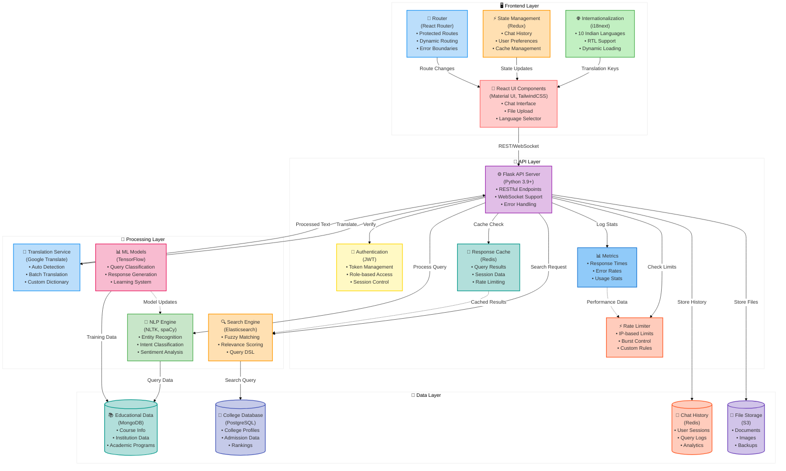
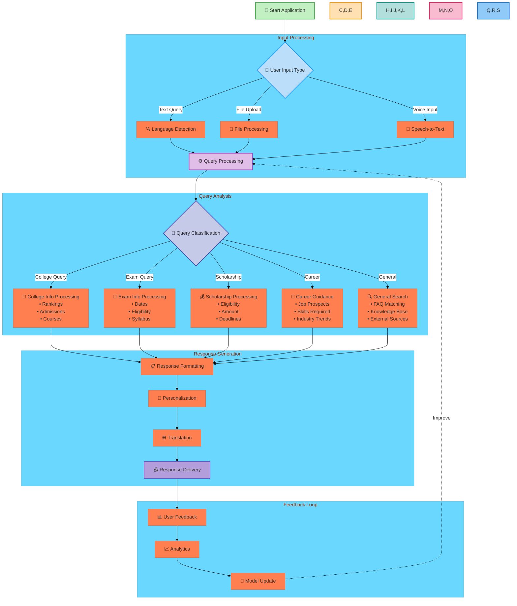
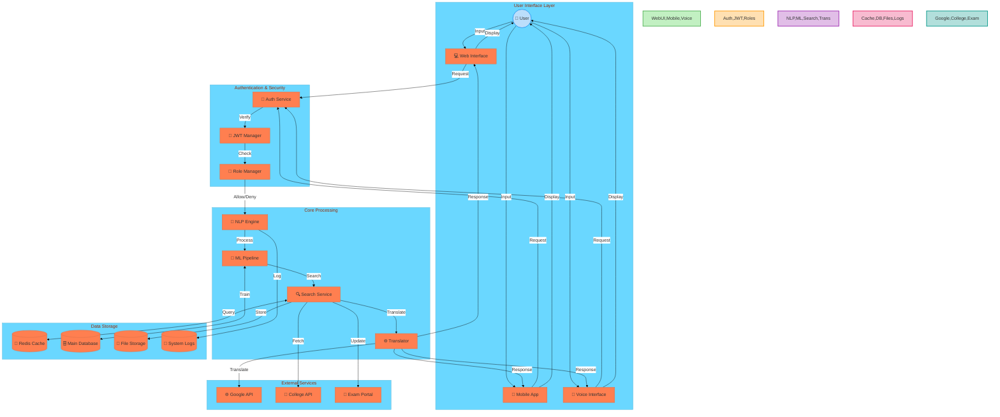
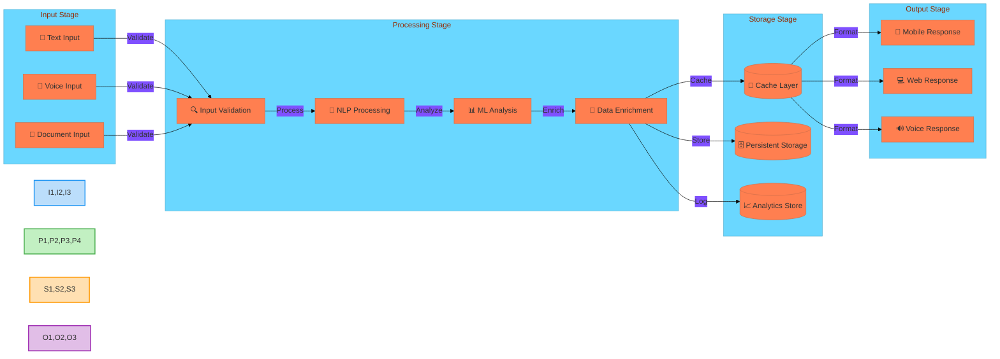

# Enhanced System Documentation - Architecture and Flows

## 1. Detailed System Architecture

## 2. Enhanced Flow Charts

### 2.1 Main Application Flow

## 3. Detailed Data Flow Diagrams

### 3.1 Comprehensive System DFD

### 3.2 Data Processing Pipeline

These enhanced diagrams now include:
1. Detailed component descriptions
2. Comprehensive data flows
3. Subsystem interactions
4. Color-coded sections
5. Emoji indicators
6. Processing stages
7. Error handling paths
8. Feedback loops
9. External service integration
10. Security considerations 