# Project Diagrams Collection

## System Architecture Diagrams

### Version 1: Basic Architecture
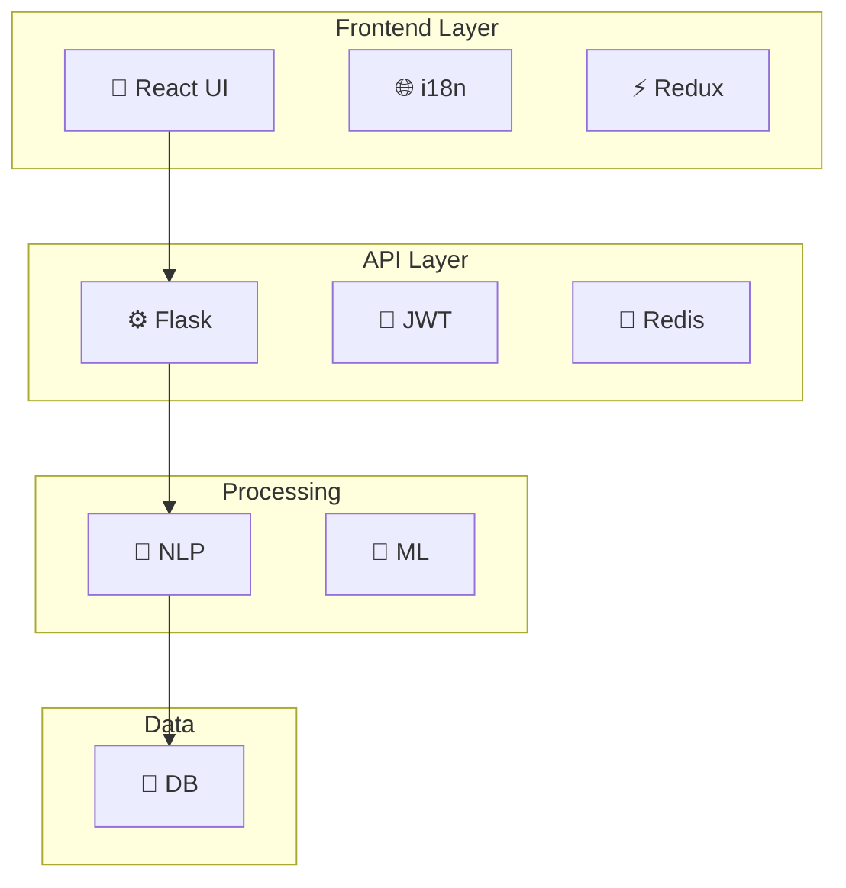

### Version 2: Detailed Architecture
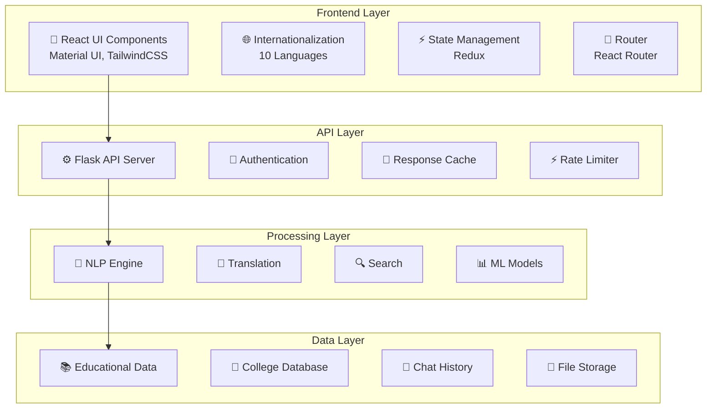

## Data Flow Diagrams

### Version 1: Basic DFD
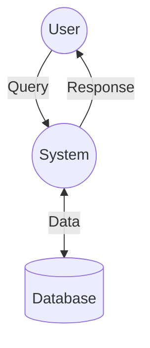

### Version 2: Detailed DFD
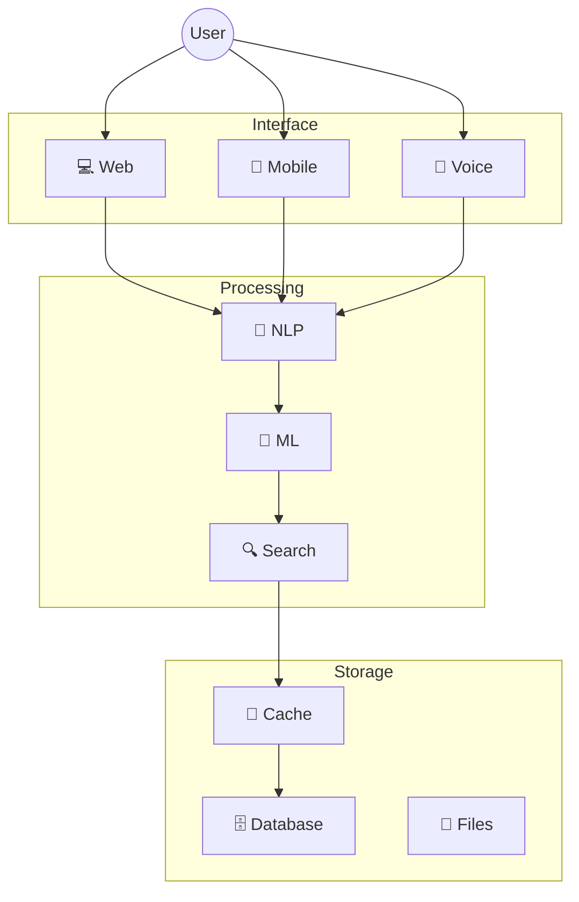

## Sequence Diagrams

### Version 1: Basic Flow
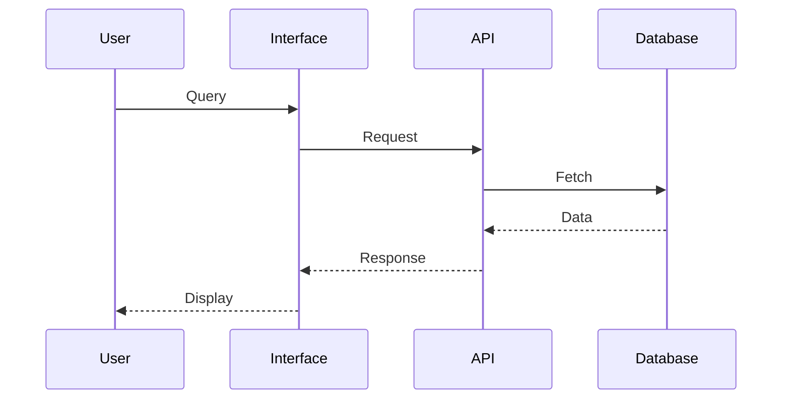

### Version 2: Detailed Flow
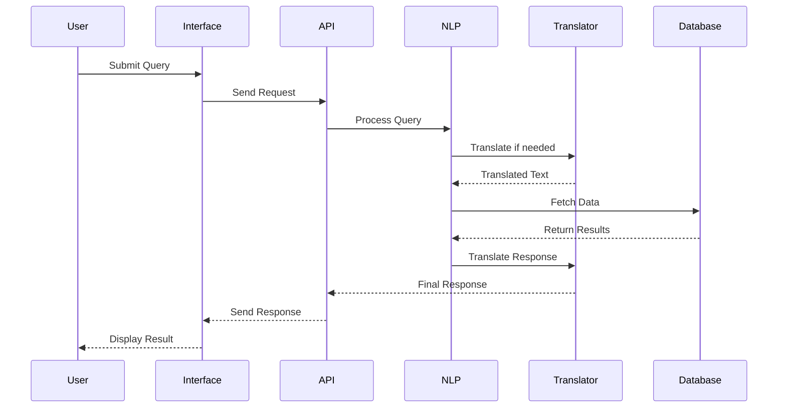

## Class Diagrams

### Version 1: Core Classes
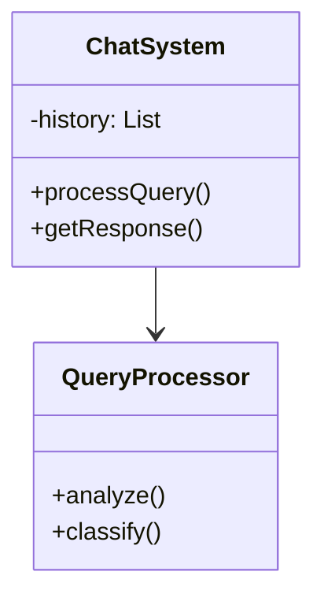

### Version 2: Detailed Classes
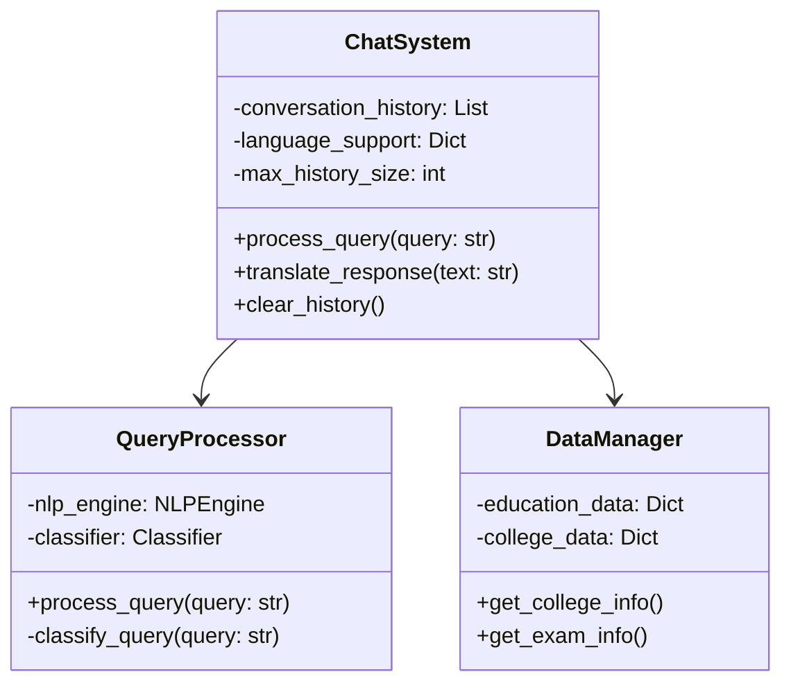

## Activity Diagrams

### Version 1: Basic Flow
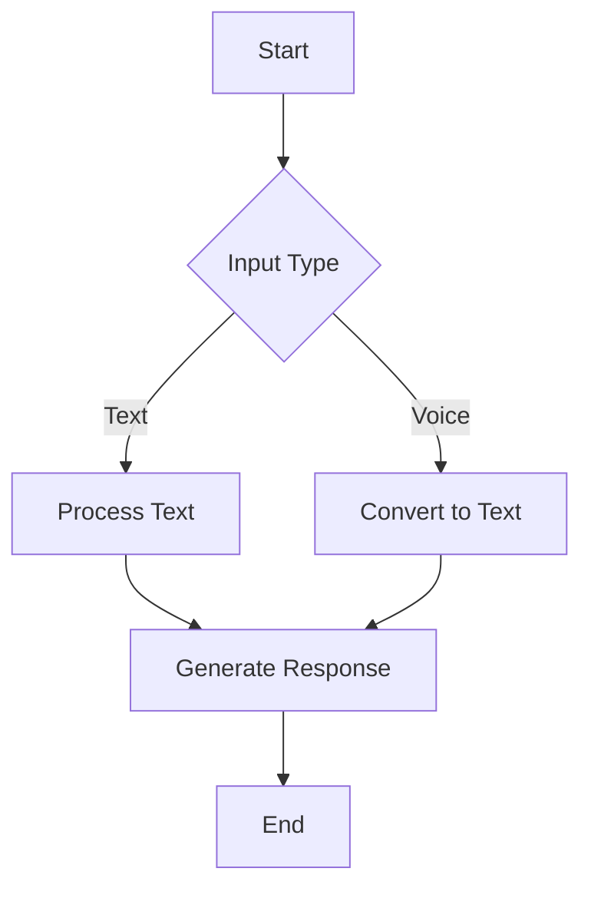

### Version 2: Detailed Flow
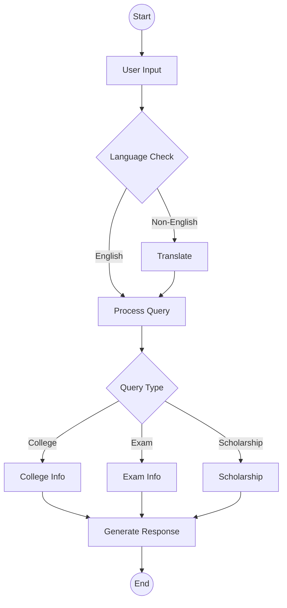

## Use Case Diagrams

### Version 1: Basic Use Cases
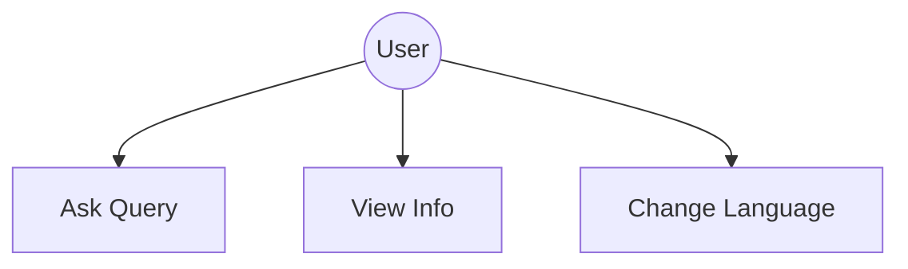

### Version 2: Detailed Use Cases
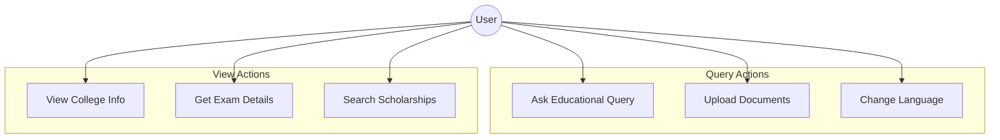

[Additional diagrams can be added based on project needs] 