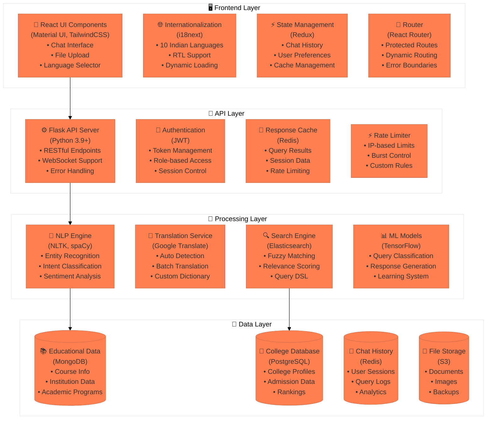
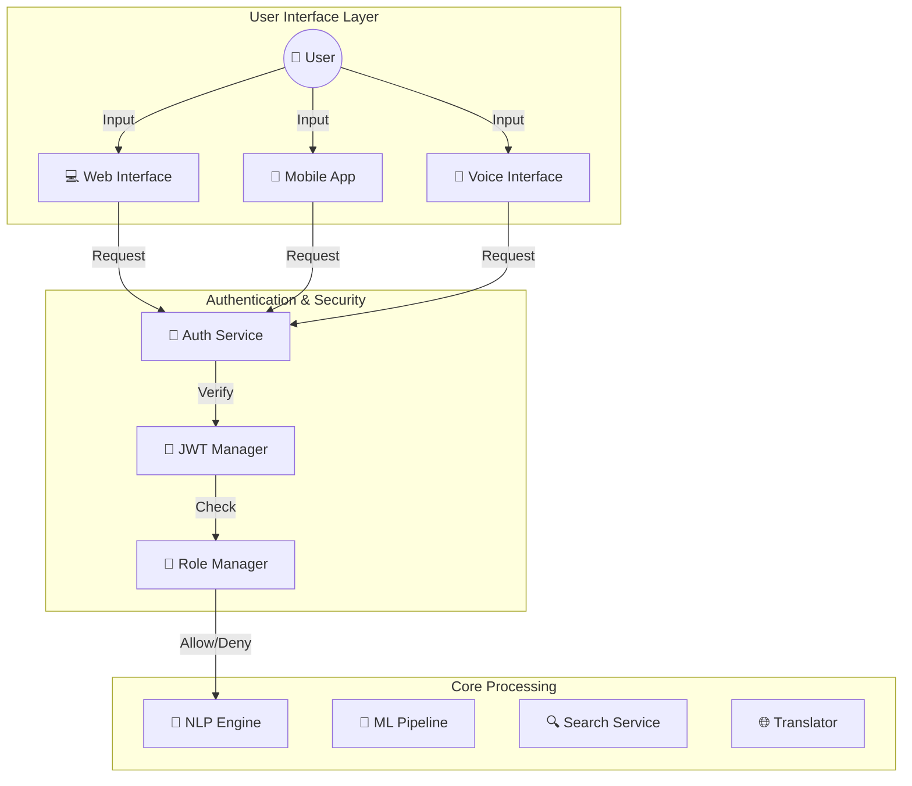
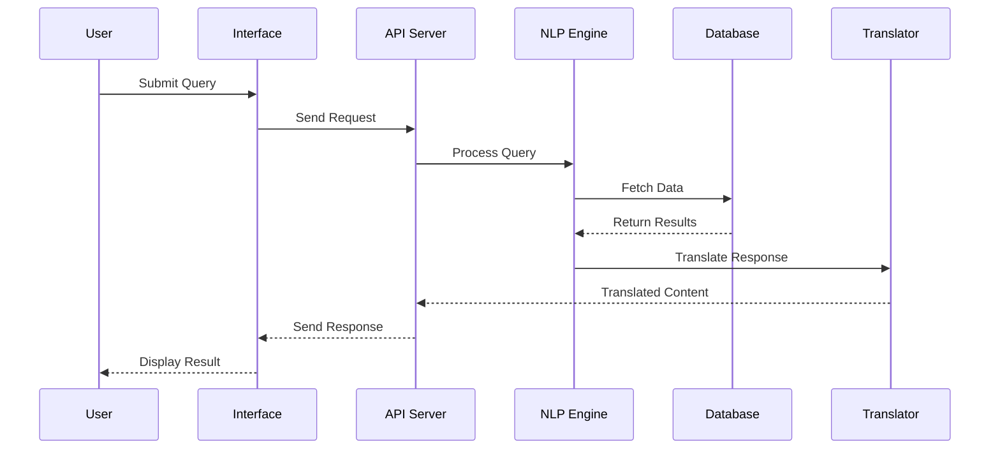
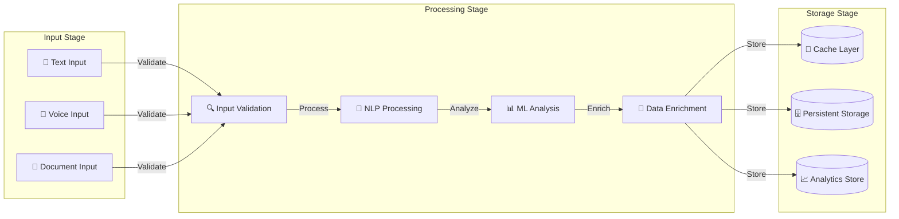

# Educational Assistant Chatbot
## A Multilingual AI-Powered Educational Guidance System

### Project Report
#### Department of Computer Engineering
#### Academic Year 2023-24

---

## Table of Contents

1. [Introduction](#1-introduction)
   1.1 Background
   1.2 Problem Statement
   1.3 Project Objectives
   1.4 Project Scope

2. [Literature Survey](#2-literature-survey)
   2.1 Existing Systems
   2.2 Limitations of Existing Systems
   2.3 Proposed System Features

3. [System Analysis](#3-system-analysis)
   3.1 Requirement Analysis
   3.2 Feasibility Study
   3.3 System Architecture
   3.4 Technology Stack

4. [System Design](#4-system-design)
   4.1 High-Level Design
   4.2 Detailed Design
   4.3 Database Design
   4.4 Interface Design
   4.5 Security Design

5. [Implementation](#5-implementation)
   5.1 Development Environment
   5.2 Core Modules
   5.3 Integration
   5.4 Testing
   5.5 Deployment

6. [Results and Discussion](#6-results-and-discussion)
   6.1 System Performance
   6.2 User Experience
   6.3 Limitations
   6.4 Future Scope

7. [Conclusion](#7-conclusion)

---

## 1. Introduction

### 1.1 Background
The Indian education system, with its vast diversity and complexity, presents unique challenges for students seeking guidance about educational opportunities. The need for accessible, multilingual educational guidance has become increasingly important as education becomes more diverse and specialized.

### 1.2 Problem Statement
Students in India face significant challenges in:
- Accessing accurate educational information in their preferred language
- Understanding admission processes for various institutions
- Finding relevant scholarship opportunities
- Getting personalized career guidance
- Navigating complex educational pathways

### 1.3 Project Objectives
1. Develop a multilingual chatbot system for educational guidance
2. Provide real-time, accurate information about educational institutions
3. Offer personalized career guidance and recommendations
4. Enable easy access to scholarship information
5. Support multiple Indian languages for broader accessibility
6. Implement secure and scalable system architecture

### 1.4 Project Scope
The system encompasses:
- Multi-platform support (Web, Mobile, Voice)
- Support for 10 major Indian languages
- Integration with educational databases
- Real-time query processing
- Personalized response generation
- Analytics and feedback systems

## 2. Literature Survey

### 2.1 Existing Systems
Current educational guidance systems typically fall into these categories:
1. Traditional counseling services
2. Web-based information portals
3. Basic chatbots with limited functionality
4. Single-language assistance systems

### 2.2 Limitations of Existing Systems
- Limited language support
- Lack of real-time updates
- Poor personalization
- Limited accessibility
- Inconsistent information
- High maintenance costs

### 2.3 Proposed System Features
Our system addresses these limitations through:
- Multilingual support using advanced NLP
- Real-time data integration
- AI-powered personalization
- Multi-platform accessibility
- Automated updates
- Scalable architecture

## 3. System Analysis

### 3.1 Requirement Analysis

#### 3.1.1 Functional Requirements
1. User Interface
   - Multilingual chat interface
   - File upload capability
   - Voice input support
   - Language selection
   - Response customization

2. Processing
   - Query analysis
   - Language detection
   - Response generation
   - Translation services
   - Data validation

3. Data Management
   - Educational database
   - User session management
   - Cache management
   - Analytics collection

#### 3.1.2 Non-Functional Requirements
1. Performance
   - Response time < 2 seconds
   - 99.9% uptime
   - Support for 1000+ concurrent users

2. Security
   - End-to-end encryption
   - Role-based access control
   - Data privacy compliance

3. Scalability
   - Horizontal scaling capability
   - Load balancing
   - Distributed caching

### 3.2 Feasibility Study

#### 3.2.1 Technical Feasibility
- Available technologies support all required features
- Open-source frameworks reduce development time
- Cloud infrastructure ensures scalability

#### 3.2.2 Economic Feasibility
- Initial development costs offset by reduced manual support
- Scalable cloud infrastructure optimizes costs
- Open-source technologies reduce licensing costs

#### 3.2.3 Operational Feasibility
- Automated systems reduce operational overhead
- Built-in analytics enable continuous improvement
- Minimal training required for end-users

### 3.3 System Architecture

### 3.4 Technology Stack

#### Frontend
- React.js with TypeScript
- Material UI & TailwindCSS
- Redux for state management
- i18next for internationalization

#### Backend
- Python 3.9+ with Flask
- JWT for authentication
- Redis for caching
- WebSocket for real-time communication

#### AI/ML
- NLTK and spaCy for NLP
- TensorFlow for ML models
- Google Translate API
- Custom classification models

#### Database
- MongoDB for educational data
- PostgreSQL for structured data
- Redis for caching
- S3 for file storage

## 4. System Design

### 4.1 High-Level Design

#### 4.1.1 Component Diagram

### 4.2 Detailed Design

#### 4.2.1 Sequence Diagram

### 4.3 Database Design

#### 4.3.1 Data Flow Diagram

[Continued in next part due to length...] 