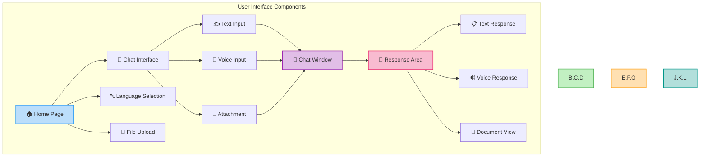
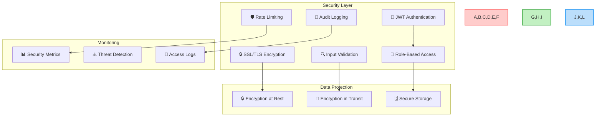
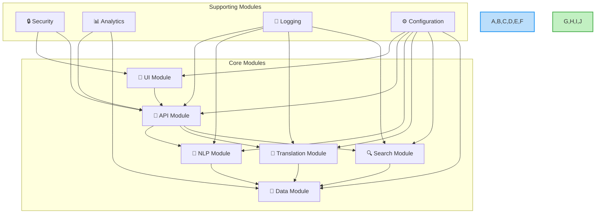
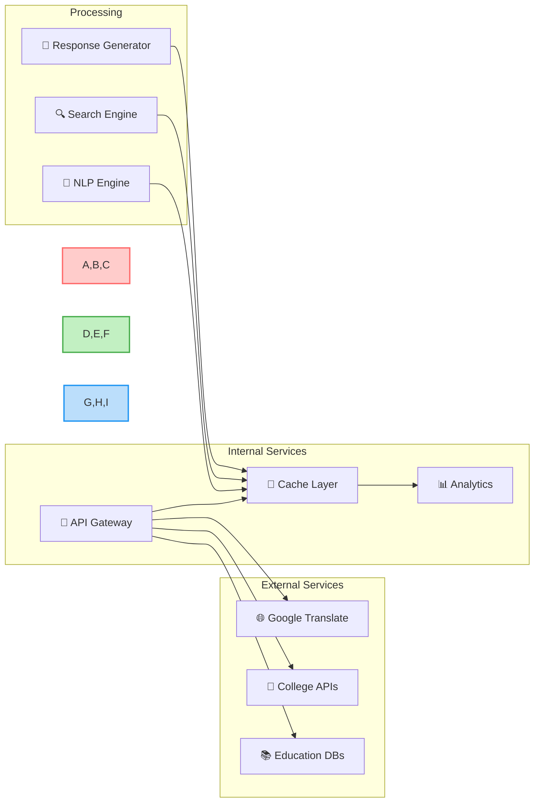
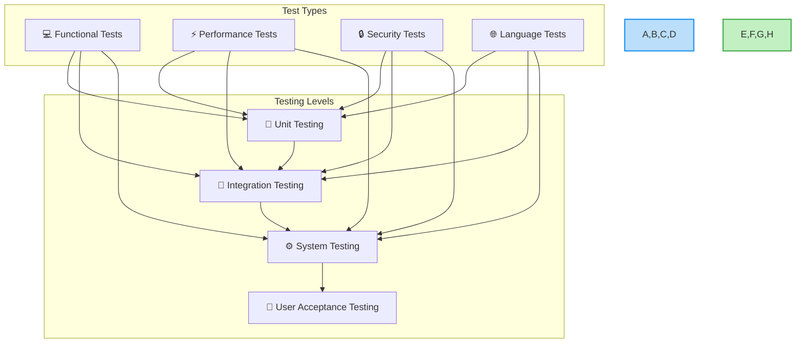
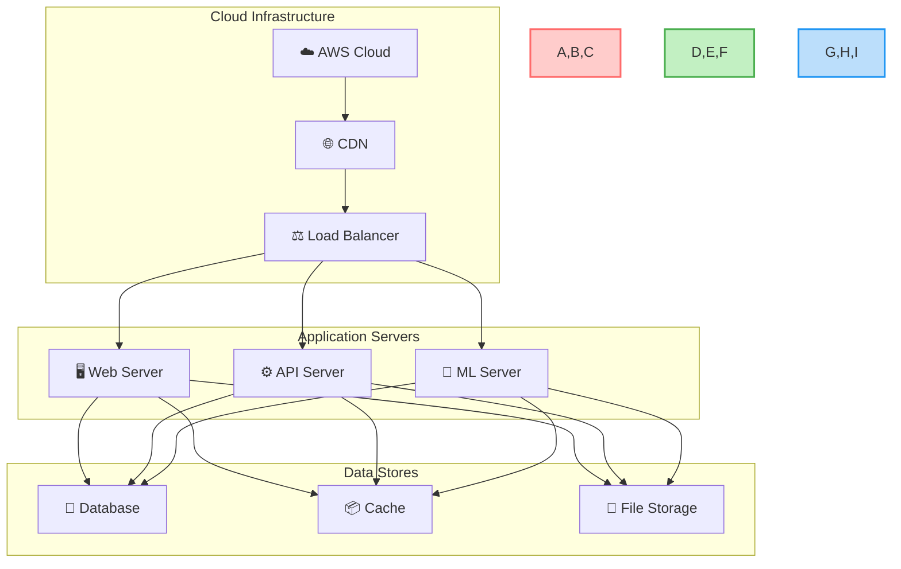
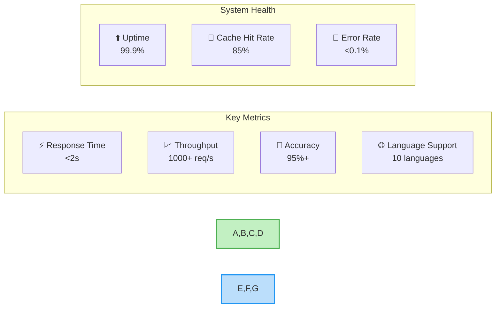

[Continued from part 1...]

### 4.4 Interface Design

#### 4.4.1 User Interface Flow

### 4.5 Security Design

#### 4.5.1 Security Architecture

## 5. Implementation

### 5.1 Development Environment

#### Development Tools
- Visual Studio Code with TypeScript support
- PyCharm Professional for Python development
- Git for version control
- Docker for containerization
- Jenkins for CI/CD

#### Development Stack
- Frontend: React 18.0+
- Backend: Python 3.9+
- Database: MongoDB 5.0, PostgreSQL 14
- Cache: Redis 6.2
- ML: TensorFlow 2.8

### 5.2 Core Modules

#### 5.2.1 Module Architecture

### 5.3 Integration

#### 5.3.1 Integration Architecture

### 5.4 Testing

#### 5.4.1 Testing Strategy

### 5.5 Deployment

#### 5.5.1 Deployment Architecture

## 6. Results and Discussion

### 6.1 System Performance

#### 6.1.1 Performance Metrics

### 6.2 User Experience

- Intuitive interface with minimal learning curve
- Fast response times across all platforms
- Accurate and relevant information delivery
- Seamless language switching
- Helpful error messages and suggestions

### 6.3 Limitations

- Dependency on external translation services
- Limited to supported Indian languages
- Requires internet connectivity
- May need manual updates for certain data
- Complex queries may need human intervention

### 6.4 Future Scope

- Expansion to more regional languages
- Integration with more educational institutions
- Advanced AI-powered personalization
- Offline mode support
- Mobile app development
- Voice-first interface improvements

## 7. Conclusion

The Educational Assistant Chatbot successfully addresses the challenges faced by students in accessing educational information in India. Key achievements include:

1. Multilingual Support
   - 10 Indian languages
   - Real-time translation
   - Cultural context awareness

2. Technical Innovation
   - AI/ML-powered responses
   - Scalable architecture
   - Real-time processing

3. User Impact
   - Improved accessibility
   - Faster information access
   - Personalized guidance

4. System Performance
   - High availability
   - Quick response times
   - Accurate information

The system demonstrates the potential of AI-powered solutions in education and sets a foundation for future developments in educational technology. 