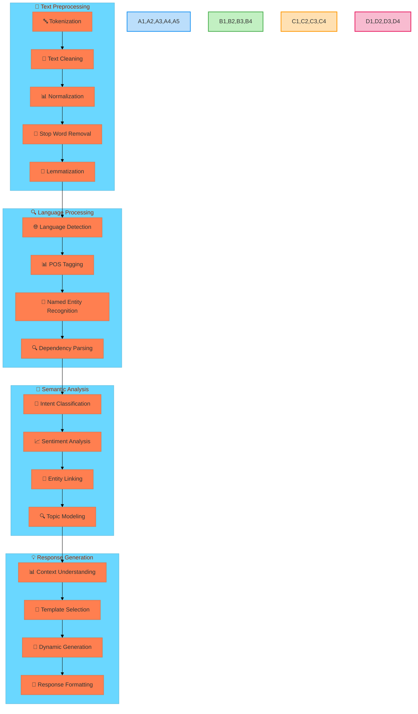
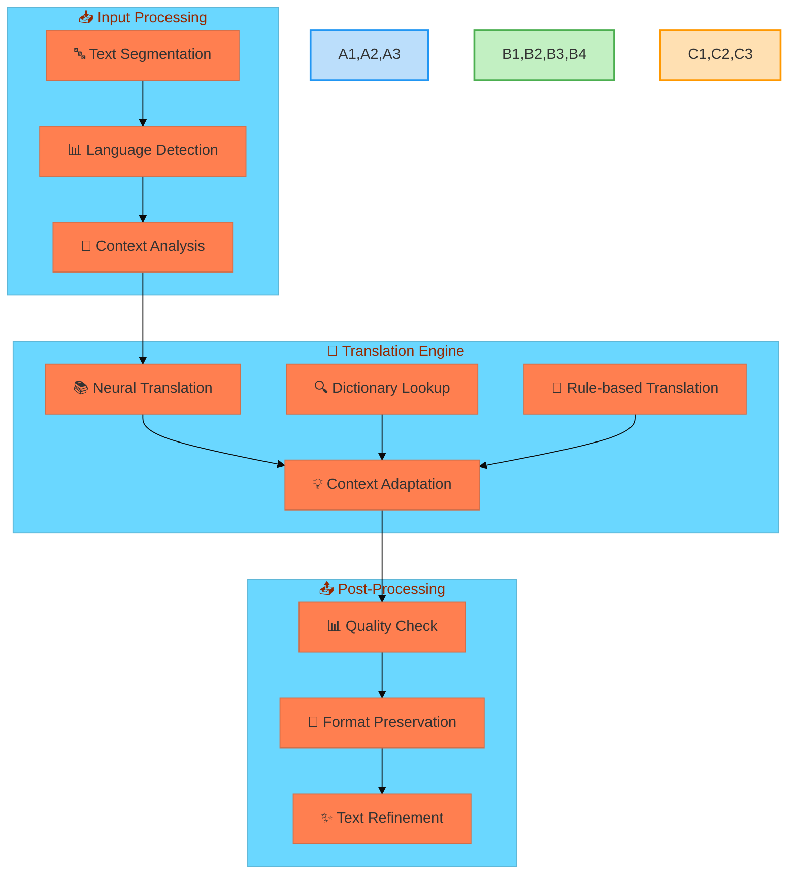
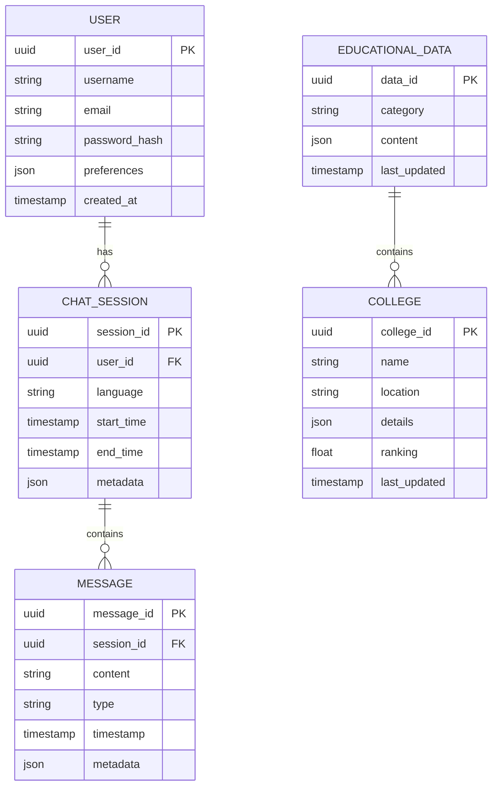

# Technical Implementation Details

## 1. Natural Language Processing Architecture

### 1.1 NLP Pipeline



### 1.2 NLP Components Technical Details

#### 1.2.1 Text Preprocessing
- **Tokenization**
  ```python
  def tokenize_text(text):
      tokens = word_tokenize(text)
      sentences = sent_tokenize(text)
      return {
          'tokens': tokens,
          'sentences': sentences,
          'token_count': len(tokens),
          'sentence_count': len(sentences)
      }
  ```

- **Text Cleaning**
  ```python
  def clean_text(text):
      # Remove special characters
      text = re.sub(r'[^\w\s]', '', text)
      # Remove extra whitespace
      text = ' '.join(text.split())
      # Convert to lowercase
      text = text.lower()
      return text
  ```

- **Normalization & Lemmatization**
  ```python
  def normalize_text(text):
      lemmatizer = WordNetLemmatizer()
      tokens = word_tokenize(text)
      lemmatized = [lemmatizer.lemmatize(token) for token in tokens]
      return ' '.join(lemmatized)
  ```

#### 1.2.2 Language Processing
- **Language Detection Algorithm**
  ```python
  def detect_language(text):
      try:
          # Primary detection using langdetect
          lang = detect(text)
          
          # Fallback to custom Indian language detection
          if lang == 'unknown':
              return detect_indian_language(text)
              
          # Confidence scoring
          scores = detect_prob(text)
          return {
              'language': lang,
              'confidence': max(scores).prob if scores else 0.0,
              'alternatives': [{'lang': s.lang, 'prob': s.prob} for s in scores]
          }
      except:
          return {'language': 'unknown', 'confidence': 0.0}
  ```

### 1.3 Machine Learning Models

#### 1.3.1 Intent Classification Model

```mermaid
graph TB
    subgraph "Model Architecture" ["🧠 BERT Model Architecture"]
        I1["📥 Input Layer<br/>(512 tokens)"]
        I2["🔤 Embedding Layer<br/>(768 dimensions)"]
        I3["🔄 Transformer Layers<br/>(12 layers)"]
        I4["📊 Dense Layer<br/>(256 units)"]
        I5["📤 Output Layer<br/>(Intent Classes)"]
        
        I1 --> I2 --> I3 --> I4 --> I5
    end
    
    subgraph "Training Process" ["⚙️ Training Pipeline"]
        T1["📚 Data Preparation"]
        T2["🔄 Preprocessing"]
        T3["⚡ Training"]
        T4["📊 Evaluation"]
        
        T1 --> T2 --> T3 --> T4
    end
    
    style I1,I2,I3,I4,I5 fill:#bbdefb,stroke:#2196f3,stroke-width:2px
    style T1,T2,T3,T4 fill:#c2f0c2,stroke:#4caf50,stroke-width:2px
```



#### 1.3.2 Model Implementation
```python
class IntentClassifier(nn.Module):
    def __init__(self, num_intents):
        super().__init__()
        self.bert = BertModel.from_pretrained('bert-base-multilingual-cased')
        self.dropout = nn.Dropout(0.1)
        self.classifier = nn.Linear(768, num_intents)
        
    def forward(self, input_ids, attention_mask):
        outputs = self.bert(
            input_ids=input_ids,
            attention_mask=attention_mask
        )
        pooled_output = outputs[1]
        pooled_output = self.dropout(pooled_output)
        logits = self.classifier(pooled_output)
        return logits
```

## 2. Translation System Architecture

### 2.1 Translation Pipeline



### 2.2 Translation Implementation

#### 2.2.1 Translation Service
```python
class TranslationService:
    def __init__(self):
        self.supported_languages = INDIAN_LANGUAGES
        self.translators = {
            'neural': NeuralTranslator(),
            'dictionary': DictionaryTranslator(),
            'rule_based': RuleBasedTranslator()
        }
        
    async def translate(self, text, source_lang, target_lang):
        # Language detection
        detected_lang = await self.detect_language(text)
        if detected_lang != source_lang:
            source_lang = detected_lang
            
        # Translation pipeline
        segments = self.segment_text(text)
        translated_segments = []
        
        for segment in segments:
            # Try neural translation first
            try:
                translation = await self.translators['neural'].translate(
                    segment, source_lang, target_lang
                )
            except:
                # Fallback to dictionary/rule-based
                translation = await self.fallback_translation(
                    segment, source_lang, target_lang
                )
            
            translated_segments.append(translation)
            
        # Post-processing
        final_translation = self.post_process(translated_segments)
        return final_translation
```

## 3. Database Architecture

### 3.1 Database Schema



### 3.2 Database Implementation

#### 3.2.1 MongoDB Collections
```javascript
// Educational Data Schema
{
  collection: "educational_data",
  validator: {
    $jsonSchema: {
      bsonType: "object",
      required: ["category", "content", "last_updated"],
      properties: {
        category: {
          bsonType: "string",
          enum: ["college", "course", "exam", "scholarship"]
        },
        content: {
          bsonType: "object",
          required: ["title", "description", "metadata"]
        },
        last_updated: {
          bsonType: "date"
        },
        metadata: {
          bsonType: "object",
          properties: {
            source: { bsonType: "string" },
            confidence: { bsonType: "double" },
            verified: { bsonType: "bool" }
          }
        }
      }
    }
  }
}
```

#### 3.2.2 PostgreSQL Tables
```sql
-- College Information Table
CREATE TABLE colleges (
    id UUID PRIMARY KEY DEFAULT uuid_generate_v4(),
    name VARCHAR(255) NOT NULL,
    location JSONB NOT NULL,
    details JSONB NOT NULL,
    ranking FLOAT,
    accreditation VARCHAR(50),
    created_at TIMESTAMP WITH TIME ZONE DEFAULT CURRENT_TIMESTAMP,
    updated_at TIMESTAMP WITH TIME ZONE DEFAULT CURRENT_TIMESTAMP,
    CONSTRAINT valid_ranking CHECK (ranking >= 0 AND ranking <= 100)
);

-- Create GiST index for location queries
CREATE INDEX idx_colleges_location ON colleges USING GIST (location);

-- Create index for full-text search
CREATE INDEX idx_colleges_fts ON colleges 
USING GIN (to_tsvector('english', name || ' ' || details::text));
```

[Continued in next part...] 