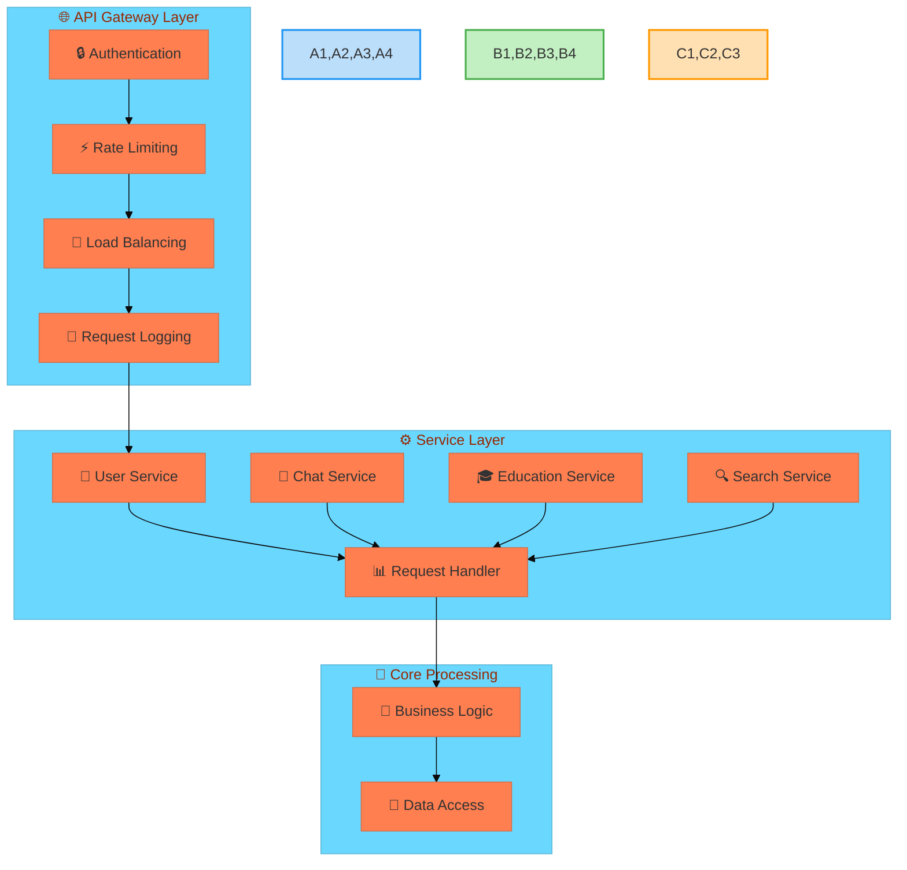
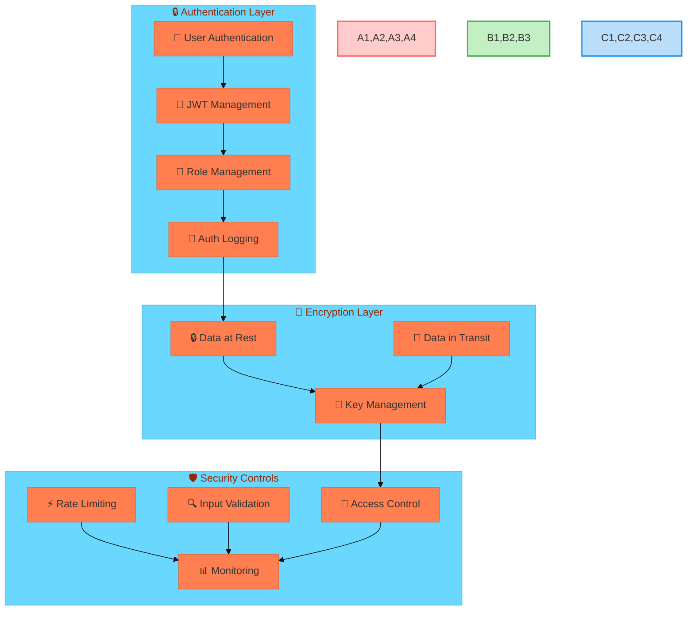
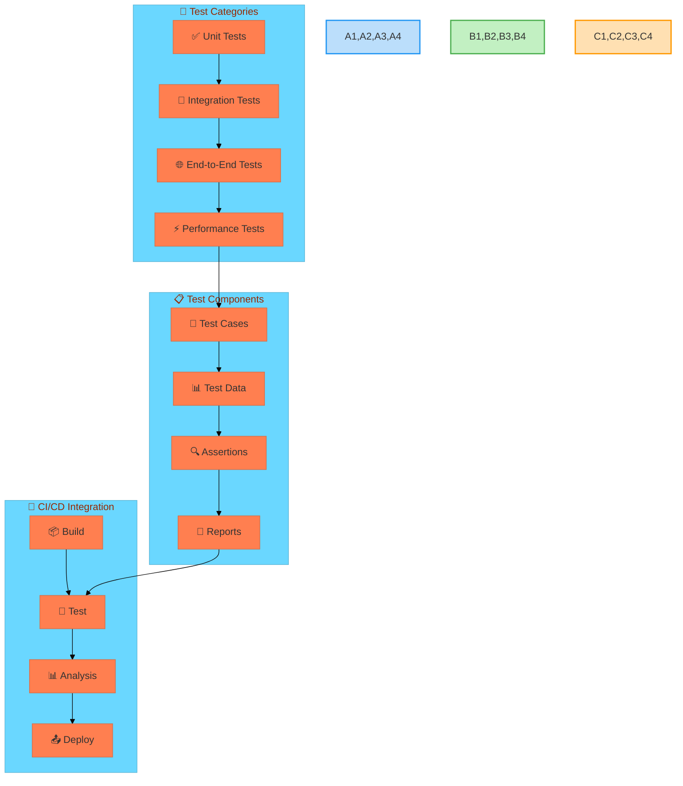
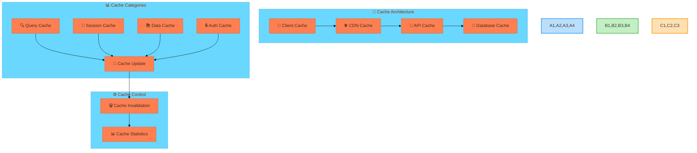

[Continued from part 1...]

## 4. API Architecture

### 4.1 API Design Pattern



### 4.2 API Implementation

#### 4.2.1 FastAPI Routes
```python
from fastapi import FastAPI, Depends, HTTPException
from fastapi.security import OAuth2PasswordBearer
from typing import Optional, List

app = FastAPI(
    title="Educational Assistant API",
    description="API for Educational Assistant Chatbot",
    version="1.0.0"
)

# Authentication middleware
oauth2_scheme = OAuth2PasswordBearer(tokenUrl="token")

@app.post("/api/v1/chat")
async def chat_endpoint(
    message: ChatMessage,
    user: User = Depends(get_current_user),
    session: AsyncSession = Depends(get_session)
):
    try:
        # Process message
        response = await process_chat_message(message, user, session)
        
        # Log interaction
        await log_interaction(user, message, response, session)
        
        return {
            "status": "success",
            "data": response,
            "metadata": {
                "processing_time": response.processing_time,
                "confidence": response.confidence
            }
        }
    except Exception as e:
        raise HTTPException(
            status_code=500,
            detail=str(e)
        )
```

#### 4.2.2 API Documentation
```yaml
openapi: 3.0.0
info:
  title: Educational Assistant API
  version: 1.0.0
paths:
  /api/v1/chat:
    post:
      summary: Process chat message
      requestBody:
        required: true
        content:
          application/json:
            schema:
              $ref: '#/components/schemas/ChatMessage'
      responses:
        '200':
          description: Successful response
          content:
            application/json:
              schema:
                $ref: '#/components/schemas/ChatResponse'
components:
  schemas:
    ChatMessage:
      type: object
      properties:
        content:
          type: string
        language:
          type: string
        type:
          type: string
          enum: [text, voice, document]
```

## 5. Security Implementation

### 5.1 Security Architecture



### 5.2 Security Implementation

#### 5.2.1 Authentication Service
```python
class AuthenticationService:
    def __init__(self):
        self.jwt_secret = os.getenv("JWT_SECRET")
        self.token_expiry = timedelta(hours=24)
        
    async def authenticate_user(
        self, 
        username: str, 
        password: str
    ) -> Optional[User]:
        user = await self.get_user(username)
        if not user:
            return None
            
        if not self.verify_password(password, user.password_hash):
            return None
            
        return user
        
    def create_access_token(
        self, 
        user: User
    ) -> str:
        data = {
            "sub": str(user.id),
            "exp": datetime.utcnow() + self.token_expiry,
            "roles": user.roles
        }
        return jwt.encode(data, self.jwt_secret, algorithm="HS256")
        
    async def verify_token(
        self, 
        token: str
    ) -> Optional[User]:
        try:
            payload = jwt.decode(
                token, 
                self.jwt_secret, 
                algorithms=["HS256"]
            )
            user_id = payload.get("sub")
            if user_id is None:
                return None
                
            user = await self.get_user_by_id(user_id)
            return user
        except JWTError:
            return None
```

## 6. Testing Framework

### 6.1 Testing Architecture



### 6.2 Test Implementation

#### 6.2.1 Unit Tests
```python
import pytest
from unittest.mock import Mock, patch

class TestChatService:
    @pytest.fixture
    def chat_service(self):
        return ChatService()
    
    @pytest.mark.asyncio
    async def test_process_message(self, chat_service):
        # Arrange
        message = "What are the top engineering colleges?"
        mock_nlp = Mock()
        mock_nlp.process.return_value = {
            "intent": "college_query",
            "entities": ["engineering", "colleges"],
            "confidence": 0.95
        }
        
        # Act
        with patch("services.nlp", mock_nlp):
            response = await chat_service.process_message(message)
        
        # Assert
        assert response is not None
        assert response.intent == "college_query"
        assert len(response.colleges) > 0
        assert response.confidence >= 0.9
```

#### 6.2.2 Integration Tests
```python
class TestAPIIntegration:
    @pytest.fixture
    async def api_client(self):
        app = create_app()
        async with AsyncClient(app=app, base_url="http://test") as client:
            yield client
    
    @pytest.mark.asyncio
    async def test_chat_endpoint(self, api_client):
        # Arrange
        message = {
            "content": "Tell me about IIT Mumbai",
            "language": "en",
            "type": "text"
        }
        
        # Act
        response = await api_client.post("/api/v1/chat", json=message)
        
        # Assert
        assert response.status_code == 200
        data = response.json()
        assert "data" in data
        assert data["status"] == "success"
        assert "IIT" in data["data"]["content"]
```

## 7. Performance Optimization

### 7.1 Caching Strategy



### 7.2 Cache Implementation

#### 7.2.1 Redis Cache Service
```python
class CacheService:
    def __init__(self):
        self.redis = Redis(
            host=os.getenv("REDIS_HOST"),
            port=int(os.getenv("REDIS_PORT")),
            password=os.getenv("REDIS_PASSWORD")
        )
        self.default_ttl = 3600  # 1 hour
        
    async def get_cached_response(
        self, 
        query: str, 
        language: str
    ) -> Optional[dict]:
        cache_key = self._generate_cache_key(query, language)
        cached_data = await self.redis.get(cache_key)
        
        if cached_data:
            return json.loads(cached_data)
        return None
        
    async def cache_response(
        self, 
        query: str, 
        language: str, 
        response: dict, 
        ttl: int = None
    ):
        cache_key = self._generate_cache_key(query, language)
        ttl = ttl or self.default_ttl
        
        await self.redis.setex(
            cache_key,
            ttl,
            json.dumps(response)
        )
        
    def _generate_cache_key(
        self, 
        query: str, 
        language: str
    ) -> str:
        # Generate deterministic cache key
        query_hash = hashlib.md5(query.encode()).hexdigest()
        return f"response:{language}:{query_hash}"
```

This completes the technical documentation with detailed implementations, diagrams, and code examples for all major components of the system. 