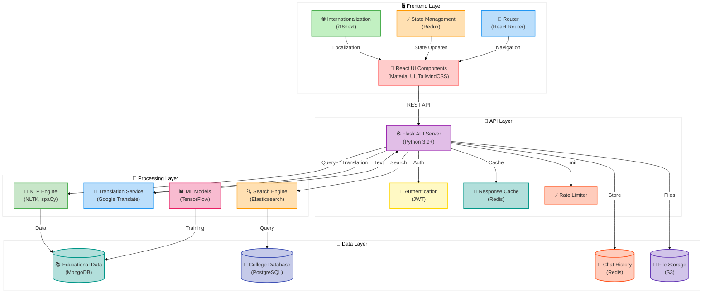
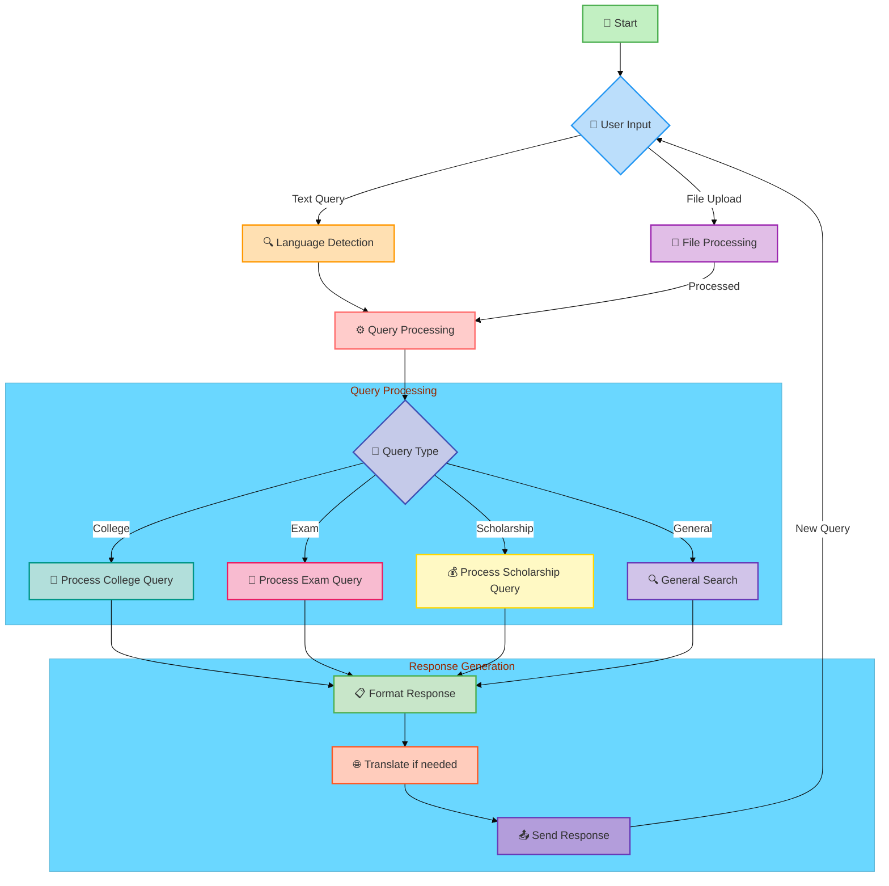
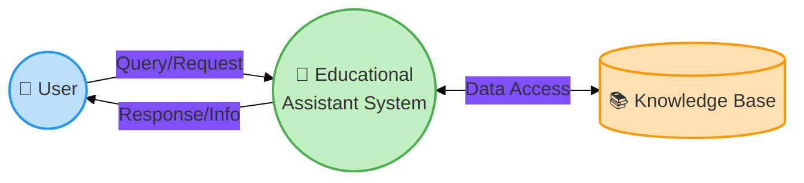
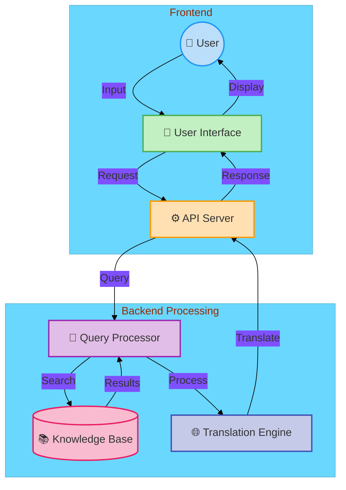
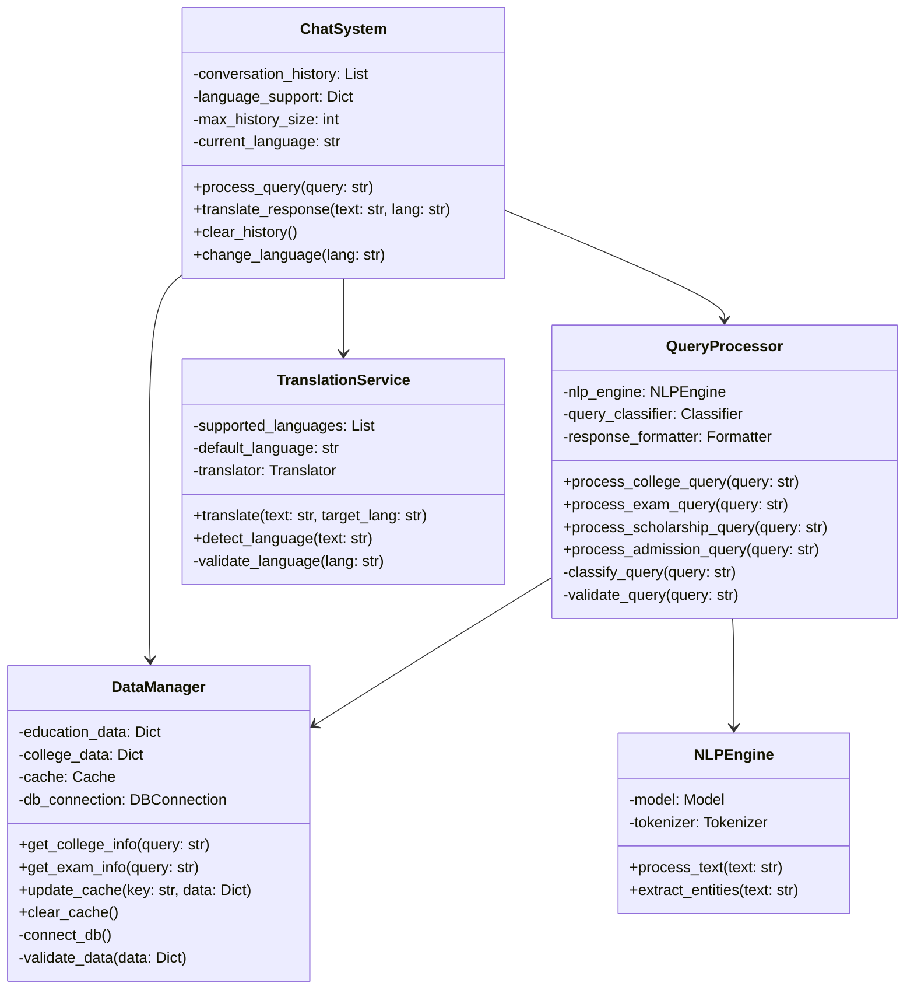
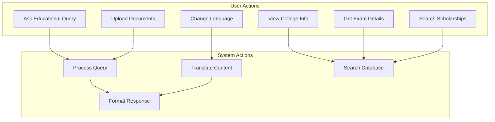

# Educational Assistant Chatbot - System Documentation

## Table of Contents
1. [System Architecture](#system-architecture)
2. [Flow Charts](#flow-charts)
3. [Data Flow Diagrams](#data-flow-diagrams)
4. [UML Diagrams](#uml-diagrams)
5. [Problem Definition and Scope](#problem-definition-and-scope)
6. [Technical Details](#technical-details)

## 1. System Architecture



## 2. Flow Charts

### Main Application Flow



## 3. Data Flow Diagrams

### Level 0 DFD



### Level 1 DFD



## 4. UML Diagrams

### Class Diagram



### Use Case Diagram



## 5. Problem Definition and Scope

### 5.1 Problem Definition
The Educational Assistant Chatbot addresses the challenge of providing accessible, multilingual educational guidance to students in India. It offers information about:
- College and university details
- Entrance examination guidance
- Scholarship opportunities
- Admission processes
- General educational queries

### 5.2 Modules
1. **Query Processing Module**
   - Natural language understanding
   - Query classification
   - Response generation

2. **Translation Module**
   - Language detection
   - Multi-language support
   - Real-time translation

3. **Data Management Module**
   - Educational database
   - College information
   - Exam details
   - Scholarship data

4. **User Interface Module**
   - React-based frontend
   - Responsive design
   - Accessibility features

### 5.3 Project Scope
- **Geographic Coverage**: Pan-India with detailed focus on Maharashtra
- **Language Support**: 10 major Indian languages
- **Information Domains**:
  - Higher Education
  - Professional Courses
  - Entrance Exams
  - Scholarships
  - Career Guidance

## 6. Technical Details

### 6.1 Technology Stack
- **Frontend**: React, TypeScript, TailwindCSS
- **Backend**: Flask (Python)
- **Database**: JSON-based data store
- **APIs**: Google Translate, Custom Search

### 6.2 Algorithms

#### Query Processing Algorithm
```python
1. Input: User query (text)
2. Detect language if not specified
3. Translate to English if needed
4. Classify query type:
   - College-related
   - Exam-related
   - Scholarship-related
   - General
5. Process query based on type
6. Format response
7. Translate response to user's language
8. Return formatted response
```

#### Search Algorithm
```python
1. Input: Processed query
2. Extract keywords and entities
3. Match against database:
   - Direct matches
   - Fuzzy matches
   - Semantic similarity
4. Rank results by relevance
5. Return top N matches
```

### 6.3 Performance Considerations
- Response time: < 2 seconds
- Translation accuracy: > 95%
- Query understanding: > 90%
- Scalability: Up to 1000 concurrent users 